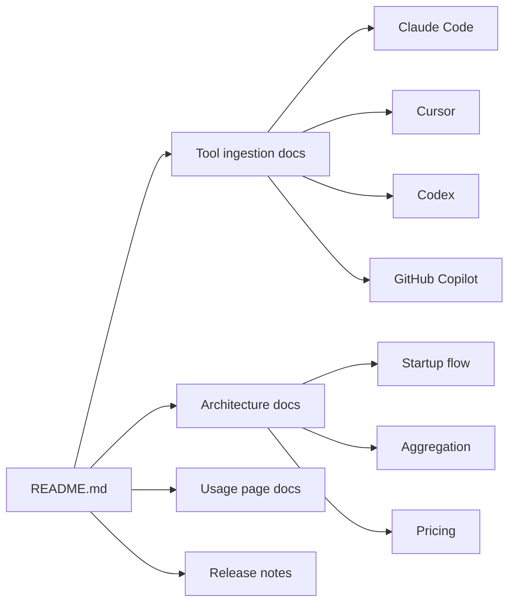

# Documentation

This folder is the long-form companion to the short project README.

## Start Here

- [Tool ingestion](tools/README.md): what local files each AI coding tool writes, how `tokenuse` discovers them, and how fields are normalized.
- [Architecture](architecture.md): startup flow, local archive sync, the page/modal state machine (Overview, Deep Dive, Usage, Session drill-down, Config, Help), dashboard aggregation, project identity, deduplication, pricing, and the export pipeline.
- [Usage page](usage.md): the rolling-24h utilisation page (`u`) — per-tool activity histograms, plan rate-limit windows, and top models. Independent of the period and project filters.
- [Release notes](releases/): unreleased changes plus per-version notes, including [`unreleased`](releases/unreleased.md) and [`0.0.1`](releases/0.0.1.md).

The short [project README](../README.md) covers installation, the keyboard reference (including `h` for help, `s` for the session drill-down, `e` for export, `r` for live reload), and the configuration directory layout.

## Terminology

The UI and user docs say **tool**: Claude Code, Cursor, Codex, and GitHub Copilot are the tools being analyzed.

The Rust code uses an internal `ToolAdapter` trait in `src/tools/`. In docs, "adapter" means that internal implementation for one tool's local files.
