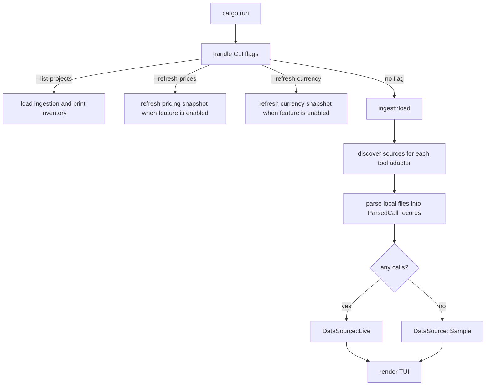
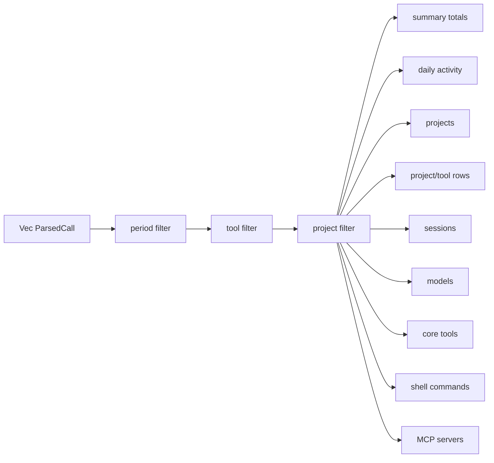
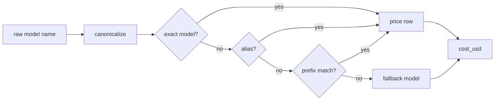

# Architecture

`tokenuse` is intentionally simple: read local session files, normalize them to one record shape, aggregate in memory, and render a terminal dashboard. There is no daemon and no file watcher.

## Startup Flow



`ingest::load()` runs once before the TUI starts. New sessions written while the dashboard is open are not visible until the app is restarted.

Individual adapter discovery or parse errors are skipped so one malformed source does not stop the whole dashboard. If no calls survive ingestion, the UI shows sample data and a status message.

## Normalized Record

Every adapter emits `ParsedCall` from `src/tools/types.rs`. The important fields are:

| Field | Meaning |
| --- | --- |
| `tool` | Stable internal tool id such as `claude-code`, `cursor`, `codex`, or `copilot` |
| `model` | Raw or inferred model name before display shortening |
| `input_tokens`, `output_tokens` | Billable input/output buckets after adapter-specific normalization |
| `cache_creation_input_tokens`, `cache_read_input_tokens` | Cache write/read buckets when the tool exposes them |
| `cached_input_tokens` | Cached input reported inside `input_tokens`, currently used for OpenAI-style records |
| `reasoning_tokens` | Reasoning bucket when exposed or estimated |
| `web_search_requests` | Server-side web search request count when exposed |
| `cost_usd` | Calculated from the embedded pricing snapshot |
| `tools`, `bash_commands` | Tool call names and split shell commands |
| `timestamp`, `session_id`, `project` | Aggregation and filtering keys |
| `dedup_key` | Per-call key used by the shared run-level dedup set |

## Aggregation



The dashboard panels are built from the filtered call set:

- Summary: cost, call count, tool-qualified session count, cache hit rate, input, output, cache reads, and cache writes.
- Daily Activity: cost and calls by local date.
- By Project: top projects by cost, average cost per session, and top tool spend mix.
- Top Sessions: highest-cost sessions, keyed by `tool:session_id`.
- Project Spend by Tool: project/tool rows sorted by project total, then tool spend.
- By Model: model display name, cost, calls, and cache percentage.
- Core Tools: normalized assistant tool calls.
- Shell Commands: first word of split Bash commands.
- MCP Servers: tool names shaped like `mcp__server__tool`, grouped by server.

## Project Identity

Raw project strings come from each tool's local data. Before display, `tokenuse`:

1. normalizes path separators and trims trailing slashes
2. folds absolute paths to the nearest existing Git root when one exists
3. groups costs by that identity across tools
4. displays the shortest unique suffix, such as `tokens` or `dvr/tokens`

`cargo run -- --list-projects` prints both the compact project label and the raw project value so ingestion mistakes are easier to spot.

## Deduplication

A single shared `HashSet<String>` is passed through every adapter during a run. Each parser creates a stable `dedup_key` for the call shape it understands:

- Claude Code: message id, falling back to timestamp
- Cursor bubbles: conversation id, timestamp, and token counts
- Cursor Agent KV: request id
- Codex: rollout path, token event timestamp, and cumulative token totals
- Copilot: session id and message id

Session counts are tool-qualified, so `claude-code:s1` and `codex:s1` remain separate sessions even if the raw session id text matches.

## Pricing

`src/pricing/snapshot.json` is embedded at compile time and loaded through `PriceTable::embedded()`.



Canonicalization lowercases model names, drops a vendor prefix such as `anthropic/`, strips an `@pin` suffix, and removes trailing `-YYYYMMDD` date stamps. Aliases such as `cursor-auto`, `anthropic-auto`, and `openai-auto` resolve through the snapshot.

The pricing formula is:

```text
cost = multiplier * (
    input_tokens * input_rate
  + output_tokens * output_rate
  + cache_creation_input_tokens * cache_write_rate
  + cache_read_input_tokens * cache_read_rate
  + web_search_requests * web_search_rate
)
```

Claude Opus fast mode uses the model row's `fast_multiplier` when present. The refresh command fetches LiteLLM pricing, filters to relevant model families, adds local aliases, and rewrites the embedded snapshot:

```bash
cargo run --features refresh-prices -- --refresh-prices
```

## Currency Snapshot

`currency/rates.json` is a checked-in generated snapshot for future currency display. The running dashboard does not call an exchange-rate API and still stores calculated spend as `cost_usd`.

The snapshot is generated from Frankfurter's USD-based v2 rates endpoint, filtered to fiat display currencies, and refreshed by a nightly GitHub Action:

```bash
cargo run --features refresh-currency -- --refresh-currency
```

The default build does not include this networked refresh path.
