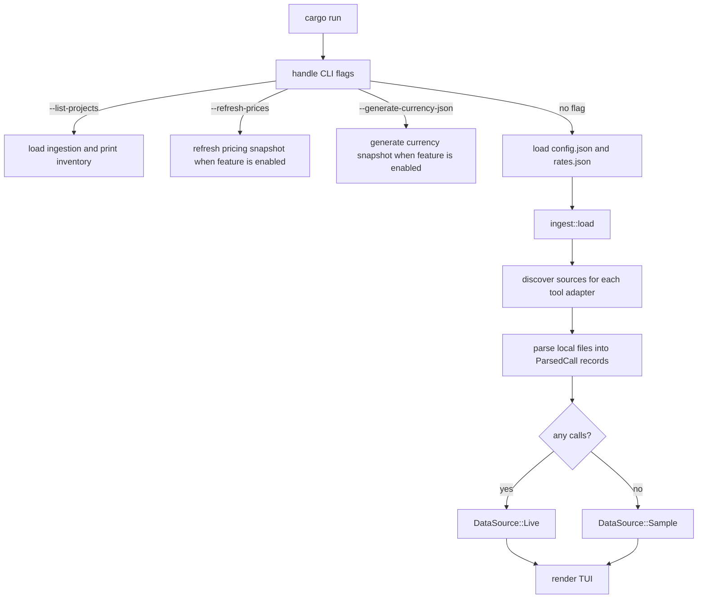
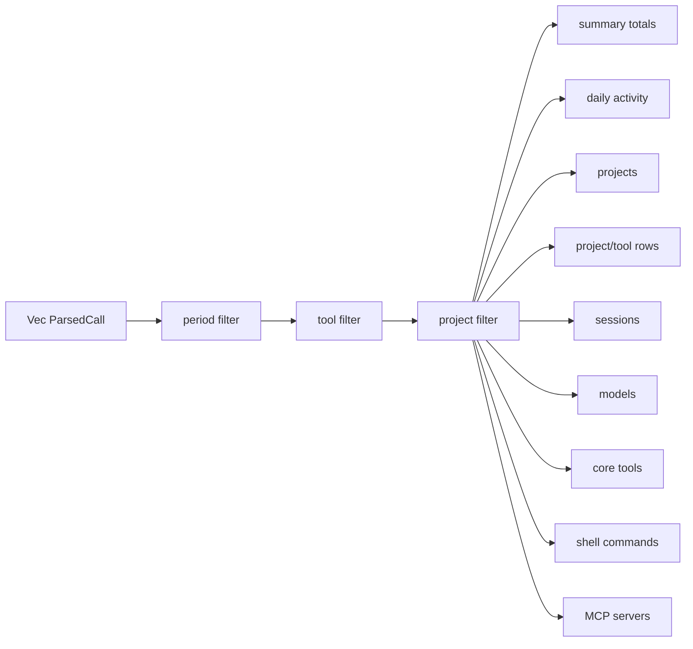
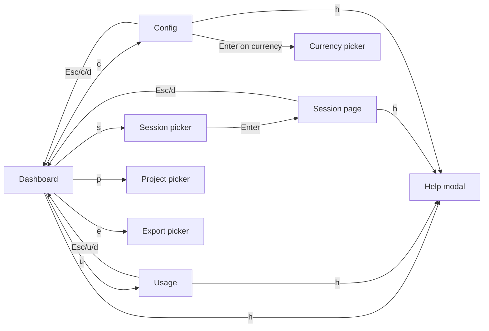
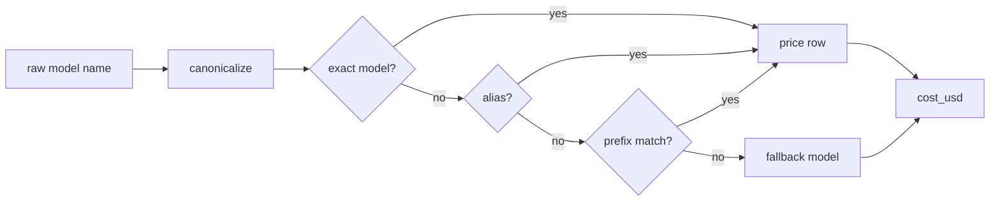

# Architecture

`tokenuse` is intentionally simple: read local session files, normalize them to one record shape, aggregate in memory, and render a terminal dashboard. There is no daemon and no file watcher.

## Startup Flow



`ingest::load()` runs once before the TUI starts. New sessions written while the dashboard is open are not visible until the user explicitly reloads — press `r` (Dashboard, Usage, or Session pages) to re-run `ingest::load()` on a background thread. The dashboard stays responsive: the status bar shows `reloading…` while it runs, the next tick of the main loop drains the result via `App::poll_reload`, and the status flips to `reloaded · N calls`. Pressing `r` again while a reload is in flight is a no-op so worker threads don't pile up. Failures or empty results keep the prior data unchanged.

Individual adapter discovery or parse errors are skipped so one malformed source does not stop the whole dashboard. If no calls survive ingestion, the UI shows sample data and a status message.

## Normalized Record

Every adapter emits `ParsedCall` from `src/tools/types.rs`. The important fields are:

| Field | Meaning |
| --- | --- |
| `tool` | Stable internal tool id such as `claude-code`, `cursor`, `codex`, or `copilot` |
| `model` | Raw or inferred model name before display shortening |
| `input_tokens`, `output_tokens` | Billable input/output buckets after adapter-specific normalization |
| `cache_creation_input_tokens`, `cache_read_input_tokens` | Cache write/read buckets when the tool exposes them |
| `cached_input_tokens` | Cached input reported inside `input_tokens`, currently used for OpenAI-style records |
| `reasoning_tokens` | Reasoning bucket when exposed or estimated |
| `web_search_requests` | Server-side web search request count when exposed |
| `cost_usd` | Calculated from the configured pricing snapshot, embedded by default |
| `tools`, `bash_commands` | Tool call names and split shell commands |
| `timestamp`, `session_id`, `project` | Aggregation and filtering keys |
| `dedup_key` | Per-call key used by the shared run-level dedup set |

## Aggregation



The dashboard panels are built from the filtered call set:

- Summary: cost, call count, tool-qualified session count, cache hit rate, input, output, cache reads, and cache writes.
- Daily Activity: cost and calls by local date.
- By Project: top projects by cost, average cost per session, and top tool spend mix.
- Top Sessions: highest-cost sessions, keyed by `tool:session_id`.
- Project Spend by Tool: project/tool rows sorted by project total, then tool spend.
- By Model: model display name, cost, calls, and cache percentage.
- Core Tools: normalized assistant tool calls.
- Shell Commands: first word of split Bash commands.
- MCP Servers: tool names shaped like `mcp__server__tool`, grouped by server.

## Pages And Modals

The TUI is a small state machine over four pages plus five overlay modals. All routing lives in `src/app.rs`; rendering is dispatched from `src/ui.rs`.



- **Dashboard** (`Page::Dashboard`): default landing page with all 9 panels listed under [Aggregation](#aggregation).
- **Usage** (`Page::Usage`): per-tool 24-hour activity histogram + plan-side rate limit windows. Built from `Ingested::limits` over the same `ParsedCall` set plus `LimitSnapshot` records.
- **Session** (`Page::Session`): drill-down for one `tool:session_id`. Rendered from `SessionDetailView`, which is computed by filtering `Ingested.calls` by `session_key(call) == key` and sorting by timestamp. Live data shows per-call timestamp, model, cost, in/out tokens, cache, tools used, and a 120-char single-line prompt snippet. Sample mode shows a privacy note since per-call records are not bundled.
- **Config** (`Page::Config`): currency override + local data refresh actions (rates, LiteLLM pricing).
- **Project picker, Currency picker, Session picker** (`*Modal` structs): each holds `options`, a typeable `query`, and a `filtered: Vec<usize>` mapping; all three share the same case-insensitive substring filter pattern. The project picker pins `All` regardless of query.
- **Export picker** (`ExportModal`): four-row chooser (`JSON`, `CSV`, `SVG`, `PNG`); on `Enter` it calls `export::write` with the active period, tool, and project filter.
- **Help** (`help_open: bool`): full keybinding reference, openable from any page with `h` or `?`. Closes with `h`, `?`, or `Esc`.

The five modals are checked in priority order in `App::handle_key`: help, currency, project, session, then export. Only one is open at a time.

## Project Identity

Raw project strings come from each tool's local data. Before display, `tokenuse`:

1. normalizes path separators and trims trailing slashes
2. folds absolute paths to the nearest existing Git root when one exists
3. groups costs by that identity across tools
4. displays the shortest unique suffix, such as `tokens` or `dvr/tokens`

`cargo run -- --list-projects` prints both the compact project label and the raw project value so ingestion mistakes are easier to spot.

## Deduplication

A single shared `HashSet<String>` is passed through every adapter during a run. Each parser creates a stable `dedup_key` for the call shape it understands:

- Claude Code: message id, falling back to timestamp
- Cursor bubbles: conversation id, timestamp, and token counts
- Cursor Agent KV: request id
- Codex: rollout path, token event timestamp, and cumulative token totals
- Copilot: session id and message id

Session counts are tool-qualified, so `claude-code:s1` and `codex:s1` remain separate sessions even if the raw session id text matches.

## Pricing

`src/pricing/snapshot.json` is embedded at compile time. At runtime, `PriceTable::configured()` first looks for a local `pricing-snapshot.json` in the tokenuse config directory, then falls back to the embedded snapshot.



Canonicalization lowercases model names, drops a vendor prefix such as `anthropic/`, strips an `@pin` suffix, and removes trailing `-YYYYMMDD` date stamps. Aliases such as `cursor-auto`, `anthropic-auto`, and `openai-auto` resolve through the snapshot.

The pricing formula is:

```text
cost = multiplier * (
    input_tokens * input_rate
  + output_tokens * output_rate
  + cache_creation_input_tokens * cache_write_rate
  + cache_read_input_tokens * cache_read_rate
  + web_search_requests * web_search_rate
)
```

Claude Opus fast mode uses the model row's `fast_multiplier` when present. The CLI refresh command fetches LiteLLM pricing, filters to relevant model families, adds local aliases, and rewrites the embedded snapshot:

```bash
cargo run --features refresh-prices -- --refresh-prices
```

The TUI configuration page can also pull the LiteLLM-derived snapshot into the local config directory when built with `refresh-prices`. Because ingestion runs once at startup and parser records only the calculated `cost_usd`, newly pulled pricing applies after restarting the app.

## Export

Press `e` on the Dashboard to open the export picker. Output lands in `<config dir>/tokenuse/exports/`, never overwriting prior runs — every filename is timestamped with `YYYYMMDDTHHMMSS` and slugged with the active period, tool, and project filter (for example `tokenuse-20260429T160054-week-claude-allprojects.json`).

Exports always reflect the **current filtered view** (period + tool + project). The data shape and the filter slug are computed from the same `DashboardData` the dashboard is rendering.

| Format | Output | Notes |
| --- | --- | --- |
| JSON | one `.json` file | Pretty-printed `DashboardData` (summary, daily, projects, project_tools, sessions, models, tools, commands, mcp_servers). All `&'static str` panel cells serialize as strings. |
| CSV | a directory of `.csv` files | One file per panel: `summary.csv`, `daily.csv`, `projects.csv`, `project_tools.csv`, `sessions.csv`, `models.csv`, `tools.csv`, `commands.csv`, `mcp_servers.csv`. Hand-written RFC 4180 escaping (commas, quotes, newlines). |
| SVG | one `.svg` file | Multi-panel render of the dashboard at 1800×1500. |
| PNG | one `.png` file | Same render as SVG, rasterized via `plotters`' bitmap backend. |

Both image formats are produced by the same `render_dashboard_chart` function in `src/export.rs`, so they always look identical. The palette is loaded from constants that mirror `src/theme.rs` and `DESIGN.md`. Tests serialize chart rendering through a process-wide `Mutex` because plotters' macOS font lookup is not thread-safe.

The export pipeline depends on `plotters` (with the `svg_backend`, `bitmap_backend`, `bitmap_encoder`, `line_series`, and `ttf` features) and the existing `serde_json`. There is no network dependency on this path.

## Configuration And Currency

Runtime settings live in the platform config directory under `tokenuse`:

| File / directory | Purpose |
| --- | --- |
| `config.json` | User overrides, currently the display currency |
| `rates.json` | Locally downloaded copy of the published currency snapshot |
| `pricing-snapshot.json` | Locally downloaded LiteLLM-derived pricing snapshot |
| `exports/` | Output directory for `e`-key exports (JSON, CSV, SVG, PNG) |

USD is the default display currency. The dashboard still stores calculated spend as `cost_usd`; aggregation sums USD and formats the final display values through the active currency table.

`currency/rates.json` is the embedded fallback snapshot. The TUI configuration page can pull the latest published copy from:

```text
https://raw.githubusercontent.com/russmckendrick/tokenuse/refs/heads/main/currency/rates.json
```

That local rates pull is enabled only when built with `refresh-currency`; the default build remains local-only and has no network dependency.

The snapshot is generated from Frankfurter's USD-based v2 rates endpoint, filtered to fiat display currencies, and refreshed by a nightly GitHub Action:

```bash
cargo run --features refresh-currency -- --generate-currency-json
```
