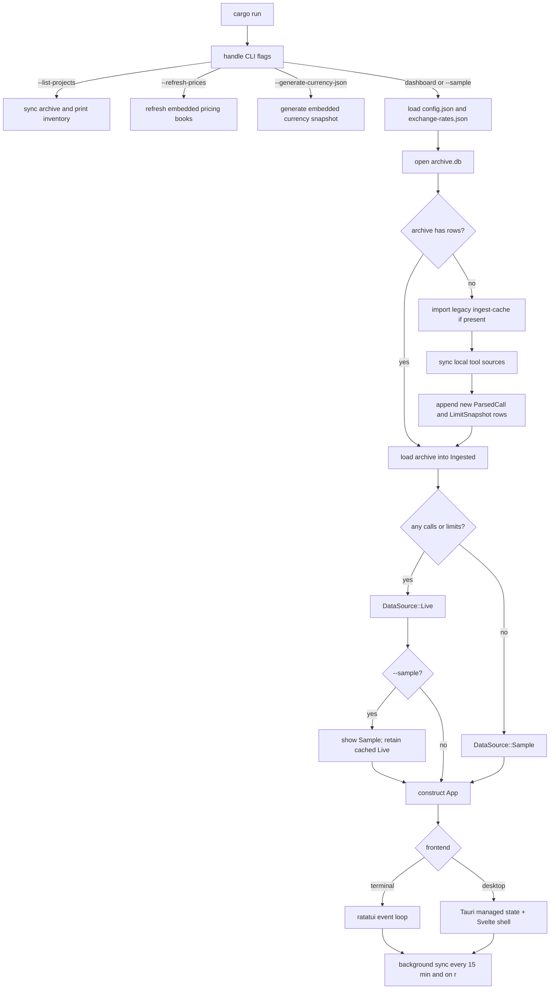
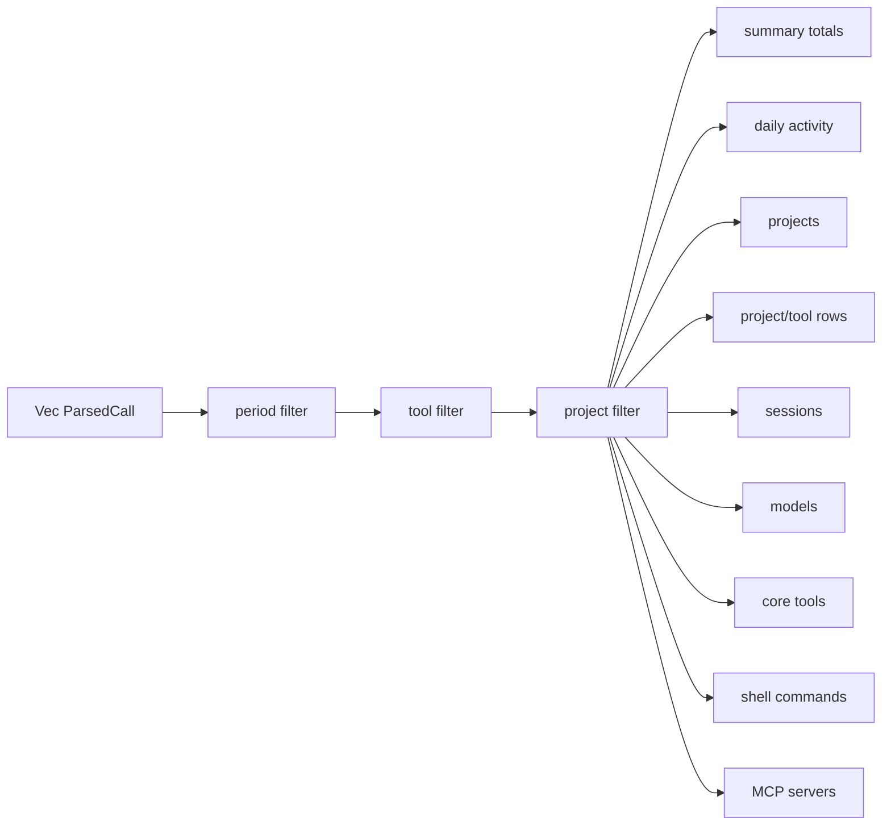
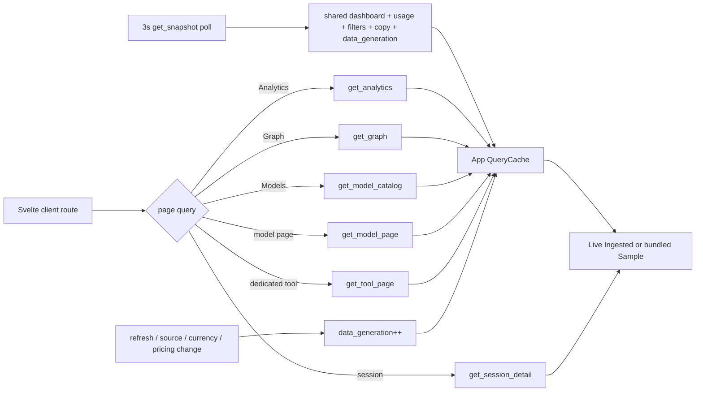
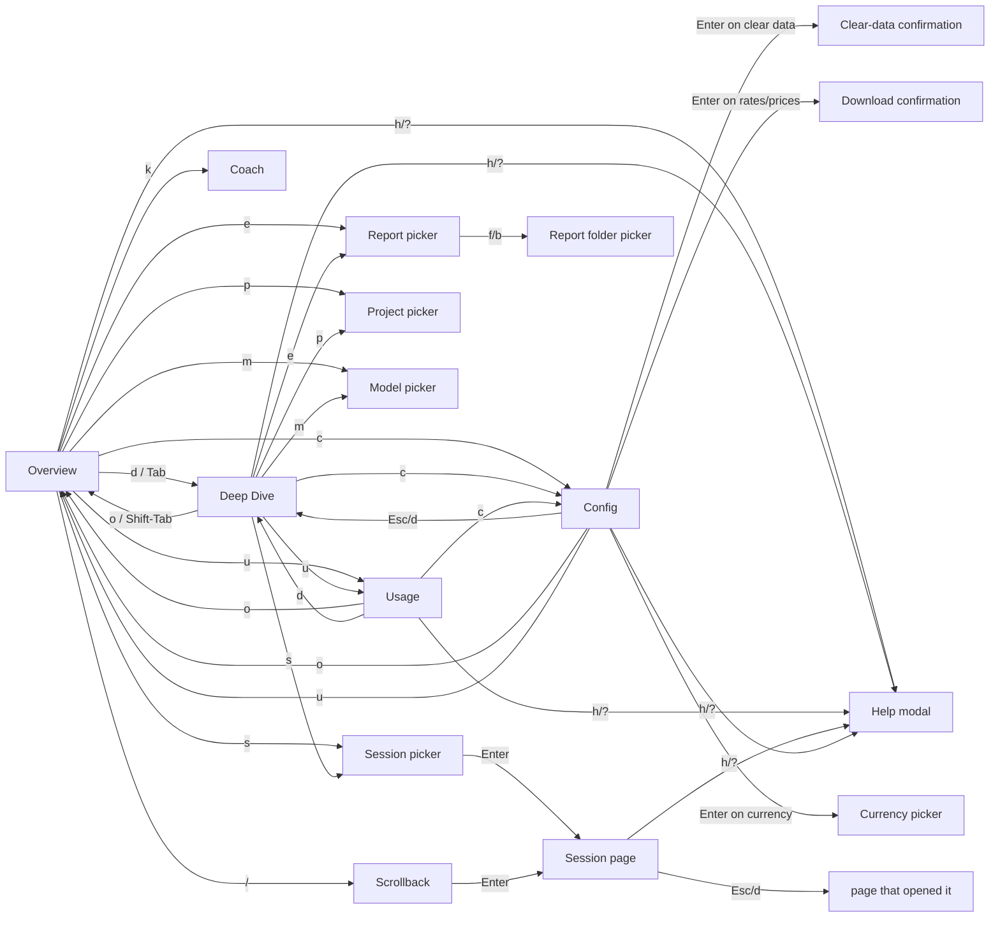
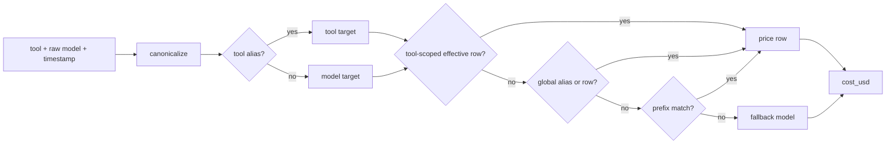

# Architecture

`tokenuse` keeps usage ingestion local: read local session files, append normalized records to its own archive, aggregate in memory, and render a dashboard. The TUI is the default frontend, and the Tauri desktop app is a second frontend over the same Rust core. There is no daemon and no file watcher. Network access is limited to explicit confirmed Config-page downloads, Copilot / Claude.ai / ChatGPT (Codex) quota sync, and maintainer refresh flags. The Claude.ai and ChatGPT quota sync features store a session cookie locally in the OS keychain (via the `keyring` crate) and are gated behind the `quota-sync` Cargo feature. Quota sync always starts with an explicit confirmed Config-page action; once a provider is opted in (a stored keychain cookie for Claude/Codex, an existing `limits/copilot.json` sidecar for Copilot) the background refresher re-fetches it every 15 minutes and at the start of each manual reload, and every quota request carries a 20-second timeout so the shared refresher thread cannot hang on a stalled connection.

## Startup Flow



The durable archive lives at `<config dir>/tokenuse/archive.db`. If it already has rows, startup loads it immediately and queues an incremental background sync so the dashboard opens without reparsing every source. If the archive is empty, startup imports the legacy `~/.cache/tokenuse/ingest-cache.json` snapshot when present, performs one synchronous source sync, then renders from the archive. If the archive cannot be opened or migrated, the app falls back to raw `ingest::load()` for that run.

Both Config pages can also clear local usage data after confirmation. That path deletes `archive.db`, recreates the schema, and immediately syncs local tool sources so per-source fingerprints are rebuilt from scratch. Config files, rates, pricing books, limit sidecars, legacy pricing snapshots, and generated reports are kept; archive-only history is lost if the original source files are no longer present. Since v7 the archive also holds the Scrollback transcript index, so both Config pages lead the Clear Data row's value with the current archive size (`Archive {size} incl. transcript index`, binary units) and Clear Data remains the purge path for captured transcript text.

The startup loader lives in `src/runtime.rs` so both frontends use the same config, currency, archive, fallback, and background refresh setup. `tokenuse --sample` changes the TUI's initial visible source but retains any loaded live snapshot, so `Shift-D` can restore it. The desktop app stores an `App` instance behind Tauri managed state and exposes narrow commands for filters, pure page queries, session lookup, config actions, refresh, reports, desktop settings, and the tray popover. It also runs a small backend monitor that continues calling `App::poll_reload()` while the webview is hidden, drains queued background usage alerts, and sends native notifications from Rust. See [Desktop app usage](../guides/desktop-usage.md).

New sessions written while either frontend is open are visible after archive sync — press `r` to sync on a background thread. The previous snapshot remains visible during refresh. The TUI reports status in its title treatment; the desktop uses transient bottom-right toasts. Each event loop drains completed results through `App::poll_reload`. The refresher runs one sync at a time; if several results complete between UI ticks, the latest result wins. Failures or empty sync results keep the prior data unchanged.

Desktop background alerts use the unfiltered live archive totals as their baseline: cost in USD, activity tokens, and call count across all tools/projects. Automatic refresh deltas accumulate until one configured threshold crosses, then an alert is queued, the baseline resets to the new totals, and the cooldown starts. Manual refreshes reset the baseline without alerting. The thresholds live under `background_alerts` in `config.json`; sample-only startup data does not trigger alerts. Desktop-only startup preferences live under `desktop` in `config.json` and currently control open-at-login plus Dock/taskbar visibility.

Individual adapter discovery or parse errors are skipped so one malformed source does not stop the whole dashboard. If the archive has no calls or limits after sync, the UI shows sample data and a status message. Bundled sample data lives in `src/data/sample_data.json` and is embedded at build time.

## Normalized Record

Every adapter emits `ParsedCall` from `src/tools/types.rs`. The important fields are:

| Field | Meaning |
| --- | --- |
| `tool` | Stable internal tool id such as `claude-code`, `cursor`, `codex`, `copilot`, or `gemini` |
| `model` | Raw or inferred model name before display shortening |
| `input_tokens`, `output_tokens` | Billable input/output buckets after adapter-specific normalization |
| `cache_creation_input_tokens`, `cache_read_input_tokens` | Cache write/read buckets when the tool exposes them |
| `cached_input_tokens` | Cached input reported inside `input_tokens`, currently used for OpenAI-style records |
| `reasoning_tokens` | Reasoning bucket when exposed or estimated |
| `web_search_requests` | Server-side web search request count when exposed |
| `cost_usd` | Calculated from the configured pricing table at import time |
| `tools`, `bash_commands` | Tool call names and split shell commands |
| `timestamp`, `session_id`, `project` | Aggregation and filtering keys |
| `dedup_key` | Per-call key used by the shared run-level dedup set |
| `is_canceled` | Turn was interrupted, where the source records it (see per-tool signal matrices) |
| `prompt_chars`, `response_chars` | Full prompt/response lengths; `None` when the source lacks the signal |
| `elapsed_ms` | User-message to assistant-message turn latency |
| `code_blocks` | AI code output as `{language, loc}` pairs from fences and Write/Edit-style payloads |
| `edited_files`, `referenced_files` | File paths touched/read by the turn's tool calls |
| `interaction_mode` | `agent`, `chat`, `plan`, or `unknown` when locally observable |
| `token_quality` | `exact`, `estimated`, `mixed`, or `unknown` provenance for token totals |
| `timestamp_quality` | `exact`, `session`, `file`, or `unknown` provenance for the timestamp |
| `superseded_dedup_keys` | Transient exact legacy rows replaced by a reconstructed canonical call; never persisted |
| `transcript_user`, `transcript_assistant` | Archive-only full turn text for Scrollback search; written to SQLite during sync and never loaded back into memory |

The cancellation-through-file fields are the archive v4 Coach enrichment; archive v5 adds mode and quality provenance plus safe transient supersession — see [Coach engine](coach.md). The two transcript fields feed the archive v7 transcript store — see [Archive And Sync](#archive-and-sync).

## Model Identity

Adapters retain the raw or inferred `ParsedCall.model`. Aggregation resolves `(tool, model)` through `src/models/registry.json`, producing a canonical id, display name, provider, and family before rows are grouped. The registry is ordered and first-match wins; tool-scoped automatic-router rules precede general rules. `models::canonical_key` lowercases identifiers and removes vendor paths, `@` pins, and trailing `-YYYYMMDD` dates, so equivalent ids fold into one row.

Unknown ids use provider-aware readable fallbacks rather than appearing raw. The same canonical-key function is shared with pricing, but registry identity and pricing rows remain separate concerns. See [Model normalisation](models.md) for the schema and update workflow.

## Aggregation



The dashboard panels are built from the filtered call set:

- Summary: cost, call count, tool-qualified session count, cache hit rate, input, output, cache reads, and cache writes.
- Daily Activity: cost and calls by local date.
- By Project: projects with cost, average cost per session, and top tool spend mix.
- Top Sessions: sessions keyed by `tool:session_id`.
- Project Spend by Tool: project/tool rows with cost, calls, session count, and average cost per session.
- By Model: model display name, cost, calls, and cache percentage.
- Core Tools: normalized assistant tool calls.
- Shell Commands: first word of split Bash commands.
- MCP Servers: tool names shaped like `mcp__server__tool`, grouped by server.
- By Activity: thirteen deterministic task categories (coding, debugging, feature, refactoring, testing, exploration, planning, delegation, git, build/deploy, brainstorming, conversation, general) classified per call in `src/categories.rs` — tool patterns first, then keyword refinement on the stored prompt prefix using first-match-by-position. No LLM; the same call always lands in the same category. Rendered on the desktop Analytics page and in `tokenuse overview`.

`App::sort` is a runtime-only `SortMode` (`Spend`, `Date`, `Tokens`) and defaults to spend on launch. Aggregators carry cost, activity tokens (`input + output + cache_creation + cache_read`), and latest timestamp until rows are ordered; count-style tables split a call's cost/tokens evenly across the row occurrences they emit while keeping occurrence counts unchanged. Dashboard views serialize as `DashboardData`. Desktop-specific pure queries additionally build `AnalyticsData`, `GraphData`, the cross-tool `ModelCatalogEntry` list, `ModelPageDetail`, `ToolPageData`, and `SessionDetailView`. Graph aggregation normalizes project identities and model ids through the same registries as the dashboard, attributes capability cost/tokens across occurrences, and returns deterministic display caps plus honest omitted counts. Reports build a separate `ReportDataset` from raw `Ingested` calls and limits.

### Query Cache And Desktop Polling

`App` owns a `QueryCache` keyed by every input that can affect a result: period, tool, project identity, model canonical id, sort or graph metric, and currency as appropriate. It memoizes dashboard, Usage, model-catalog, model-detail, Analytics, and Graph queries. `data_generation` increments when source data, source selection, currency, pricing, clear-data results, or refresh results change; the next query drops the old generation's entries before rebuilding.

This cache is load-bearing for the desktop. The Svelte shell polls `get_snapshot` every three seconds, but an unchanged filter set reuses the prior aggregate and its leaked `&'static str` display values rather than rebuilding and leaking a new dashboard every poll. Page components request heavier data only when their reactive key changes.



## Frontends, Pages, And Modals

The TUI is a small state machine over seven pages (Overview, Deep Dive, Usage, Coach, Scrollback, Config, Session) plus picker, confirmation, detail, and help modals. Overview, Deep Dive, Usage, Coach, and Scrollback are reachable through the tab strip via `Tab` / `Shift-Tab` or their direct keys; Config and Session are sub-pages opened from any tab. `g` cycles the global sort mode, and `Shift-D` toggles the visible data source between live and sample data when live data is available. Shortcut definitions, help groups, and footer hints live in `src/keymap/keymap.json`; `src/keymap/mod.rs` validates the embedded JSON and resolves keys to action IDs. `src/app.rs` applies those actions to state, while rendering is dispatched from `src/ui/mod.rs`.



- **Overview** (`Page::Overview`): default command-center landing page. Compact KPI strip plus a chronological activity pulse, models, project/tool spend, shell commands, and MCP servers. Acts as the at-a-glance landing for everyday use.
- **Deep Dive** (`Page::DeepDive`): analysis workbench with every panel listed under [Aggregation](#aggregation), including a larger chronological activity trend, top sessions, model efficiency, and core tool counts that are not on Overview.
- **Usage** (`Page::Usage`): per-tool 24-hour console with an activity pulse, optional plan-side rate limit gauges, and top-3 models per tool. Built from `Ingested::limits` over the same `ParsedCall` set plus `LimitSnapshot` records. Entering Usage normalizes the visible period to `Period::Today`, the rolling 24-hour window; project and model filters are deliberately ignored, while sort mode controls section/model order. See [TUI usage](../guides/tui-usage.md#usage-page).
- **Coach** (`Page::Coach`): the practice report card — overall grade, per-group scores, triggered findings, and the advisory Setup panel, sharing the desktop Coach page's data and copy. See [Coach engine](coach.md).
- **Scrollback** (`Page::Scrollback`): full-text transcript search over the archive (see [Archive And Sync](#archive-and-sync)). `/` from the other pages opens it with the query input focused — the TUI's only page-level text input. Enter runs the search synchronously (FTS5 answers in single-digit milliseconds, so the key handler needs no async plumbing) honouring the global tool and project filters; results group per session, Enter drills into the Session page, and results survive the round trip because `ScrollbackState` lives on `App`. Sample mode still searches the live archive — the sample dataset has no transcript index.
- **Session** (`Page::Session`): drill-down for one `tool:session_id`. Rendered from `SessionDetailView`, computed by filtering `Ingested.calls` by `session_key(call) == key` and sorting calls with the active sort mode. Live data shows per-call timestamp, model, cost, in/out tokens, cache, tools used, and a 120-char single-line prompt snippet; selecting a call opens a modal with the full stored prompt plus reasoning/web-search counts, bash commands, interaction mode, token quality, and timestamp quality. Sample mode shows a privacy note since per-call records are not bundled. Closing the session returns to whichever page opened it (`App::session_return_page`), so Scrollback results and Deep Dive positions both survive the drill-down.
- **Config** (`Page::Config`): currency override, local data refresh actions (rates, pricing books, Claude/Copilot limit sidecars), and clear-data archive rebuild. The desktop frontend adds native-only controls for open-at-login and Dock/taskbar visibility on its Config page without changing the TUI state machine.
- **Project picker, Model picker, Currency picker, Session picker** (`*Modal` structs): each holds `options`, a typeable `query`, and a `filtered: Vec<usize>` mapping; all share the same case-insensitive substring filter pattern. The project and model pickers pin `All` regardless of query; a selected model becomes a `ModelFilter` that scopes the dashboard and session queries alongside the tool and project filters.
- **Report picker** (`ExportModal`): report chooser for format, period, project/all-projects scope, and redaction. It defaults to the current period and project, always includes all tools, and writes HTML, PDF, SVG, PNG, JSON, Excel, or a CSV folder.
- **Report folder picker** (`FolderPickerModal`): directory-only picker rooted at the current report folder. `Use this folder` updates `App::export_dir` for the running session; `Esc` cancels without saving to `config.json`.
- **Help** (`help_open: bool`): full keybinding reference rendered from the shared keymap, openable from any page with `h` or `?`. Closes with `h`, `?`, or `Esc`.

The modal state is checked in priority order in `App::handle_key`: help, call detail, currency, clear-data confirmation, download confirmation, project, session, report folder picker, then report. The active context is passed to the keymap resolver before `App` applies the returned action. The folder picker is the only nested modal and sits on top of the report picker.

### Desktop Router And Screens

Desktop page state is owned by `desktop/src/lib/router.svelte.ts`; it is deliberately not serialized through `App::page`. The persistent sidebar links Overview, Analytics, Graph, Coach, Scrollback, Models, Projects, then Tools directly above every individual tool row, and Config. Direct tool rows sort by the numeric call counts in the rolling 24-hour Usage snapshot, while primary routes stay fixed. `Tab` cycles the nine primary sidebar screens in that order. Session is a sub-route opened from session rows on Analytics, the tool pages, the project pages, and Scrollback results, or from the session picker; closing it returns to the route it was opened from and restores that page's scroll offset. Projects follows the same parent/sub-route shape as Tools: the parent route renders the full uncapped project index (`get_project_index`), and `Route.project` selects a per-project page (`get_project_page`) whose payload bundles the project-filtered dashboard, the full session-option list, discovered sources, and the Coach output/activity profile. Project rows on Overview, Analytics, Graph, and the tool pages route into those project pages, and model rows route into model pages from every shared model table. Drill-in opens push the originating route and scroll position onto a return trail; the detail pages' back chip and `Esc` pop it (after call detail, modals, and session), while plain navigation clears it.

- **Overview** uses the shared dashboard query for hero KPIs, current utilisation, activity, projects, and models.
- **Analytics** combines shared ranked tables with `get_analytics` stacked daily/tool data, hour-by-weekday activity, and provider/tool shares.
- **Graph** calls `get_graph` only when its period/tool/project/metric key changes. Projects and AI-stack lenses select different exact relation types from the same bounded payload; optional capability layers remain client-side toggles. Its module-scoped view state preserves the lens, selection, and 3D camera target across entity drill-ins without persisting local names to disk.
- **Coach** calls `get_coach` for practice scores, findings, flow/pace, AI code output, and the day list, plus `get_coach_timeline` for the selected day's session Gantt. The TUI Coach page renders the same data and copy. See [Coach engine](coach.md).
- **Scrollback** searches the archive's transcript index through the `search_transcripts` Tauri command, which runs `src/search.rs` on the blocking pool over its own read-only connection (deliberately skipping the shared `App` lock). Queries are debounced 300 ms as you type (minimum two characters; Enter searches immediately). Page state lives in a module store (`desktop/src/lib/scrollback.svelte.ts`, the router pattern) so drilling into a session and returning restores the query, filters, and results without refetching.
- **Tools** renders the parent route as a fixed 24-hour overview from the shared usage snapshot — one KPI card per tool linking to its sub-route. A tool sub-route calls `get_tool_page` for period-aware KPIs, utilisation, projects, models, and sessions.
- **Models** follows the same parent/sub-route shape as Projects: the parent route calls `get_model_catalog` for all five periods, groups canonical models by provider, and uses the active period for ranking; `Route.model` selects a per-model page (`get_model_page`) whose payload bundles the model-filtered dashboard, the model's session options, its per-tool split, and a token-composition/pricing detail block.
- **Projects** uses shared project/session rows and pure `get_session_detail` lookups for project-to-session-to-call drill-down.
- **Config** operates on the shared `App` plus desktop settings, updater state, and the live/sample toggle.

Desktop navigation and modal shortcuts resolve in `desktop/src/lib/shortcuts.ts` and `App.svelte`; typed data actions invoke narrow Tauri commands directly. The checked-in keymap still owns TUI behavior and the copy deck used for footer hints, but the desktop no longer calls a backend `handle_shortcut` or serializes TUI page state. Route changes use Motion actions, status changes become temporary toasts, and long page panels scroll internally beneath the sticky header.

Terminal graph primitives live in `src/ui/graphs.rs`. They provide relative block sparklines, ranked bars, and compact gauges without another charting dependency. The desktop extends the same language with D3-backed SVG activity, stacked-bar, donut, and heatmap components plus rank strips and gauges. The relationship explorer is the exception: `3d-force-graph` and Three.js provide the local WebGL scene, orbit controls, and object picking around deterministic positions and D3 forces. Type-specific depth planes, density-aware camera framing, drag, selection, and reduced-motion settling stay in the Svelte component; the library receives only the already-bounded local payload and performs no outbound request. `DashboardData.activity_timeline` is the chronological source for TUI Overview/Deep Dive and desktop Overview/Analytics: 24 Hours and 7 Days use hourly buckets, This Month uses hourly buckets until day 15 and daily buckets afterward, and 30 Days/All Time use daily buckets. `Period::Today` is a rolling last-24-hours filter, not a local calendar day. The tray requests a dedicated 24-hour snapshot and renders compact totals plus urgent utilisation rows without mutating main-window filters. `DashboardData.daily` remains the sort-aware table source.

## Project Identity

Raw project strings come from each tool's local data. Before display, `tokenuse`:

1. normalizes path separators and trims trailing slashes
2. folds absolute paths to the nearest existing Git root when one exists
3. groups costs by that identity across tools
4. displays the shortest unique suffix, such as `tokens` or `dvr/tokens`

`cargo run -- --list-projects` syncs the archive, then prints both the compact project label and the raw project value so ingestion mistakes are easier to spot.

## Archive And Sync

`src/archive.rs` owns the SQLite archive. Schema v7 stores full `ParsedCall` rows, append-only limit snapshots, per-source fingerprints in `source_state`, and the transcript store behind Scrollback search. The v4 migration added Coach enrichment (`is_canceled`, prompt/response chars, elapsed time, code blocks, and file lists); v5 adds `interaction_mode`, `token_quality`, and `timestamp_quality`. Existing timestamped rows migrate as exact, and source fingerprints are cleared once so surviving sources can reparse with stronger metadata. Re-inserted duplicate rows backfill previously empty enrichment/provenance without clobbering stronger archived data. Calls remain unique on `(tool, dedup_key)`.

v6 adds `source_state.cursor_json`: an adapter-owned incremental-parse cursor persisted beside the fingerprint (purely additive — no forced re-parse). The `ToolAdapter::parse_with_cursor` hook receives the stored cursor and returns the next one; the default ignores cursors and parses fully. Claude Code is the only adapter that implements it: its session JSONL files are append-only, so grown files resume from a stored per-file byte offset instead of re-reading every session in the project directory (see the Claude Code tool doc for the mechanism and boundary caveats). The sync status line on both front-ends appends `· N tail-resumed` when any file resumed this way.

Targeted deletion happens only through supersession, where a new call carries the transient exact legacy dedup keys it replaces and those listed rows are deleted in the same transaction after the insert is accepted. Cursor canonical reconstruction uses it to retire pre-reconstruction rows, and the Codex v6 re-keying uses it to retire legacy path-based rows (inheriting the replaced row's import-time cost when the token buckets match, so migration never reprices history). Historical rows with missing/unreconstructable sources are never bulk-deleted. Ordinary source deletion remains append-preserving.

The source fingerprint hook defaults to file metadata for file-backed sources and recursive directory metadata for directory-backed sources. Sources are tagged as session or limit sources. Session sources must parse calls successfully before their fingerprint is advanced; limit sidecars must parse limit snapshots successfully before their fingerprint is advanced. When a source fingerprint has not changed, sync skips parsing it. When it changes, sync parses the source, inserts only new call keys, stores any new limit snapshots, and updates the fingerprint.

Codex imports limit snapshots from the same rollout JSONL files as calls. Claude Code and Copilot import optional local sidecars from `<config dir>/tokenuse/limits/`: Claude Code reads a status-line JSON capture, while Copilot reads the local `copilot.json` written by the confirmed Config-page sync action. The opt-in `claude_subscription` and `codex_subscription` adapters write `claude_subscription.json` and `codex_subscription.json` sidecars from the same directory; they call Claude.ai's and ChatGPT's user-facing usage endpoints with a session cookie pulled from the OS keychain, and tag the resulting `LimitSnapshot` rows with the existing `claude-code` / `codex` tool IDs so gauges appear inside those sections.

The old JSON ingest cache is now legacy seed input only. New runs do not write `~/.cache/tokenuse/ingest-cache.json`.

### Transcript Store And Scrollback Search

v7 adds the Scrollback transcript store, entirely inside `archive.db`: a `transcripts` table — one row per turn, unique on `(tool, dedup_key)`, with `session_id`, `project`, `timestamp`, `user_text`, `assistant_text`, and an `origin` of `'prompt'` or `'full'` — plus an external-content FTS5 table `transcripts_fts` (`unicode61` tokenizer with `remove_diacritics 2`) kept in sync by `AFTER INSERT`/`DELETE`/`UPDATE` triggers. All five parsers capture full user and assistant turn text through two archive-only `ParsedCall` fields (`transcript_user`, `transcript_assistant`); thinking/reasoning text is excluded everywhere. The fields are written to SQLite during sync and never loaded back — `load_calls()` leaves them `None` — so the resident dataset stays text-free and the display `user_message` stays truncated at 500 chars.

The v7 migration seeds fallback rows from already-archived truncated prompts with `origin = 'prompt'`, so sessions whose source files were deleted before the upgrade stay prompt-searchable, then clears `source_state` to force one full re-parse that re-reads surviving sources with transcript capture and upgrades their rows to `origin = 'full'` (each adapter's fingerprint version, and Claude Code's incremental-cursor `PARSE_VERSION`, was bumped for the same reason). Transcript upserts are grow-only per column — a fresh parse of an append-only source is a superset of what was archived, so longer text wins and a weaker parse never clobbers captured text — with one exception: Claude tail-resumed continuations append their assistant blocks to the stored row, cooperating with the v6 cursor-based tail parsing. Superseded Cursor and Codex rows delete their transcript rows in the same transaction as their call rows.

`src/search.rs` is the query side. `search_transcripts(paths, query, filters)` opens its own read-only SQLite connection per query, so callers on any thread — the TUI key handler, the desktop `search_transcripts` Tauri command, the MCP `scrollback` tool — never contend with the sync writer's connection and can never mutate the archive. Raw input is sanitised into a safe MATCH expression: each whitespace-separated token becomes a quoted phrase (neutralising FTS5 operators such as `-`, `OR`, and `NEAR(`), the final token matches by prefix, and terms are ANDed. Ranking uses bm25 with user text weighted 2:1 over assistant text (prose outranks code-heavy assistant output); results are grouped per session — 20 by default, capped at 50 — each with up to three snippets carrying highlight spans, a `prompt_only` flag for sessions whose only matches are migration-seeded prompt fallbacks, and the session's summed call cost. The project filter accepts a project identity and is expanded to every raw archived project string it groups. The unicode61 tokenizer means word/prefix matching only: no infix substring matches and weak CJK segmentation.

## MCP Server

`src/mcp.rs` is a read-only MCP server with a transport-agnostic core: `McpServer::handle_line(&str) -> Option<Value>` parses one JSON-RPC message and returns the response (`None` for notifications), with a 15-minute-TTL data cache fed by `archive::sync_and_load`. Two transports front it:

- **stdio** (`tokenuse mcp`): newline-delimited JSON-RPC on stdin/stdout, spawned per client session. No network, no async runtime.
- **Streamable HTTP** (`src/mcp/http.rs`; `tokenuse mcp --http`, or the desktop app's Config-page toggle): a hand-rolled `std::net::TcpListener` bound to `127.0.0.1` only — still no async runtime and no new dependencies. `POST /mcp` carries one JSON-RPC message per request and answers `application/json` (HTTP 202 for notifications); `GET` is 405 and no `Mcp-Session-Id` is issued, which is the spec's stateless mode. Every request must present `Authorization: Bearer <token>` — the token lives beside the pseudonym salt at `<config dir>/tokenuse/mcp-token` (0600 on Unix; created on first use, deleted to rotate) — and `Host`/`Origin` headers must be localhost, so browsers and DNS-rebinding pages cannot reach the endpoint. One shared `Mutex<McpServer>` serves all connections (thread-per-connection, `Connection: close`), so the TTL cache is shared and tool calls serialize. Shutdown raises an `AtomicBool` and self-connects to unblock the blocking `accept()`.

The desktop backend hosts the listener via `desktop/src-tauri/src/mcp_http.rs` (process-global handle; started at launch when `config.json`'s `mcp.http_enabled` is set, toggled by the `set_mcp_http_enabled` / `set_mcp_http_port` commands). The snapshot carries only `{enabled, port, running, endpoint, last_error}`; the token is fetched on demand by `reveal_mcp_token` and never rides the 3-second poll. The desktop endpoint always pseudonymises project names; `--real-names` exists only on the CLI transports.

See [MCP server](mcp-server.md) for the full transport internals (request lifecycle, security-gate matrix, shutdown, data-freshness cache) and the four tools' input and output schemas, with diagrams.

## Deduplication

A single shared `HashSet<String>` is passed through every adapter during a run. Each parser creates a stable `dedup_key` for the call shape it understands:

- Claude Code: message id, falling back to timestamp; within a file, later streamed lines of the same message id merge into the first line's call instead of being dropped
- Cursor bubbles: conversation id, timestamp, and token counts
- Cursor Agent KV: request id
- Cursor Agent transcripts: transcript path, conversation id, and turn index
- Codex: session lineage (the fork parent's session id when forked, else the session's own id) plus the cumulative token breakdown, so forked rollouts that replay parent history collide instead of double counting
- Copilot: session id and message id
- Gemini: session id and message id

Session counts are tool-qualified, so `claude-code:s1` and `codex:s1` remain separate sessions even if the raw session id text matches.

## Pricing

Pricing is embedded as two compile-time books under `costs/`. At runtime, `PriceTable::configured()` first looks for local `pricing-upstream.json` and `pricing-overrides.json` in the tokenuse config directory, then falls back to the embedded books. A legacy local `pricing-snapshot.json` is still accepted for older installs.



Canonicalization lowercases model names, drops a vendor prefix such as `anthropic/`, strips an `@pin` suffix, and removes trailing `-YYYYMMDD` date stamps. Aliases such as `anthropic-auto` and `openai-auto` resolve through the overrides book; `cursor-auto` is a direct Cursor Auto pricing row. Tool aliases are scoped, so Copilot display names do not affect Codex/OpenAI/Claude/Gemini calls.

The pricing formula is:

```text
cost = multiplier * (
    input_tokens * input_rate
  + output_tokens * output_rate
  + cache_creation_input_tokens * cache_write_rate
  + cache_creation_1h_share * cache_write_rate * 0.6
  + cache_read_input_tokens * cache_read_rate
  + web_search_requests * web_search_rate
)
```

Claude Opus fast mode uses the model row's `fast_multiplier` when present. The `cache_creation_1h_share` term is the 1-hour-TTL share of cache writes (currently only reported by Claude Code); Anthropic bills 1h writes at 2x base input versus 1.25x for 5m, so the share adds a 0.6x surcharge on top of the books' 5-minute cache-write rate already charged in the line above. The share is a transient import-time pricing input and is not persisted to the archive. Cache-rate labels in the UI are derived from `cache_read_rate / input_rate`, not from observed cache-hit percentage. The maintainer CLI refresh command reads `pricing-sources.json`, fetches configured upstream feeds and official-source tables, then rewrites both checked-in books:

```bash
cargo run -- --refresh-prices
```

The TUI and desktop configuration pages can also download the published pricing books into the local config directory after confirmation and reload pricing in-process. Because the archive stores `cost_usd` at import time, refreshed pricing applies to newly imported calls; existing historical rows keep their original USD cost. Builds made with `--no-default-features` compile without these download actions.

See [Pricing and cache rates](pricing.md) for provider source quotes, current cache-read multipliers, and parser caveats.

## Reports

Press `e` on Overview, Deep Dive, Usage, or Session to open the report picker. Output defaults to the user's Downloads folder, falling back to `~/Downloads` and then `<config dir>/tokenuse/reports/` if the platform does not expose a Downloads directory. Press `f` or `b` inside the report picker to choose another folder for the current TUI session. Report files never overwrite prior runs: every filename is timestamped with `YYYYMMDDTHHMMSS` and slugged with the chosen period and project scope.

Reports are built from raw `Ingested` calls and limits through `ReportDataset`, not from the visible dashboard snapshot. Scope is period plus project or all projects; tools are always included together. Redaction is off by default and, when enabled, replaces prompts, shell commands, raw paths, session IDs, and dedup keys with report-local placeholders while preserving totals and costs.

| Format | Output | Notes |
| --- | --- | --- |
| HTML | one `.html` file | Client-ready executive report deck with cover metadata, KPI ribbon, insight tiles, activity page, and breakdown page. |
| PDF | one `.pdf` file | Fulgur-rendered A4 landscape version of the same executive report deck. |
| SVG | one `.svg` file | One-page 16:9 executive visual summary with KPI strip, readable activity heatmap/trend, and top project/model/session highlights. |
| PNG | one `.png` file | Same one-page executive summary rendered through `plotters`' bitmap backend. |
| JSON | one `.json` file | Pretty-printed full `ReportDataset`. |
| Excel | one `.xlsx` file | Multi-sheet workbook: Summary, Activity, Projects, Project Tools, Sessions, Calls, Models, Tools, Commands, MCP Servers, By Activity (task categories), Limits Latest, Limits Raw, and Metadata. |
| CSV | a directory of `.csv` files | One file per Excel/report area with hand-written RFC 4180 escaping. |

The report pipeline depends on `plotters` for SVG/PNG summaries, `fulgur` for browserless HTML/CSS-to-PDF rendering, `rust_xlsxwriter` for Excel, and `serde_json` for JSON. HTML generation is hand-written, escaped at render time, and uses no external scripts or network dependency. Full raw data lives in JSON, Excel, and CSV outputs rather than the visual deck/summary reports.

## Configuration And Currency

Runtime settings live in the platform config directory under `tokenuse`:

| File / directory | Purpose |
| --- | --- |
| `config.json` | User overrides, currently the display currency |
| `archive.db` | Durable local usage archive and transcript index loaded by the dashboard |
| `exchange-rates.json` | Locally downloaded copy of the published currency snapshot |
| `rates.json` | Legacy local currency snapshot, accepted for older installs |
| `pricing-upstream.json` | Locally downloaded broad pricing book |
| `pricing-overrides.json` | Locally downloaded official overrides and aliases |
| `pricing-snapshot.json` | Legacy local pricing snapshot, accepted for older installs |
| `mcp-salt` | Persistent salt for MCP project-name pseudonyms |
| `mcp-token` | Bearer token for the opt-in MCP HTTP endpoint (owner-readable only; delete to rotate) |
| `reports/` | Fallback output directory when no Downloads folder can be resolved |

USD is the default display currency. The dashboard still stores calculated spend as `cost_usd`; aggregation sums USD and formats the final display values through the active currency table.

The clear-data Config action deletes and recreates `archive.db`, then reimports local tool history immediately. Rebuilt rows are priced with the current configured pricing table. It intentionally does not delete `config.json`, local `exchange-rates.json`, legacy `rates.json`, local pricing books, legacy `pricing-snapshot.json`, or generated reports.

`costs/exchange-rates.json` is the embedded fallback snapshot. The TUI and desktop configuration pages can download the latest published copy after confirmation from:

```text
https://raw.githubusercontent.com/russmckendrick/tokenuse/refs/heads/main/costs/exchange-rates.json
```

That local rates download writes `<config dir>/tokenuse/exchange-rates.json` and reloads the currency table immediately. Existing local `<config dir>/tokenuse/rates.json` files are still accepted as a legacy fallback. Builds made with `--no-default-features` compile without this download action.

The snapshot is generated from Frankfurter's USD-based v2 rates endpoint, filtered to fiat display currencies, and refreshed by a weekly GitHub Action:

```bash
cargo run -- --generate-currency-json
```
