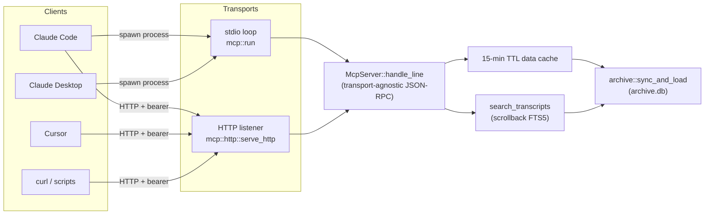
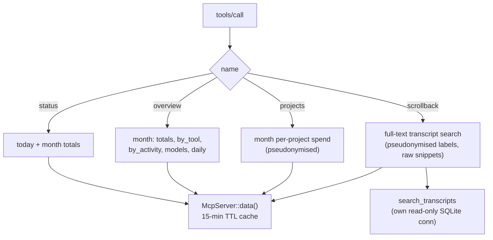
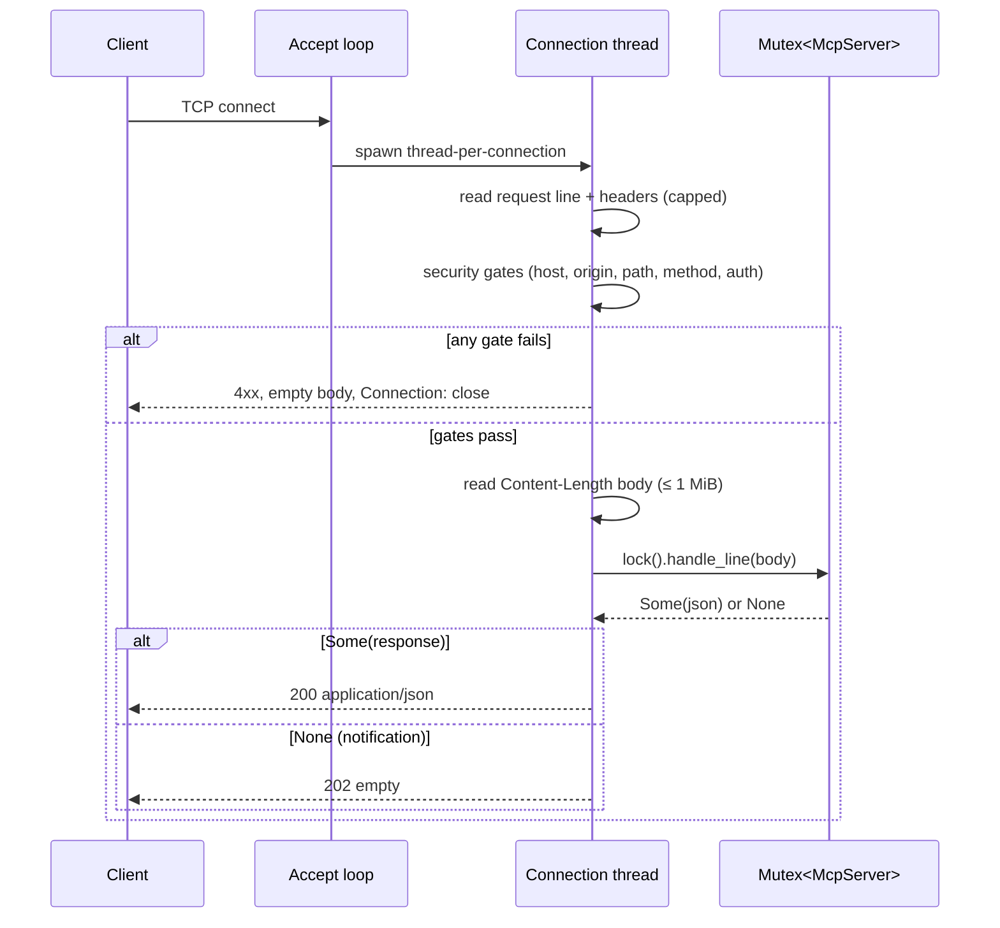
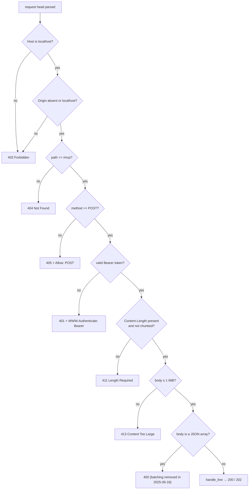
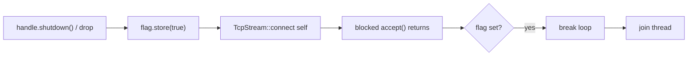
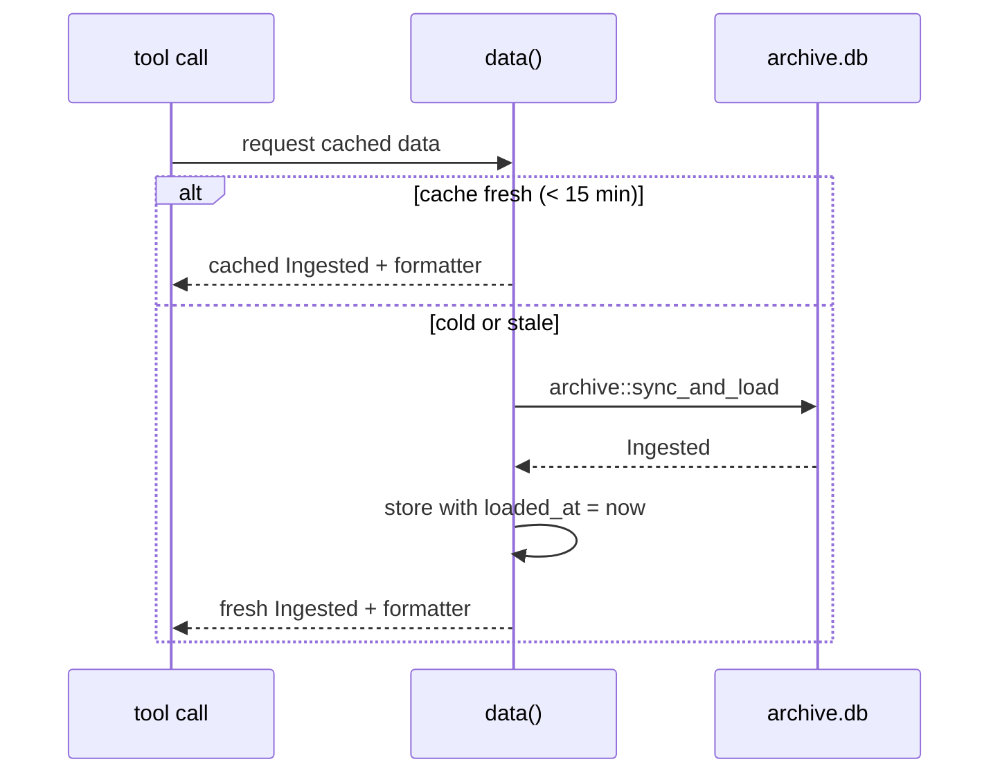
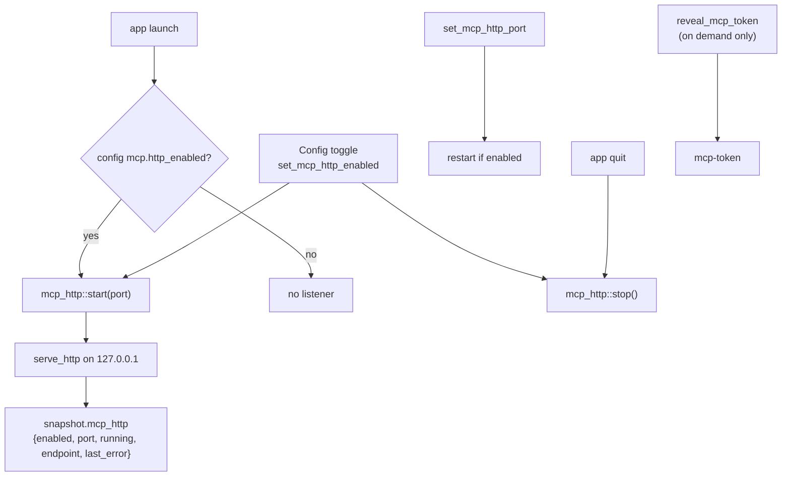

# MCP Server

`tokenuse` ships a read-only [Model Context Protocol](https://modelcontextprotocol.io) server so LLM clients (Claude Code, Claude Desktop, Cursor, and anything else that speaks MCP) can ask about local AI-coding spend without reading the raw session logs themselves. It exposes the same numbers as the scriptable CLI summaries — nothing leaves the machine, and there are no platform API keys, proxies, or telemetry involved.

The server has **one dispatcher and two transports**:

- **stdio** — `tokenuse mcp`. The client spawns the process per session and talks newline-delimited JSON-RPC over stdin/stdout. No network, no listener left behind.
- **Streamable HTTP** — `tokenuse mcp --http`, or the desktop app's Config-page toggle. A loopback-only HTTP listener that runs for as long as its host does, so the desktop app can serve MCP the whole time it is open.

> Source: `src/mcp.rs` (dispatcher + tools + stdio transport), `src/mcp/http.rs` (HTTP transport), `desktop/src-tauri/src/mcp_http.rs` (desktop process-global host).



The design goal is that `McpServer::handle_line(&str) -> Option<Value>` is the single point that parses one JSON-RPC message and returns a response (`None` means "notification, no reply"). Both transports are thin shims that feed it lines and write back its answers, so the tool logic, protocol negotiation, and data cache are shared and only the wire framing differs.

## Quick start

### stdio (per-session process)

```bash
# Register with Claude Code as a command server:
claude mcp add tokenuse -- tokenuse mcp
```

Or wire it into any client's config as command `tokenuse`, args `["mcp"]`. Add `--real-names` to expose real project names instead of pseudonyms.

### HTTP from the CLI (foreground)

```bash
tokenuse mcp --http                 # default port 20151
tokenuse mcp --http --port 20200    # override the configured port
tokenuse mcp --http --real-names    # combine with real names

# It prints where it is listening, then serves until interrupted:
# MCP HTTP server listening on http://127.0.0.1:20151/mcp
```

Register the HTTP endpoint — every request needs the bearer token from `<config dir>/tokenuse/mcp-token`:

```bash
claude mcp add --transport http tokenuse http://127.0.0.1:20151/mcp \
  --header "Authorization: Bearer $(cat "$HOME/Library/Application Support/tokenuse/mcp-token")"
```

The config directory is `dirs::config_dir()/tokenuse` — `~/Library/Application Support/tokenuse` on macOS, `~/.config/tokenuse` on Linux, `%APPDATA%\tokenuse` on Windows.

### HTTP from the desktop app

Open **Config → MCP Server** and flip **Serve over HTTP**. While enabled the app hosts the same endpoint at `http://127.0.0.1:<port>/mcp` for as long as it is open, restarting it on the next launch. The panel shows the endpoint, running state, and a masked token with **Reveal**, **Copy token**, and **Copy command** (a ready-to-paste `claude mcp add …`). The desktop endpoint always pseudonymises project names; `--real-names` is CLI-only.

## Protocol

JSON-RPC 2.0. The dispatcher (`McpServer::handle_request`) handles:

| Method | Behaviour |
| --- | --- |
| `initialize` | Negotiates `protocolVersion`, advertises `capabilities.tools`, returns `serverInfo` and the server `instructions`. |
| `ping` | Empty result. |
| `tools/list` | The four tool definitions with input schemas. |
| `tools/call` | Dispatches to a tool; unknown tool → `-32602`, tool failure → a successful response with `isError: true`. |
| `notifications/*` | No response (returns `None`). |
| anything else | `-32601` method not found. |

Supported protocol revisions (newest first): `2025-06-18`, `2025-03-26`, `2024-11-05`. An unknown requested revision negotiates down to `2025-06-18`. JSON-RPC error codes used: `-32700` parse error, `-32601` method not found, `-32602` invalid params.

## Tools

All four tools are read-only. Costs are API-equivalent prices formatted in the configured display currency. Every payload is returned both as pretty-printed text (`content[0].text`) and, for non-error results, as `structuredContent` for clients that consume typed output.



### `status`

Today's and this calendar month's totals. No arguments.

```jsonc
{
  "currency": "GBP",
  "today":  { "cost": "£42.10", "cost_usd": 56.2, "calls": 320, "sessions": 12,
              "input_tokens": 812004, "output_tokens": 41233,
              "cache_read_tokens": 60540221, "cache_write_tokens": 104322 },
  "month":  { "cost": "£1997", "cost_usd": 2665.1, "calls": 12405, "sessions": 410, "...": "..." }
}
```

Each period carries the `PeriodTotals` fields (`cost_usd`, `calls`, `sessions`, `input_tokens`, `output_tokens`, `cache_read_tokens`, `cache_write_tokens`) plus a `cost` string formatted in the display currency.

### `overview`

This month with no project or session identifiers: totals, the per-tool split, deterministic activity categories, top models, and the daily trend. No arguments.

```jsonc
{
  "period": "This month",
  "currency": "GBP",
  "totals":  { "cost": "£1997", "calls": 12405, "...": "..." },
  "by_tool": [ { "tool": "claude-code", "cost": "£1600", "calls": 9000, "...": "..." } ],
  "by_activity": [ { "label": "Coding", "cost": "£820", "calls": 4100 } ],
  "models": [ { "name": "claude-…", "provider": "Anthropic", "cost": "£1200", "calls": 7000, "cache_rate": 0.86 } ],
  "daily": [ { "day": "2026-07-01", "cost": "£63", "calls": 210 } ]
}
```

### `projects`

This month's per-project spend, busiest first. No arguments. Project names are pseudonymised (`project-<hex>`) unless the server was started with `--real-names`.

```jsonc
{
  "period": "This month",
  "currency": "GBP",
  "pseudonymised": true,
  "projects": [
    { "project": "project-0e99caeba693", "cost": "£1339", "sessions": 180,
      "avg_per_session": "£7.44", "tool_mix": "claude-code, codex" }
  ]
}
```

### `scrollback`

Full-text search across archived session transcripts, grouped per session. Backed by the same `search_transcripts` FTS5 index the TUI and desktop Scrollback pages use (see [Transcript Store And Scrollback Search](architecture.md#transcript-store-and-scrollback-search)).

Arguments:

| Argument | Required | Notes |
| --- | --- | --- |
| `query` | yes | Terms are ANDed; the final term matches by prefix. A blank query is a tool error and never touches the archive. |
| `project` | no | A real project name, a pseudonym from a previous response, or a raw identity — all resolve to the same underlying project. |
| `tool` | no | A tool id such as `claude-code`, `codex`, `cursor`, `copilot`, or `gemini`. |
| `limit` | no | 1–50 matching sessions (default 20). |

```jsonc
{
  "query": "headroom",
  "currency": "GBP",
  "pseudonymised": true,
  "total_sessions": 9,
  "sessions": [
    {
      "session": "claude-code:d6c26f05-…",
      "tool": "claude-code",
      "project": "project-8473062ed331",
      "last_timestamp": "2026-07-05T09:27:31.468+00:00",
      "cost": "£5.87",
      "match_count": 84,
      "prompt_only": false,
      "matches": [
        { "role": "user", "timestamp": "2026-07-05T08:57:25.990+00:00",
          "snippet": "…Terminal showing headroom init configuring Claude Code and Codex…" }
      ]
    }
  ]
}
```

Project **labels** follow the projects-tool pseudonymisation, but **snippets are raw transcript text** — the client is reading its own local sessions. `prompt_only: true` marks sessions whose only matches came from migration-seeded prompt fallbacks (their source files were gone before the transcript store existed).

## HTTP transport internals

The HTTP transport is hand-rolled over `std::net::TcpListener` — no async runtime, no new dependencies, consistent with the crate's "std-only" ethos. It binds `127.0.0.1` only and implements just enough of Streamable HTTP to carry JSON-RPC:

- `POST /mcp` with a JSON body → `application/json` JSON-RPC response, or **HTTP 202** with an empty body when `handle_line` returns `None` (a notification).
- `GET /mcp` → **405** (no server-initiated SSE stream is offered).
- Any other path → **404**.
- **Stateless**: no `Mcp-Session-Id` is issued. This is the spec's stateless mode; clients proceed without a session.

### Request lifecycle



Each connection is served on its own thread with a 10 s read timeout and `Connection: close` (no keep-alive state to manage). One shared `Arc<Mutex<McpServer>>` backs every connection, so the 15-minute data cache is shared and tool calls serialize through the mutex.

### Security gates

Security checks run **before** routing, so a request that fails them learns nothing about what is served. Error responses carry empty bodies (the status line is a protocol constant, not user-facing copy).



| Condition | Status |
| --- | --- |
| Malformed request head | `400` |
| `Host` missing or not `localhost` / `127.0.0.1` / `[::1]` | `403` |
| `Origin` present and not localhost | `403` |
| Path other than `/mcp` | `404` |
| Method other than `POST` (incl. `GET`) | `405` + `Allow: POST` |
| Missing or wrong `Authorization: Bearer` | `401` + `WWW-Authenticate: Bearer` |
| `Transfer-Encoding: chunked` or no `Content-Length` | `411` |
| Body over 1 MiB | `413` |
| Body is a JSON array (batching) | `400` |
| Valid request | `200` (response) or `202` (notification) |

- The `Host` and `Origin` allowlists are the **DNS-rebinding defence**: a browser page on another origin can send requests to `127.0.0.1`, but the browser stamps its real `Origin`/`Host`, so those requests are rejected. Non-browser MCP clients simply omit `Origin`.
- The bearer comparison is length-checked then folded byte-by-byte, so equal-length compares do not short-circuit on the first differing byte.
- Request line is capped at 8 KiB and headers at 16 KiB to bound a hostile head.

### Shutdown

`TcpListener::accept()` blocks, so the handle can't just drop the listener. Stopping raises an `AtomicBool` and makes a throwaway self-connect to `127.0.0.1:<port>` to unblock the pending `accept()`; the loop observes the flag and exits, then the handle joins the thread. This is instant and costs zero CPU while idle, and it is safe to call from a Tauri command handler.



## Data freshness

Every tool call goes through `McpServer::data()`, which keeps an in-memory cache with a **15-minute TTL** (matching the dashboard's background refresh cadence). On a cold or stale cache it runs `archive::sync_and_load` — an incremental archive sync plus load — under the shared mutex, so the first call after the TTL expires can be slower while it catches the archive up. `scrollback` additionally opens its **own read-only, no-mutex SQLite connection** per query (via `search_transcripts`), so transcript search never contends with the sync writer and can run from any thread.



## Configuration and files

Settings live in the shared `config.json` (`UserConfig.mcp`, `src/config.rs`):

```jsonc
{
  "mcp": {
    "http_enabled": false,   // desktop toggle state; started at launch when true
    "http_port": 20151       // default DEFAULT_MCP_HTTP_PORT; 0 normalises back to the default
  }
}
```

Two files sit in the config directory beside `archive.db`:

| File | Purpose |
| --- | --- |
| `mcp-salt` | Persistent salt for project-name pseudonyms. Stable across restarts so pseudonyms stay linkable within a client, but not derivable without the file. |
| `mcp-token` | Bearer token for the HTTP endpoint. Created on first use, `0600` on Unix (Windows relies on the per-user profile ACL). **Delete the file to rotate the token.** |

### Pseudonymisation

Project names are hashed with a salted FNV-1a into `project-<12 hex>`. The salt is generated once from OS entropy (`RandomState`, no `rand` dependency) and persisted to `mcp-salt`, so the same project maps to the same pseudonym across calls and restarts, but a client that has never seen the real names cannot reverse them. `--real-names` (CLI transports only) disables the mapping; the desktop endpoint always pseudonymises. The `scrollback` `project` filter accepts a real label, a pseudonym from a prior response, or a raw identity, so a client can drill from a `projects` result straight into transcript search.

> Note: the token reuses the salt generator. `RandomState` is not a CSPRNG, but 64 hex chars is a 256-bit search space and the only reachable attacker is a local process or browser on loopback. If the endpoint ever leaves localhost, swap in a real CSPRNG.

## Desktop integration

The desktop app hosts the HTTP listener through `desktop/src-tauri/src/mcp_http.rs`, which holds the `HttpServerHandle` in a **process-global static** (there is only ever one listener per process, and this keeps `snapshot(app: &App)` and its ~50 call sites free of a new state field).



- Commands: `set_mcp_http_enabled`, `set_mcp_http_port`, `reveal_mcp_token`. Enabling **binds before persisting**, so a port conflict returns an error and leaves the saved config disabled (the toggle snaps back on the next 3-second snapshot poll) rather than saving a broken state.
- The snapshot carries only `{enabled, port, running, endpoint, last_error}`. The **token is never in the snapshot** — `reveal_mcp_token` fetches it on demand, mirroring the booleans-only subscription-cookie state.
- A port already in use surfaces as a clean bind error (`Address already in use`), which is exactly what happens if both the CLI and the desktop app try the same port.

## Testing

```bash
# Unit tests (in-process TcpStream against a serve_http bound on port 0):
cargo test --lib mcp::

# End-to-end against a live endpoint:
tokenuse mcp --http --port 20151 &
TOKEN=$(cat "$HOME/Library/Application Support/tokenuse/mcp-token")
E=http://127.0.0.1:20151/mcp

# initialize
curl -s -X POST "$E" -H "Authorization: Bearer $TOKEN" -H 'Content-Type: application/json' \
  -d '{"jsonrpc":"2.0","id":1,"method":"initialize","params":{"protocolVersion":"2025-06-18","capabilities":{},"clientInfo":{"name":"curl","version":"0"}}}'

# a tool call
curl -s -X POST "$E" -H "Authorization: Bearer $TOKEN" -H 'Content-Type: application/json' \
  -d '{"jsonrpc":"2.0","id":2,"method":"tools/call","params":{"name":"status","arguments":{}}}'

# security gates
curl -i -X POST "$E" -d '{}'                                             # 401
curl -i "$E" -H "Authorization: Bearer $TOKEN"                           # 405
curl -i -X POST "$E" -H "Host: evil.example" -H "Authorization: Bearer $TOKEN" -d '{}'  # 403
```

The unit tests cover the full gate matrix (401/403/404/405/411/413/400), the 202 notification path, `shutdown` freeing the port, and the `0600` token file mode. `search_transcripts`' own read-only connection means `scrollback` is safe to exercise concurrently.

## Related docs

- [Architecture → MCP Server](architecture.md#mcp-server): where the server sits in the wider system.
- [Architecture → Transcript Store And Scrollback Search](architecture.md#transcript-store-and-scrollback-search): the FTS5 index behind `scrollback`.
- [TUI usage](../guides/tui-usage.md): the `tokenuse mcp` command reference.
- [Desktop app usage](../guides/desktop-usage.md): the Config-page MCP Server panel.
