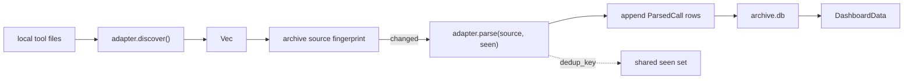

# Tool Ingestion

`tokenuse` reads usage data **directly from local files** written by AI coding tools. There is no proxy, no API key, no telemetry endpoint, and no live watcher.

The UI calls these sources **tools**. Internally each one is implemented as a `ToolAdapter` under `src/tools/<name>/`.

## Supported Tools

| Tool | Status | Source format | Token quality | Doc |
| --- | --- | --- | --- | --- |
| Claude Code | implemented | JSONL session files under `~/.claude/projects/` and Claude Desktop agent sessions | exact usage, cache reads/writes, tool calls | [claude-code.md](claude-code.md) |
| Cursor | implemented | SQLite `state.vscdb` | exact when `tokenCount` exists; estimated fallback otherwise | [cursor.md](cursor.md) |
| Codex | implemented | JSONL rollouts under `~/.codex/sessions/` | exact per-turn token-count deltas | [codex.md](codex.md) |
| GitHub Copilot | implemented | JSONL events from legacy CLI and VS Code Copilot Chat transcripts | legacy output exact when present; transcripts estimated | [copilot.md](copilot.md) |

## Data Path



The same `seen: &mut HashSet<String>` is shared across every tool adapter during one sync, so re-reading the same local record only contributes once. The archive also enforces uniqueness on `(tool, dedup_key)`, which lets changed sources be reparsed without duplicating historical calls.

## Internal Adapter Contract

All tool adapters implement the same trait in `src/tools/mod.rs`:

```rust
pub trait ToolAdapter: Send + Sync {
    fn id(&self) -> &'static str;
    fn display_name(&self) -> &'static str;
    fn discover(&self) -> Result<Vec<SessionSource>>;
    fn parse(
        &self,
        source: &SessionSource,
        seen: &mut HashSet<String>,
    ) -> Result<Vec<ParsedCall>>;
    fn parse_limits(&self, source: &SessionSource) -> Result<Vec<LimitSnapshot>> { /* default */ }
    fn source_fingerprint(&self, source: &SessionSource) -> Result<String> { /* default */ }

    fn model_display(&self, model: &str) -> String { /* default */ }
    fn tool_display(&self, tool: &str) -> String { /* default */ }
}
```

`ParsedCall` from `src/tools/types.rs` is the normalized record every adapter emits and every dashboard aggregator consumes. See [architecture.md](../architecture.md) for field meanings and aggregation behavior.

## Pricing

`src/pricing/snapshot.json` is an embedded LiteLLM-derived price table. Usage ingestion never fetches pricing; the Config page can download a local `pricing-snapshot.json` override only after confirmation.

```text
cost = multiplier * (
    input_tokens * input_rate
  + output_tokens * output_rate
  + cache_creation_input_tokens * cache_write_rate
  + cache_read_input_tokens * cache_read_rate
  + web_search_requests * web_search_rate
)
```

Model lookup canonicalizes model names, resolves aliases such as `cursor-auto`, `anthropic-auto`, and `openai-auto`, then falls back to a default Sonnet row if no match exists. Claude Opus fast mode applies the row's `fast_multiplier`.

Refresh the embedded maintainer snapshot with:

```bash
cargo run -- --refresh-prices
```

## Adding a New Tool

1. Create `src/tools/<name>/{mod.rs, config.rs, discovery.rs, parser.rs}`.
2. Put every path, env var, glob, SQL query, and source constant in `config.rs`.
3. Implement `ToolAdapter` in `mod.rs` and register it in `tools::registry()`.
4. Add a variant to `app::Tool`, update its label and cycle order, and update `ingest::matches_tool`.
5. Add display names in aggregation helpers such as `tool_short_label` when needed.
6. Override `source_fingerprint` only when the default file/directory metadata fingerprint is too broad or too narrow for the source.
7. Write `docs/development/tools/<name>.md` and add it to the supported tools table above.
8. Add parser tests for source validation, token mapping, deduplication, project detection, and tool/bash extraction.

## Verification

- `cargo test` runs parser unit tests, pricing lookup tests, aggregation tests, and render smoke tests.
- `cargo run` launches the TUI and falls back to sample data when the archive has no local calls.
- `cargo run -- --list-projects` syncs the archive and prints normalized project/tool inventory rows for debugging source attribution.
