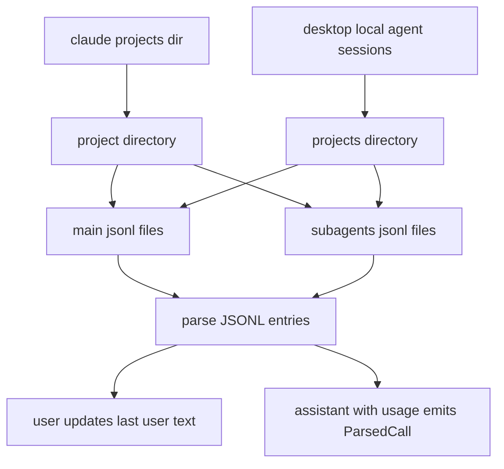
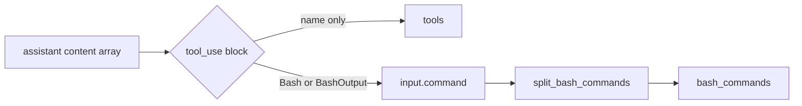

# Claude Code

Claude Code records every assistant message — including token usage and tool calls — to JSONL files on disk. `tokenuse` reads these directly.

> Status: implemented (`src/tools/claude_code/`).

## Where the data lives

| Platform | Path |
| --- | --- |
| All (CLI, projects) | `~/.claude/projects/<sanitized-cwd>/*.jsonl` |
| macOS (Desktop, agent mode) | `~/Library/Application Support/Claude/local-agent-mode-sessions/**/projects/<dir>/*.jsonl` |
| Linux (Desktop, agent mode) | `~/.config/Claude/local-agent-mode-sessions/**/projects/<dir>/*.jsonl` |
| Windows (Desktop, agent mode) | `%APPDATA%/Claude/local-agent-mode-sessions/**/projects/<dir>/*.jsonl` |

Subagent transcripts live in a `subagents/` subdirectory under each project and are read in addition to the main `*.jsonl` files.

**Env var override:** `CLAUDE_CONFIG_DIR` replaces `~/.claude` for the CLI projects path. Useful for sandboxed installs.

Claude entries include a top-level `cwd` field, and that is the authoritative project path for parsed calls. The project directory name is only a lossy fallback: names like `-Users-me-Code-ai-commit-dev` cannot distinguish path separators from real hyphens, so never treat the directory-derived value as canonical when `cwd` is present.

**Discovery rules** (`src/tools/claude_code/discovery.rs`):
- Enumerate immediate subdirectories of `~/.claude/projects/`.
- Walk the Desktop sessions tree to depth 8 looking for any directory named `projects`; treat each child as a session source.
- Skip `node_modules` and `.git` while walking.



## Record format

Each `*.jsonl` is one JSON object per line. Two entry types matter:

```jsonc
// User turn
{
  "type": "user",
  "timestamp": "2026-04-26T10:00:00Z",
  "sessionId": "session-uuid",
  "message": {
    "role": "user",
    "content": "refactor the parser"            // string OR array of {type:"text", text:"..."}
  }
}

// Assistant turn — the only entry type that produces a ParsedCall
{
  "type": "assistant",
  "timestamp": "2026-04-26T10:00:01Z",
  "sessionId": "session-uuid",
  "message": {
    "role": "assistant",
    "id": "msg_01ABC...",                       // dedup key
    "model": "claude-opus-4-7-20250514",
    "usage": {
      "input_tokens": 100,
      "output_tokens": 50,
      "cache_creation_input_tokens": 1000,
      "cache_read_input_tokens": 5000,
      "speed": "fast",                          // optional, "standard" | "fast"
      "server_tool_use": {
        "web_search_requests": 0
      }
    },
    "content": [
      { "type": "tool_use", "name": "Bash", "input": { "command": "ls -la | grep foo" } },
      { "type": "tool_use", "name": "Edit",  "input": { /* ... */ } },
      { "type": "text", "text": "Done." }
    ]
  }
}
```

## Token & cost mapping

| `ParsedCall` field | Source |
| --- | --- |
| `input_tokens` | `message.usage.input_tokens` |
| `output_tokens` | `message.usage.output_tokens` |
| `cache_creation_input_tokens` | `message.usage.cache_creation_input_tokens` |
| `cache_read_input_tokens` | `message.usage.cache_read_input_tokens` |
| `cached_input_tokens` | `0` — Anthropic reports cache reads separately (not included in input) |
| `reasoning_tokens` | `0` — Claude does not report a separate reasoning bucket |
| `web_search_requests` | `message.usage.server_tool_use.web_search_requests` |
| `speed` | `message.usage.speed` (default `Standard`) |
| `model` | `message.model` (preserved verbatim; pricing canonicalizes) |
| `cost_usd` | `pricing::cost(model, &call, speed)` |

Anthropic-specific quirk: cache reads are billed at ~10% of the input rate, and `cache_read_input_tokens` is **not** included in `input_tokens`. The pricing formula handles this directly — do **not** sum the buckets together before pricing.

## Deduplication

`dedup_key = message.id` if present, otherwise `claude:<timestamp>`.

Re-reading the same JSONL across runs is normal; the shared `seen: &mut HashSet<String>` ensures every assistant message contributes once per process.

## Tools / bash extraction

Walk `message.content[]` and collect `name` from every `{ "type": "tool_use" }` block.
- `mcp__server__tool` names are kept in `tools` and surface separately in the dashboard's MCP servers panel (split on `__`).
- For `Bash` and `BashOutput` tool calls, parse `input.command` and split on unquoted `;`, `|`, `&&`, `||`. Each split is a separate command (`tools::jsonl::split_bash_commands`). The dashboard then groups by first word (`first_word`).



## Known limitations

- The user message captured per call is the most recent user turn before the assistant response, truncated to 500 chars. If a user sends multiple messages in rapid succession before any assistant reply, only the last is recorded.
- Synthetic models (`<synthetic>`, used by Claude Code for placeholder rows) hit the pricing fallback — they cost `$0` because their token counts are zero, but they still count toward call totals.
- No live file watching: press `r` or wait for the 15-minute background archive sync to pick up new sessions.
