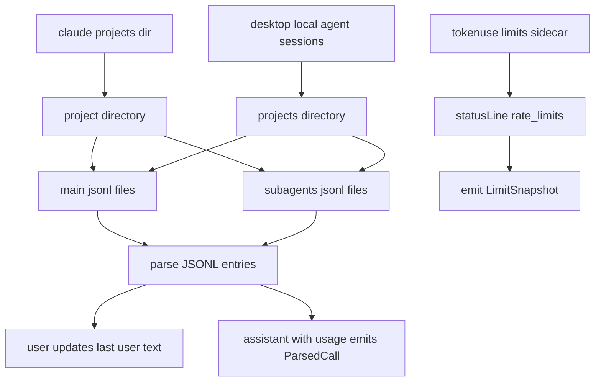
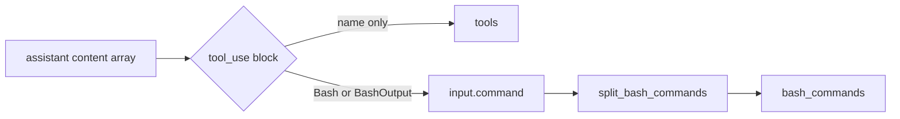

# Claude Code

Claude Code records every assistant message — including token usage and tool calls — to JSONL files on disk. `tokenuse` reads these directly.

> Status: implemented (`src/tools/claude_code/`).

## Where the data lives

| Platform | Path |
| --- | --- |
| All (CLI, projects) | `~/.claude/projects/<sanitized-cwd>/*.jsonl` |
| macOS (Desktop, agent mode) | `~/Library/Application Support/Claude/local-agent-mode-sessions/**/projects/<dir>/*.jsonl` |
| Linux (Desktop, agent mode) | `~/.config/Claude/local-agent-mode-sessions/**/projects/<dir>/*.jsonl` |
| Windows (Desktop, agent mode) | `%APPDATA%/Claude/local-agent-mode-sessions/**/projects/<dir>/*.jsonl` |

Subagent transcripts live in a `subagents/` subdirectory under each project and are read in addition to the main `*.jsonl` files. The whole `subagents/` tree is walked: workflow and ultracode runs nest their agent transcripts as `subagents/workflows/<workflow>/agent-*.jsonl`. Newer Claude Code builds also scope subagent transcripts per session as `<project>/<session-id>/subagents/agent-*.jsonl`; those nested directories are walked the same way.

**Env var override:** `CLAUDE_CONFIG_DIR` replaces the default CLI roots for the projects path. It can contain one path or a comma-separated list of config roots, each expected to contain a `projects/` directory. Without an override, `tokenuse` checks both `$XDG_CONFIG_HOME/claude/projects` (or `~/.config/claude/projects`) and `~/.claude/projects`.

Claude entries include a top-level `cwd` field, and that is the authoritative project path for parsed calls. The project directory name is only a lossy fallback: names like `-Users-me-Code-ai-commit-dev` cannot distinguish path separators from real hyphens, so never treat the directory-derived value as canonical when `cwd` is present.

**Discovery rules** (`src/tools/claude_code/discovery.rs`):
- Enumerate immediate subdirectories of every configured CLI `projects/` root.
- Walk the Desktop sessions tree to depth 8 looking for any directory named `projects`; treat each child as a session source.
- Skip `node_modules` and `.git` while walking.


```mermaid
flowchart TD
    A[claude projects dir] --> C[project directory]
    B[desktop local agent sessions] --> D[projects directory]
    C --> E[main jsonl files]
    C --> F[subagents jsonl files]
    D --> E
    D --> F
    E --> G[parse JSONL entries]
    F --> G
    G --> H[user updates last user text]
    G --> I[assistant with usage emits ParsedCall]
    J[tokenuse limits sidecar] --> K[statusLine rate_limits]
    K --> L[emit LimitSnapshot]
```

## Record format

Each `*.jsonl` is one JSON object per line. Two entry types matter:

```jsonc
// User turn
{
  "type": "user",
  "timestamp": "2026-04-26T10:00:00Z",
  "sessionId": "session-uuid",
  "message": {
    "role": "user",
    "content": "refactor the parser"            // string OR array of {type:"text", text:"..."}
  }
}

// Assistant turn — the only entry type that produces a ParsedCall
{
  "type": "assistant",
  "timestamp": "2026-04-26T10:00:01Z",
  "sessionId": "session-uuid",
  "message": {
    "role": "assistant",
    "id": "msg_01ABC...",                       // dedup key
    "model": "claude-opus-4-7-20250514",
    "usage": {
      "input_tokens": 100,
      "output_tokens": 50,
      "cache_creation_input_tokens": 1000,
      "cache_read_input_tokens": 5000,
      "speed": "fast",                          // optional, "standard" | "fast"
      "server_tool_use": {
        "web_search_requests": 0
      }
    },
    "content": [
      { "type": "tool_use", "name": "Bash", "input": { "command": "ls -la | grep foo" } },
      { "type": "tool_use", "name": "Edit",  "input": { /* ... */ } },
      { "type": "text", "text": "Done." }
    ]
  }
}
```

## Token & cost mapping

| `ParsedCall` field | Source |
| --- | --- |
| `input_tokens` | `message.usage.input_tokens` |
| `output_tokens` | `message.usage.output_tokens` |
| `cache_creation_input_tokens` | `max(usage.cache_creation_input_tokens, usage.cache_creation.ephemeral_5m_input_tokens + ephemeral_1h_input_tokens)` |
| `cache_creation_1h_input_tokens` | `usage.cache_creation.ephemeral_1h_input_tokens`, capped by the total; transient pricing input, never persisted |
| `cache_read_input_tokens` | `message.usage.cache_read_input_tokens` |
| `cached_input_tokens` | `0` — Anthropic reports cache reads separately (not included in input) |
| `reasoning_tokens` | `0` — Claude does not report a separate reasoning bucket |
| `web_search_requests` | `message.usage.server_tool_use.web_search_requests` |
| `speed` | `message.usage.speed` (default `Standard`) |
| `model` | `message.model` (preserved verbatim; pricing canonicalizes) |
| `cost_usd` | `pricing::cost(model, &call, speed)` |

Anthropic-specific quirk: cache reads are billed at 10% of the input rate in current bundled rows, cache writes use the 5-minute 125% rate, and `cache_read_input_tokens` is **not** included in `input_tokens`. The pricing formula handles this directly — do **not** sum the buckets together before pricing. See [Pricing and cache rates](../pricing.md) for source evidence.

**1-hour cache writes.** Newer transcripts split cache writes by TTL under `usage.cache_creation` (`ephemeral_5m_input_tokens` / `ephemeral_1h_input_tokens`). Anthropic bills 1h writes at 2x the base input rate versus 1.25x for 5m, so the pricing formula charges the 1h share a 1.6x premium over the books' cache-write rate. Sessions pinned to 1h caching (long-TTL prompt caching) were underpriced before this split was read.

## Advisor calls

Some messages carry `usage.iterations[]`: a `message`-type iteration mirrors the top-level usage (never separately counted), while each `advisor_message` iteration is its **own billed API call** with its own model (often a cheaper one) and its own token buckets, flat on the iteration object. The parser emits one extra `ParsedCall` per advisor iteration with `dedup_key = <message.id>:advisor:<ordinal>`, where the ordinal counts advisor entries only. Advisor calls carry no tools or enrichment; they share the parent message's timestamp, session, and project. `fallback_message` iterations are not accounted (semantics unknown; matches upstream observations).

## Streamed content blocks

Claude Code writes **one JSONL line per content block**: an assistant message with a text block and three `tool_use` blocks appears as four `type: "assistant"` lines, each repeating the same `message.id` and the same final `usage` payload. Same-id lines are not always adjacent — `tool_result` user lines interleave between them.

The parser creates one `ParsedCall` from the first line of a message id and merges every later line of that id (within the same file) into it: tools, bash commands, edited/referenced files, code blocks, and response text accumulate; token counts, cost, and the timestamp stay from the first line. Observed usage is identical across a message's lines (audited across thousands of duplicate ids), so nothing is summed.

## Deduplication

`dedup_key = message.id` if present, otherwise `claude:<timestamp>`.

Re-reading the same JSONL across runs is normal; the shared `seen: &mut HashSet<String>` ensures every assistant message contributes once per process. Within one file, later lines of an already-seen message id merge into its call (see above); across files (resumed sessions replay history), the first file parsed wins.

On duplicate-key archive inserts, Claude Code rows replace their stored activity columns (tools, bash commands, code blocks, file lists) and never shrink `response_chars` — this migrates rows archived by the pre-merge parser to the complete activity on the fingerprint-bump reparse.

## Tools / bash extraction

Walk `message.content[]` and collect `name` from every `{ "type": "tool_use" }` block.
- `mcp__server__tool` names are kept in `tools` and surface separately in the dashboard's MCP servers panel (split on `__`).
- For `Bash` and `BashOutput` tool calls, parse `input.command` and split on unquoted `;`, `|`, `&&`, `||`. Each split is a separate command (`tools::jsonl::split_bash_commands`). The dashboard then groups by first word (`first_word`).


```mermaid
flowchart LR
    A[assistant content array] --> B{tool_use block}
    B -->|name only| C[tools]
    B -->|Bash or BashOutput| D[input.command]
    D --> E[split_bash_commands]
    E --> F[bash_commands]
```

## Coach signals (archive v4 enrichment)

Beyond token accounting, the parser extracts per-call signals for the desktop Coach page. All of them live in the v4 archive columns and default to `NULL`/empty for rows whose source files no longer exist.

| `ParsedCall` field | Source | Notes |
| --- | --- | --- |
| `prompt_chars` | user `message.content` text length | Measured **before** the 500-char `user_message` truncation |
| `is_canceled` | user line starting `[Request interrupted by user` | Marks the **previous** call of the same session file; covers the "for tool use" variant |
| `elapsed_ms` | assistant `timestamp` − user `timestamp` | Dropped when non-positive or ≥ 2 h (stale carryover guard) |
| `response_chars` | sum of `content[].type == "text"` lengths | Thinking blocks never count |
| `code_blocks` | ``` fences in text blocks **plus** Write `content`, Edit `new_string`, MultiEdit `edits[].new_string`, NotebookEdit `new_source` | Fence tag or file extension → language (`tools::jsonl::normalize_language`); merged per call by language; capped at 32 |
| `edited_files` | `file_path`/`notebook_path` of Write/Edit/MultiEdit/NotebookEdit | Deduped, capped at 64 |
| `referenced_files` | `file_path` of Read | Deduped, capped at 64 |

User lines that are slash-command wrappers (`<command-...>`, `<local-command-...>`) or interrupt markers never become `user_message`/`prompt_chars` — they are UI plumbing, not prompts.

The adapter prefixes its source fingerprints with `claude-code-v4-transcripts`; bumping that constant forces archived sessions back through the parser after an extraction change.

## Transcript capture (archive v7)

Each emitted call also stores its full turn text for Scrollback search: the most recent user message untruncated (unlike the 500-char display `user_message`) and the concatenated `text` content blocks of the assistant message. Thinking blocks are excluded, matching `response_chars`. The text rides the two archive-only `ParsedCall` fields (`transcript_user` / `transcript_assistant`) into the archive's `transcripts` table during sync and is never loaded back into memory.

Two interactions with incremental tail parsing are deliberate. Tail-resumed continuations of a message that spans the resume boundary **append** their assistant blocks to the stored transcript row (prefix and tail blocks are disjoint, mirroring the `response_chars` sum on merge). And the per-file cursor now carries the full last user text — capped at 64 KiB characters to bound the stored cursor JSON — so tail assistant rounds keep their prompt; that cursor-shape change is why `PARSE_VERSION` went `1` → `2`, forcing stale cursors back through a full parse. The `claude-code-v4-transcripts` fingerprint bump forces the one-time re-parse that backfills full text into existing archives.

## Incremental tail parsing (archive v6)

A Claude Code source is a whole project directory, so before v6 a single appended line re-parsed every session file in that project. Session JSONL files are append-only, so the adapter now persists a cursor (`source_state.cursor_json`) with, per file: the byte offset just past the last complete line, an FNV-1a probe of the 256 bytes before it, and the carried cross-line state (last user prompt/chars/timestamp and project) so tail assistant rounds keep their turn context. Cursors cover the 64 newest files by mtime; older files fall back to a full re-parse when touched.

On sync, a grown file whose offset and probe still match seeks straight to the stored offset and parses only the tail; anything else (new files, truncated or rewritten prefixes, a bumped `PARSE_VERSION`) parses fully. A trailing line without a newline is a mid-append snapshot: it is left unconsumed so the completed line parses exactly once on the next sync.

Two signals degrade at the resume boundary by design:

- A message whose streamed lines span the boundary re-emits from the tail with tail-only activity. Those calls carry an archive-only `merge_activity` hint: on the dedup conflict, the archive **concatenates** activity into the existing row (each streamed line holds distinct content blocks), re-dedups file lists, sums `response_chars`, and keeps the stored token counts — instead of the full-reparse path's overwrite.
- An interrupt marker whose call was parsed in an earlier sync no longer flags that call as canceled (the parser cannot reach prefix calls). Cancellation rates can undercount slightly across sync boundaries.

The sync status line (TUI title bar and desktop status bar) appends `· N tail-resumed` whenever files resumed this way. Bump `PARSE_VERSION` in `parser.rs` when parsing semantics change so stale cursors fall back to a full re-parse; bumping `SOURCE_FINGERPRINT_VERSION` already forces the re-parse itself.

## Known limitations

- The user message captured per call is the most recent user turn before the assistant response, truncated to 500 chars. If a user sends multiple messages in rapid succession before any assistant reply, only the last is recorded.
- Synthetic models (`<synthetic>`, used by Claude Code for placeholder rows) hit the pricing fallback — they cost `$0` because their token counts are zero, but they still count toward call totals.
- No live file watching: press `r` or wait for the 15-minute background archive sync to pick up new sessions.

## Rate-limit snapshots

Claude Code does not write plan-window rate-limit usage into the transcript JSONL. It does expose the data to status-line commands for Claude.ai Pro/Max subscribers after the first API response in a session. `tokenuse` imports that data from:

```text
<config dir>/tokenuse/limits/claude-code.json
```

The default sidecar path is platform-specific:

| Platform | Sidecar path |
| --- | --- |
| macOS | `~/Library/Application Support/tokenuse/limits/claude-code.json` |
| Linux | `${XDG_CONFIG_HOME:-~/.config}/tokenuse/limits/claude-code.json` |
| Windows | `%APPDATA%\tokenuse\limits\claude-code.json` |

The sidecar should contain the JSON object Claude Code passes to the configured `statusLine` command. `tokenuse` reads `rate_limits.five_hour.used_percentage`, `rate_limits.five_hour.resets_at`, `rate_limits.seven_day.used_percentage`, and `rate_limits.seven_day.resets_at`, then emits one `LimitSnapshot` with 5h and weekly windows. `resets_at` is a Unix epoch timestamp in seconds.

### Recommended: install the wrapper from the desktop app

Open the **Config** page and click **Install** on the *Claude statusLine* row. Token Use will:

1. Detect whatever is already in `~/.claude/settings.json` (e.g. `cship`).
2. Write a wrapper script under `<config>/tokenuse/statusline/claude-code.sh` (or `.ps1` on Windows) that tees the JSON Claude Code passes on stdin into the sidecar path *and* pipes the same JSON through the previously detected command — so the visible status line is unchanged.
3. Back up `~/.claude/settings.json` to `settings.json.bak.<unix-ts>` and rewrite `statusLine.command` to point at the wrapper.

If you prefer not to let the app touch `settings.json`, choose **Generate wrapper only** in the second dialog. The app will write the wrapper script and tell you the exact path to paste into your settings yourself. **Uninstall** restores the previous `statusLine.command` and removes the wrapper; the sidecar JSON file is left in place.

### Manual setup

A minimal macOS/Linux wrapper can write the sidecar while preserving status output:

```bash
#!/bin/bash
input=$(cat)
if [ "$(uname)" = "Darwin" ]; then
  dir="$HOME/Library/Application Support/tokenuse/limits"
else
  dir="${XDG_CONFIG_HOME:-$HOME/.config}/tokenuse/limits"
fi
mkdir -p "$dir"
printf '%s\n' "$input" > "$dir/claude-code.json"
echo "Claude"
```

A minimal Windows PowerShell wrapper writes the same file under `%APPDATA%`:

```powershell
$inputJson = [Console]::In.ReadToEnd()
$dir = Join-Path $env:APPDATA "tokenuse\limits"
New-Item -ItemType Directory -Force -Path $dir | Out-Null
Set-Content -Path (Join-Path $dir "claude-code.json") -Value $inputJson -NoNewline -Encoding UTF8
"Claude"
```

After configuring Claude Code to use the wrapper as its `statusLine` command, run at least one Claude Code request. Claude only includes `rate_limits` after an API response, so the Config page will continue to show the setup hint until that sidecar exists.
