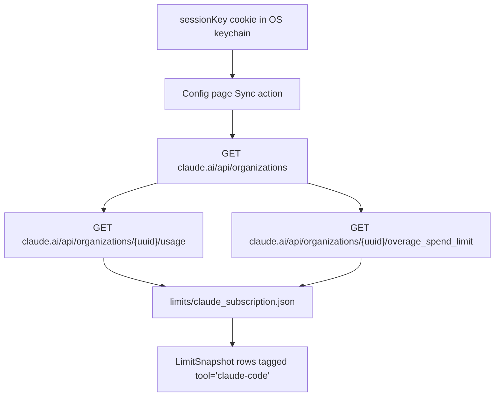

# Claude.ai Subscription Quota

`tokenuse` can optionally show Claude.ai subscription-quota gauges (5-hour / 7-day / 7-day Opus / 7-day Sonnet / Extra Usage) next to your Claude Code spend. It is **opt-in**, **user-triggered**, and gated behind the `quota-sync` Cargo feature (on by default).

> Status: implemented (limits-only adapter, no session ingestion).

## How it works

1. You add your `sessionKey` cookie from `https://claude.ai` to the OS keychain — see [Adding the cookie](#adding-the-cookie).
2. From the Config page, you select **Claude.ai subscription quota → Sync** and confirm.
3. `src/tools/claude_subscription/limits.rs::refresh_sidecar` reads the cookie from the keychain, calls Claude.ai's web-app usage endpoints with browser-style headers, and writes a sidecar JSON to:

   ```text
   <config dir>/tokenuse/limits/claude_subscription.json
   ```

4. The adapter's `discover()` picks up that sidecar on the next ingest pass and emits `LimitSnapshot` rows tagged with `tool = "claude-code"` so the gauges appear inside the existing Claude Code section.



## Adding the cookie

The cookie never leaves your machine. It is stored in:

| Platform | Storage |
| --- | --- |
| macOS | Keychain (Security framework) |
| Windows | Credential Manager (`wincred`) |
| Linux | Secret Service over D-Bus (gnome-keyring / KWallet / KeePassXC). Headless servers without a Secret Service daemon are not supported. |

Service `dev.tokenuse`, account `claude_subscription.session`.

### From the terminal

1. Open `https://claude.ai/settings/usage` in your browser and log in.
2. Open dev tools → Application → Cookies → `https://claude.ai`.
3. Copy the value of the `sessionKey` cookie.
4. Store it:

   ```sh
   tokenuse --set-claude-cookie 'sk-ant-sid01-...'
   ```

5. From the dashboard, press `c` to open the Config page, scroll to **Claude.ai subscription quota**, press Enter, then `y` to confirm.

To clear: `tokenuse --clear-claude-cookie`.

> `--set-claude-cookie <value>` is visible in shell history. Use `read -s` or a similar pattern if that's a concern for your environment.

### From the desktop app

Use the `set_claude_session_cookie` / `clear_claude_session_cookie` Tauri commands. A WebView-driven login flow that harvests the cookie automatically is on the roadmap but not yet shipped — for now the desktop build expects the cookie to be set via CLI or by paste through a future Config-page modal.

## Sidecar format

`tokenuse` writes the sidecar as a wrapper object with the upstream `usage` and `overage` payloads inlined:

```jsonc
{
  "observed_at": "2026-05-11T12:00:00Z",
  "organization_uuid": "abc-def-...",
  "organization_name": "Personal",
  "source_usage": "https://claude.ai/api/organizations/abc-def-.../usage",
  "source_overage": "https://claude.ai/api/organizations/abc-def-.../overage_spend_limit",
  "usage": {
    "five_hour":      { "utilization": 42.5, "resets_at": "2026-05-11T18:00:00Z" },
    "seven_day":      { "utilization": 17.0, "resets_at": "2026-05-18T00:00:00Z" },
    "seven_day_opus":   { "utilization": 0,    "resets_at": null },
    "seven_day_sonnet": { "utilization": 25.0, "resets_at": "2026-05-18T00:00:00Z" }
  },
  "overage": {
    "is_enabled": true,
    "monthly_limit": 5000,
    "used_credits": 1250.0,
    "currency": "USD",
    "out_of_credits": false
  }
}
```

The parser also accepts a raw `usage` object (no wrapper) for manual snapshots.

| `LimitSnapshot` row | Source field | Notes |
| --- | --- | --- |
| `five_hour` | `usage.five_hour.utilization` / `resets_at` | window 300 min |
| `seven_day` | `usage.seven_day.utilization` / `resets_at` | window 10 080 min |
| `seven_day_opus` | `usage.seven_day_opus.utilization` / `resets_at` | window 10 080 min — skipped if utilization is 0 and `resets_at` is null |
| `seven_day_sonnet` | `usage.seven_day_sonnet.utilization` / `resets_at` | window 10 080 min — same zero-skip |
| `extra_usage` | `overage.monthly_limit`, `overage.used_credits` | used % derived; balance in dollars (`(limit − used) / 100`); `out_of_credits` → `rate_limit_reached_type` |

## Errors and re-auth

| HTTP / payload | Behaviour |
| --- | --- |
| `401` | Status bar shows "Claude session expired or unauthorized" — re-run `--set-claude-cookie`. |
| `403` or HTML response | Status bar shows "Cloudflare challenge" — usually means the user-agent/header fingerprint is stale; report an issue. |
| `429` | Status bar shows "rate limited" — wait and retry. |
| overage endpoint `403`/`404` | Treated as "Extra Usage not enabled"; the rest of the sync still succeeds. |

The sidecar is overwritten on every successful sync. There is no historical archive; integrating that is a follow-up.

## Browser fingerprint

The header set in `src/tools/claude_subscription/config.rs` mimics Chrome 131 on macOS, including `anthropic-client-platform: web_claude_ai`, `referer: https://claude.ai/settings/usage`, and the `sec-fetch-*` triplet. Anthropic may change Cloudflare rules at any time; if syncs start failing with `403` / HTML responses, bump the UA in `USER_AGENT` and re-test.

## Privacy posture

- Cookie is stored in the OS keychain only — never in plaintext on disk, never sent anywhere except `claude.ai` over HTTPS.
- No telemetry. No background polling — only the explicit Config-page Sync action triggers a network call.
- Disable the feature entirely with `cargo build --no-default-features` (or omit `quota-sync` from your feature list); the Config row falls back to a "sync unavailable in this build" status.
- This feature accesses your own Claude.ai account using your own credentials. It is for personal monitoring of your subscription quota and does not extract or share account data. Anthropic's Terms of Service govern your use of the underlying endpoints.
