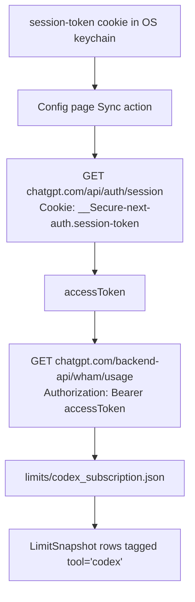

# ChatGPT (Codex) Subscription Quota

`tokenuse` can optionally show ChatGPT (Codex) subscription-quota gauges (5-hour / 7-day / credits balance) next to your local Codex CLI spend. It is **opt-in**, **user-triggered**, and gated behind the `quota-sync` Cargo feature (on by default).

> Status: implemented (limits-only adapter, no session ingestion).

The flow mirrors the Claude.ai subscription adapter — see [claude-subscription.md](./claude-subscription.md) for the full design rationale. Codex differs in three ways:

1. **Auth is two-step.** ChatGPT expects a session cookie (`__Secure-next-auth.session-token`), which you exchange for a short-lived bearer token before calling the usage endpoint.
2. **Endpoint shape.** Quotas come from `/backend-api/wham/usage` with `Authorization: Bearer <accessToken>`, not from a per-organization usage path.
3. **`LimitSnapshot.tool`** is tagged `"codex"` so the gauges appear inside the existing Codex section.

## How it works



## Adding the cookie

Service `dev.tokenuse`, account `codex_subscription.session`.

1. Open `https://chatgpt.com` in your browser and log in.
2. Open dev tools → Application → Cookies → `https://chatgpt.com`.
3. Copy the value of the `__Secure-next-auth.session-token` cookie. **Do not include the `__Secure-next-auth.session-token=` prefix** — just the value.
4. Store it:

   ```sh
   tokenuse --set-codex-cookie '<value>'
   ```

5. Press `c` from the dashboard, scroll to **ChatGPT (Codex) subscription quota**, press Enter, then `y` to confirm.

To clear: `tokenuse --clear-codex-cookie`.

Tauri commands: `set_codex_session_cookie` / `clear_codex_session_cookie`.

## Sidecar format

```jsonc
{
  "observed_at": "2026-05-11T12:00:00Z",
  "source": "https://chatgpt.com/backend-api/wham/usage",
  "usage": {
    "plan_type": "plus",
    "rate_limit": {
      "limit_reached": false,
      "primary_window":   { "used_percent": 33.0, "limit_window_seconds": 18000,  "reset_after_seconds": 7200 },
      "secondary_window": { "used_percent": 12.0, "limit_window_seconds": 604800, "reset_after_seconds": 432000 }
    },
    "credits": {
      "has_credits": true,
      "unlimited": false,
      "balance": "45.25"
    },
    "spend_control": { "reached": false }
  }
}
```

`reset_at` (epoch seconds) is used when present; otherwise `reset_after_seconds` is added to "now" at parse time. `balance` is accepted as either a string or a number.

| `LimitSnapshot` row | Source field |
| --- | --- |
| `primary` (5-Hour Limit) | `rate_limit.primary_window` — `window_minutes` defaults to 300 when `limit_window_seconds` is missing |
| `secondary` (7-Day Limit) | `rate_limit.secondary_window` — `window_minutes` defaults to 10 080 |
| `extra_usage` | `credits` + `spend_control` |

## Errors

The error mapping matches Claude (`401` → re-auth prompt, `403`/HTML → Cloudflare, `429` → rate limited). A missing `accessToken` in the auth response also triggers the re-auth status.

## Privacy posture

Same as the Claude adapter — cookie in keychain only, no telemetry, no background polling, disabled when `quota-sync` is off. OpenAI's Terms of Service govern your use of the underlying endpoints; this feature accesses your own ChatGPT account using your own credentials.
