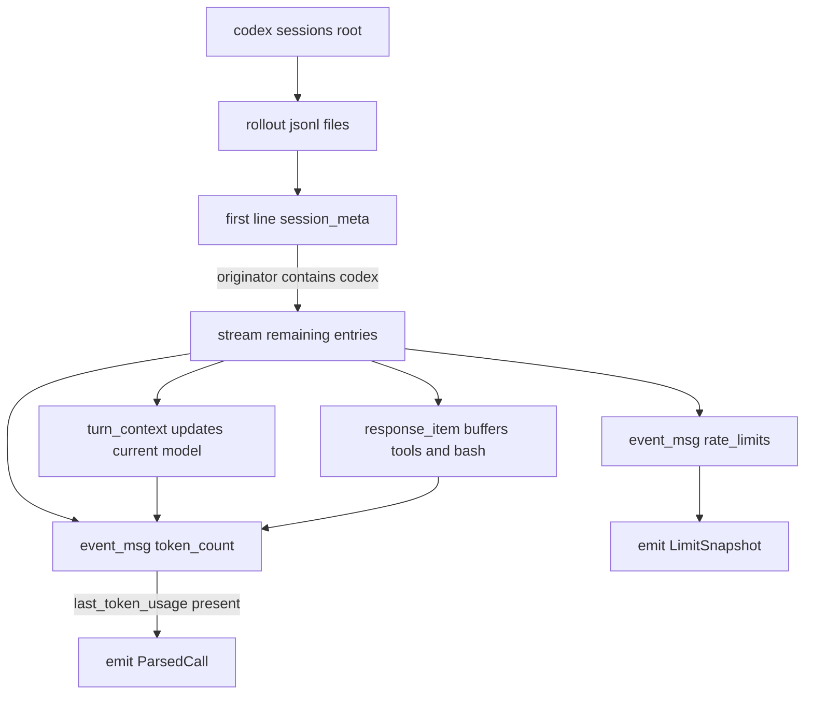
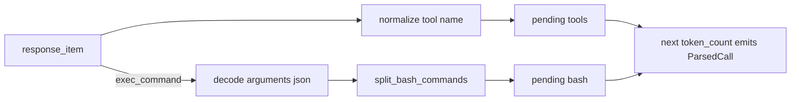

# Codex

OpenAI Codex writes one JSONL "rollout" file per session under a year/month/day tree. Every entry has the shape `{ "timestamp": "...", "type": "...", "payload": { ... } }`; the first line is always a `session_meta` envelope and per-turn usage is reported via `event_msg` events of inner type `token_count`. Recent Codex builds also attach local rate-limit snapshots to those token-count events.

> Status: implemented (`src/tools/codex/`).

## Where the data lives

| Path | Notes |
| --- | --- |
| `~/.codex/sessions/YYYY/MM/DD/rollout-*.jsonl` | One file per session |

**Env var override:** `CODEX_HOME` replaces `~/.codex`.

**Validation:** the parser reads the first line of each file and treats it as a Codex rollout only if `type == "session_meta"` and `payload.originator` contains `"codex"` (case-insensitive — the real desktop app emits `"Codex Desktop"`). Anything else is skipped to avoid ingesting unrelated JSONL.

**Discovery rules** (`src/tools/codex/discovery.rs`):
- Walk `sessions_root()` recursively (no max depth — the date tree is shallow).
- Match files whose name starts with `rollout-` and ends with `.jsonl`.
- Use the relative directory (`YYYY/MM/DD`) as the project label fallback.



## Record format

A rollout is heterogeneous JSONL. The interesting types:

```jsonc
// Envelope (must be the first line)
{ "timestamp": "2026-03-29T15:04:01.475Z", "type": "session_meta",
  "payload": { "id": "...", "cwd": "/Users/me/proj",
               "originator": "Codex Desktop", "model_provider": "openai" } }

// Model selection — emitted at the start and on every model change
{ "timestamp": "...", "type": "turn_context",
  "payload": { "model": "gpt-5.4", "approval_policy": "...", "sandbox_policy": { ... } } }

// Tool calls — payload.type is "function_call" or "custom_tool_call"; arguments is a JSON-encoded string
{ "timestamp": "...", "type": "response_item",
  "payload": { "type": "function_call", "name": "exec_command",
               "arguments": "{\"cmd\":\"cargo test\",\"workdir\":\"/Users/me/proj\"}",
               "call_id": "call_..." } }
{ "timestamp": "...", "type": "response_item",
  "payload": { "type": "custom_tool_call", "name": "apply_patch",
               "arguments": "{ ... }", "call_id": "call_..." } }

// Usage events — info may be null on the very first emission of a session
{ "timestamp": "...", "type": "event_msg",
  "payload": { "type": "token_count",
               "info": { "last_token_usage":  { "input_tokens": 18193, "cached_input_tokens": 10624,
                                                "output_tokens": 371, "reasoning_output_tokens": 38,
                                                "total_tokens": 18564 },
                         "total_token_usage": { "input_tokens": 18193, "cached_input_tokens": 10624,
                                                "output_tokens": 371, "reasoning_output_tokens": 38,
                                                "total_tokens": 18564 },
                         "model_context_window": 258400 },
               "rate_limits": {
                 "limit_id": "codex",
                 "limit_name": null,
                 "primary": { "used_percent": 17.0, "window_minutes": 300,
                              "resets_at": 1777477636 },
                 "secondary": { "used_percent": 6.0, "window_minutes": 10080,
                                "resets_at": 1777960801 },
                 "credits": null,
                 "plan_type": "prolite",
                 "rate_limit_reached_type": null
               } } }
```

`rate_limits` is parsed even when `info` is null. The Limits page keeps the latest observed snapshot per `(tool, limit_id)` and displays its primary and secondary windows separately, for example `5h` and `weekly`.

`response_item` names map to canonical tool labels:

| Codex `payload.name` | Normalized |
| --- | --- |
| `exec_command` | `Bash` |
| `read_file` | `Read` |
| `write_file`, `apply_diff`, `apply_patch` | `Edit` |
| `web_search` | `WebSearch` |
| anything else | passed through unchanged |

## Token & cost mapping

One `ParsedCall` is emitted per `event_msg/token_count` whose `info.last_token_usage` is non-null. Tokens come straight from `last_token_usage` (the per-turn delta).

| `ParsedCall` field | Source |
| --- | --- |
| `input_tokens` | `last.input_tokens` − `last.cached_input_tokens` |
| `output_tokens` | `last.output_tokens` + `last.reasoning_output_tokens` |
| `cached_input_tokens` | `last.cached_input_tokens` |
| `cache_read_input_tokens` | `last.cached_input_tokens` (priced as cache read) |
| `cache_creation_input_tokens` | always `0` (OpenAI doesn't expose cache writes) |
| `reasoning_tokens` | `last.reasoning_output_tokens` |
| `model` | most recent `turn_context.payload.model`, or `"gpt-5"` if no `turn_context` has appeared yet |
| `speed` | always `Speed::Standard` (Codex has no fast/standard split) |

**Critical quirk:** OpenAI reports cached tokens **inside** `input_tokens`. The parser subtracts `cached_input_tokens` before pricing or the cache read would be double-billed.

**Reasoning tokens** are folded into `output_tokens` and priced at the output rate, matching the bundled snapshot schema (which has no separate reasoning rate). They are also preserved in `reasoning_tokens` for future per-rate breakouts.

## Deduplication

`dedup_key = format!("codex:{path}:{timestamp}:{total.input_tokens}+{total.output_tokens}")`

Including the cumulative totals from `total_token_usage` prevents two consecutive turns that share a timestamp from collapsing, while still catching re-reads of the same file.

## Tools / bash extraction

`response_item` entries between successive `token_count` events are accumulated into `tools` (and `bash_commands` for `exec_command`). The arguments string is JSON-decoded and the inner `cmd` field is split via `tools::jsonl::split_bash_commands`. On each emitted `ParsedCall` the buffers are drained (so the next turn starts empty); duplicate `token_count` entries that lose to the `seen` dedup set also clear the buffer to avoid leaking tool calls into the following turn.



## Known limitations

- Files use UTC timestamps with millisecond precision — `chrono::DateTime::parse_from_rfc3339` is sufficient.
- `payload.cwd` from `session_meta` is the only reliable project signal; absent that, the parser falls back to the `YYYY/MM/DD` discovery label.
- Codex rolls models mid-session via `turn_context`; the parser tracks the most-recently-set model so each turn is priced correctly. Variants such as `gpt-5.4` resolve through the pricing table's exact, alias, prefix, or fallback lookup path.
- Cache-creation tokens are not exposed by OpenAI, so `cache_creation_input_tokens` is always zero. The "Cache Written" tile will read 0 for Codex.
- Limit snapshots are not live API reads. They are the latest local values Codex wrote to session JSONL, imported during archive sync.
