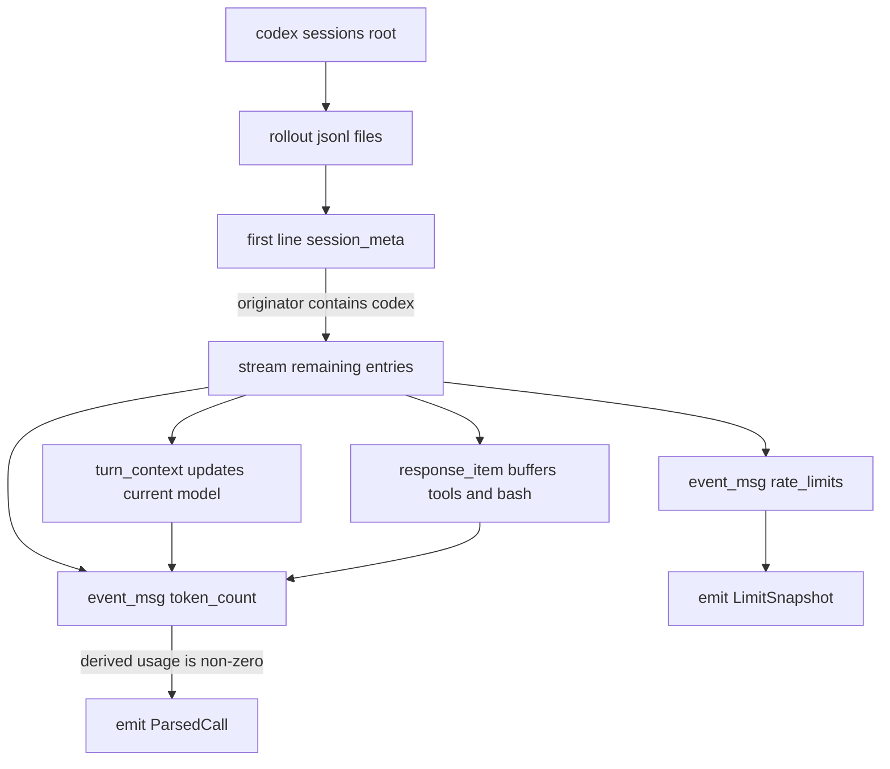
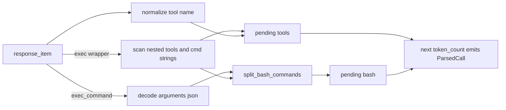

# Codex

OpenAI Codex writes one JSONL "rollout" file per session under a year/month/day tree. Every entry has the shape `{ "timestamp": "...", "type": "...", "payload": { ... } }`; the first line is always a `session_meta` envelope and per-turn usage is reported via `event_msg` events of inner type `token_count`. Recent Codex builds also attach local rate-limit snapshots to those token-count events.

> Status: implemented (`src/tools/codex/`).

## Where the data lives

| Path | Notes |
| --- | --- |
| `~/.codex/sessions/YYYY/MM/DD/rollout-*.jsonl` | One file per session |

**Env var override:** `CODEX_HOME` replaces `~/.codex`.

**Validation:** the parser reads the first line of each file and treats it as a Codex rollout only if `type == "session_meta"` and `payload.originator` contains `"codex"` (case-insensitive — the real desktop app emits `"Codex Desktop"`). Anything else is skipped to avoid ingesting unrelated JSONL.

**Discovery rules** (`src/tools/codex/discovery.rs`):
- Walk `sessions_root()` recursively (no max depth — the date tree is shallow).
- Match files whose name starts with `rollout-` and ends with `.jsonl`.
- Use the relative directory (`YYYY/MM/DD`) as the project label fallback.


```mermaid
flowchart TD
    A[codex sessions root] --> B[rollout jsonl files]
    B --> C[first line session_meta]
    C -->|originator contains codex| D[stream remaining entries]
    D --> E[turn_context updates current model]
    D --> F[response_item buffers tools and bash]
    D --> G[event_msg token_count]
    D --> I[event_msg rate_limits]
    E --> G
    F --> G
    G -->|derived usage is non-zero| H[emit ParsedCall]
    I --> J[emit LimitSnapshot]
```

## Record format

A rollout is heterogeneous JSONL. The interesting types:

```jsonc
// Envelope (must be the first line)
{ "timestamp": "2026-03-29T15:04:01.475Z", "type": "session_meta",
  "payload": { "id": "...", "cwd": "/Users/me/proj",
               "originator": "Codex Desktop", "model_provider": "openai" } }

// Model selection — emitted at the start and on every model change
{ "timestamp": "...", "type": "turn_context",
  "payload": { "model": "gpt-5.4", "approval_policy": "...", "sandbox_policy": { ... } } }

// Tool calls — payload.type is "function_call" or "custom_tool_call"; arguments is a JSON-encoded string
{ "timestamp": "...", "type": "response_item",
  "payload": { "type": "function_call", "name": "exec_command",
               "arguments": "{\"cmd\":\"cargo test\",\"workdir\":\"/Users/me/proj\"}",
               "call_id": "call_..." } }
{ "timestamp": "...", "type": "response_item",
  "payload": { "type": "custom_tool_call", "name": "apply_patch",
               "arguments": "{ ... }", "call_id": "call_..." } }
{ "timestamp": "...", "type": "response_item",
  "payload": { "type": "custom_tool_call", "name": "exec",
               "input": "const r = await tools.exec_command({cmd:\"cargo test\"}); ...",
               "call_id": "call_..." } }

// Usage events — info may be null on the very first emission of a session
{ "timestamp": "...", "type": "event_msg",
  "payload": { "type": "token_count",
               "info": { "last_token_usage":  { "input_tokens": 18193, "cached_input_tokens": 10624,
                                                "output_tokens": 371, "reasoning_output_tokens": 38,
                                                "total_tokens": 18564 },
                         "total_token_usage": { "input_tokens": 18193, "cached_input_tokens": 10624,
                                                "output_tokens": 371, "reasoning_output_tokens": 38,
                                                "total_tokens": 18564 },
                         "model_context_window": 258400 },
               "rate_limits": {
                 "limit_id": "codex",
                 "limit_name": null,
                 "primary": { "used_percent": 17.0, "window_minutes": 300,
                              "resets_at": 1777477636 },
                 "secondary": { "used_percent": 6.0, "window_minutes": 10080,
                                "resets_at": 1777960801 },
                 "credits": null,
                 "plan_type": "prolite",
                 "rate_limit_reached_type": null
               } } }
```

`rate_limits` is parsed even when `info` is null. The Limits page keeps the latest observed snapshot per `(tool, limit_id)` and displays its primary and secondary windows separately, for example `5h` and `weekly`.

`response_item` names map to canonical tool labels:

| Codex `payload.name` | Normalized |
| --- | --- |
| `exec_command` | `Bash` |
| `read_file` | `Read` |
| `write_file`, `apply_diff`, `apply_patch` | `Edit` |
| `web_search` | `WebSearch` |
| anything else | passed through unchanged |

**MCP calls.** Codex records MCP tool invocations with the underlying tool name in `payload.name` and the server prefix in a separate `payload.namespace` field shaped like `mcp__<server>__`, e.g. `{"name":"search_graph","namespace":"mcp__codebase_memory_mcp__"}`. The parser joins the two into the canonical `mcp__<server>__<name>` form (matching how Claude Code stores MCP calls in a single string), so `aggregate_mcp` picks them up. Note that Codex namespaces use underscores in server names (e.g. `codebase_memory_mcp`) while Claude Code uses dashes (`codebase-memory-mcp`); the same logical server can therefore appear as two distinct rows in the MCP Servers panel — this mirrors how each tool emits the data and is intentional.

Newer Codex Desktop builds wrap tool orchestration in a `custom_tool_call` named `exec`. Its `input` field is JavaScript containing calls such as `tools.exec_command(...)` and `tools.mcp__codebase_memory_mcp__search_graph(...)`. The adapter treats that wrapper as transparent: it scans executable JavaScript while ignoring strings and comments, records each nested tool, and extracts `cmd` string literals from nested shell calls.

## Token & cost mapping

One `ParsedCall` is emitted per `event_msg/token_count` whose usage is non-null and non-zero. Prefer cumulative `info.total_token_usage` when present: the parser subtracts the previous cumulative total in the same rollout and uses the delta. This avoids double-counting duplicate token-count snapshots that repeat the same cumulative total with a different timestamp. If Codex only writes `info.last_token_usage`, the parser uses that as a fallback.

| `ParsedCall` field | Source |
| --- | --- |
| `input_tokens` | `usage.input_tokens` − `usage.cached_input_tokens` |
| `output_tokens` | `usage.output_tokens` + `usage.reasoning_output_tokens` |
| `cached_input_tokens` | `usage.cached_input_tokens` |
| `cache_read_input_tokens` | `usage.cached_input_tokens` (priced as cache read) |
| `cache_creation_input_tokens` | always `0` (OpenAI doesn't expose cache writes) |
| `reasoning_tokens` | `usage.reasoning_output_tokens` |
| `model` | most recent model hint from `turn_context`, `token_count.info`, or payload metadata; `"gpt-5"` if none has appeared yet |
| `speed` | always `Speed::Standard` (Codex has no fast/standard split) |

Model breakdown labels preserve the complete GPT identifier. For example, `gpt-5.6-sol` is displayed as `GPT-5.6 Sol`, and `gpt-5.3-codex-spark` as `GPT-5.3 Codex Spark`. Each suffix segment is title-cased instead of matching a broad prefix, so new GPT variants do not collapse into a generic `GPT-5` label.

**Critical quirk:** OpenAI reports cached tokens **inside** `input_tokens`. The parser subtracts `cached_input_tokens` before pricing or the cache read would be double-billed.

Current bundled OpenAI/Codex cache-read rates are not uniformly 50%: GPT-5.x and GPT-5.x-Codex rows use 10%, while `codex-mini-latest` uses 25% and older rows such as `gpt-4o` can still use 50%. See [Pricing and cache rates](../pricing.md).

**Reasoning tokens** are folded into `output_tokens` and priced at the output rate, matching the bundled snapshot schema (which has no separate reasoning rate). They are also preserved in `reasoning_tokens` for future per-rate breakouts.

## Deduplication

`dedup_key = format!("codex:{path}:{timestamp}:{total.input_tokens}+{total.output_tokens}")`

Including the cumulative totals from `total_token_usage` prevents two consecutive turns that share a timestamp from collapsing, while still catching re-reads of the same file.

Duplicate `token_count` snapshots with unchanged cumulative totals are skipped before deduplication because their derived usage delta is zero. Skipped duplicate snapshots also clear pending tool buffers so tool attribution cannot leak into the next emitted call.

## Tools / bash extraction

`response_item` entries between successive `token_count` events are accumulated into `tools` (and `bash_commands` for direct or nested `exec_command`). Direct arguments are JSON-decoded; nested JavaScript `cmd` string literals are decoded by the lightweight wrapper scanner. Both paths split the command via `tools::jsonl::split_bash_commands`. On each emitted `ParsedCall` the buffers are drained (so the next turn starts empty); skipped zero-delta token snapshots and duplicate `token_count` entries that lose to the `seen` dedup set also clear the buffer to avoid leaking tool calls into the following turn.


```mermaid
flowchart LR
    A[response_item] --> B[normalize tool name]
    A -->|exec_command| C[decode arguments json]
    A -->|exec wrapper| H[scan nested tools and cmd strings]
    C --> D[split_bash_commands]
    H --> D
    H --> E
    B --> E[pending tools]
    D --> F[pending bash]
    E --> G[next token_count emits ParsedCall]
    F --> G
```

## Coach signals (archive v4 enrichment)

The parser also consumes four `event_msg` inner types that never produce a `ParsedCall` themselves but enrich the next emitted call (or, for aborts, the previous one):

```jsonc
{ "type": "event_msg", "payload": { "type": "user_message", "message": "please fix the tests\n" } }
{ "type": "event_msg", "payload": { "type": "agent_message", "message": "Fixing:\n```rust\n...\n```", "phase": "commentary" } }
{ "type": "event_msg", "payload": { "type": "turn_aborted", "turn_id": "...", "reason": "interrupted", "duration_ms": 13921 } }
{ "type": "event_msg", "payload": { "type": "patch_apply_end", "call_id": "...", "success": true,
    "changes": { "/abs/path/file.rs": { "type": "update", "unified_diff": "@@\n+added line\n-removed\n" } } } }
```

| `ParsedCall` field | Source | Notes |
| --- | --- | --- |
| `user_message` / `prompt_chars` | `user_message.message` (trimmed) | Truncated to 500 chars for display; `prompt_chars` keeps the full length. Codex session details now show prompts |
| `response_chars` | sum of `agent_message.message` lengths since the last emitted call | `agent_reasoning` text is deliberately excluded, mirroring Claude thinking blocks; `None` for rounds with no agent message |
| `elapsed_ms` | `token_count` timestamp − `user_message` timestamp | Dropped when non-positive or ≥ 2 h |
| `is_canceled` | `turn_aborted` | Marks the last **emitted** call of the rollout; an abort before any usage was recorded is lost |
| `code_blocks` | ``` fences in `agent_message` text **plus** added lines (`+`, excluding `+++` headers) of each successful `patch_apply_end` unified diff | Language from fence tag or file extension; merged per call by language; capped at 32 |
| `edited_files` | `patch_apply_end.changes` keys, only when `success` | Deduped, capped at 64. Failed patches record nothing |

`apply_patch` function-call arguments are **not** parsed for file paths — `patch_apply_end` carries the authoritative applied result, including files the patch actually touched. Rollouts old enough to lack these events simply leave the enrichment fields `NULL`/empty.

The adapter's fingerprint prefix is `codex-v3-coach-enrichment`; bumping it forces archived rollouts back through the parser after an extraction change.

## Known limitations

- Files use UTC timestamps with millisecond precision — `chrono::DateTime::parse_from_rfc3339` is sufficient.
- `payload.cwd` from `session_meta` is the only reliable project signal; absent that, the parser falls back to the `YYYY/MM/DD` discovery label.
- Codex rolls models mid-session via `turn_context`; the parser tracks the most-recently-set model so each turn is priced correctly. Variants such as `gpt-5.4` resolve through the pricing table's exact, alias, prefix, or fallback lookup path.
- Some Codex builds spell cached input as `cache_read_input_tokens` rather than `cached_input_tokens`; both names map to the same cache-read bucket.
- Cache-creation tokens are not exposed by OpenAI, so `cache_creation_input_tokens` is always zero. The "Cache Written" tile will read 0 for Codex.
- Limit snapshots are not live API reads. They are the latest local values Codex wrote to session JSONL, imported during archive sync.
