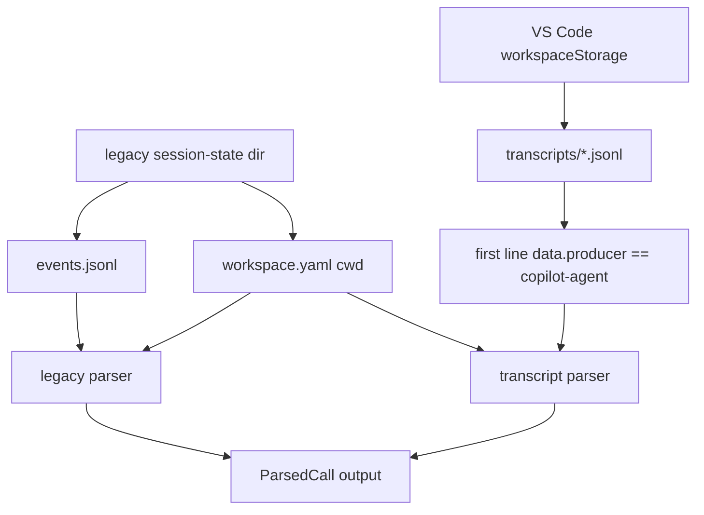
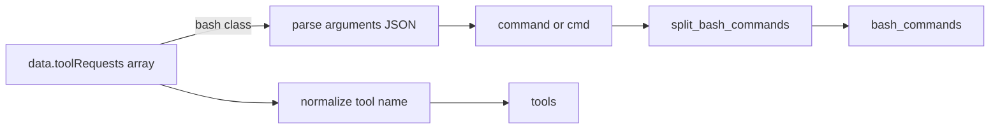

# GitHub Copilot

Copilot has two supported on-disk layouts: the legacy CLI agent under `~/.copilot/` and VS Code Copilot Chat transcripts under workspace storage. `tokenuse` reads both through `src/tools/copilot/`.

> Status: implemented.

## Where the Data Lives

### Legacy CLI Agent

```text
~/.copilot/session-state/<session-id>/
    events.jsonl
    workspace.yaml
```

`workspace.yaml` is parsed for a scalar `cwd:` line and used as the project path. `events.jsonl` is the timeline.

### VS Code Extension

| Platform | Workspace storage |
| --- | --- |
| macOS | `~/Library/Application Support/Code/User/workspaceStorage/<hash>/` |
| macOS Insiders | `~/Library/Application Support/Code - Insiders/User/workspaceStorage/<hash>/` |
| Linux | `~/.config/Code/User/workspaceStorage/<hash>/` |
| Linux Insiders/server | `~/.config/Code - Insiders/User/workspaceStorage/<hash>/`, `~/.vscode-server/data/User/workspaceStorage/<hash>/` |
| Windows | `%APPDATA%/Code/User/workspaceStorage/<hash>/` |
| Windows Insiders | `%APPDATA%/Code - Insiders/User/workspaceStorage/<hash>/` |

Inside each workspace hash directory:

```text
GitHub.copilot-chat/transcripts/<session>.jsonl
```

A transcript file only parses as Copilot when its first line has `type == "session.start"` and `data.producer == "copilot-agent"`. When that `session.start` event includes `data.context.cwd`, the cwd is the authoritative project path. If absent, `tokenuse` falls back to `workspace.yaml`, the VS Code `workspace.json` folder name, and then the workspace hash.



## Record Format

### Legacy `events.jsonl`

Legacy events store their payload under `data`. A legacy assistant message only emits a `ParsedCall` when the current model has been set by `session.model_change` and `data.outputTokens` is positive.

```jsonc
{ "type": "session.model_change",
  "timestamp": "2026-04-26T10:00:00Z",
  "data": { "newModel": "claude-sonnet-4-5" } }

{ "type": "user.message",
  "timestamp": "2026-04-26T10:00:01Z",
  "data": { "content": "fix the typo in README" } }

{ "type": "assistant.message",
  "timestamp": "2026-04-26T10:00:02Z",
  "data": {
    "messageId": "m1",
    "outputTokens": 220,
    "toolRequests": [
      { "toolCallId": "tooluse_xyz", "name": "bash",
        "arguments": "{\"command\":\"ls -la | wc -l\"}" },
      { "toolCallId": "tooluse_yyy", "name": "edit_file" }
    ]
  } }
```

### VS Code Transcripts

VS Code transcript payloads also live under `data`. The parser validates the first `session.start` line, uses `data.context.cwd` for the project path, and estimates tokens from message text.

```jsonc
{ "type": "session.start",
  "data": {
    "sessionId": "x",
    "producer": "copilot-agent",
    "model": "gpt-5",
    "context": { "cwd": "/Users/me/Code/tokens" }
  } }

{ "type": "user.message",
  "data": { "content": "hello world" } }

{ "type": "assistant.message",
  "data": {
    "messageId": "abc",
    "content": "sure thing",
    "reasoningText": "let me think",
    "toolRequests": [
      { "toolCallId": "toolu_bdrk_01ZZ", "name": "read_file" },
      { "toolCallId": "toolu_bdrk_02YY", "name": "edit_file" }
    ]
  } }
```

The current transcript parser does **not** use `data.model` for pricing. It infers one model alias per transcript from tool-call id prefixes.

## Token & Cost Mapping

| `ParsedCall` field | Legacy source | VS Code transcript source |
| --- | --- | --- |
| `input_tokens` | `0` | latest `data.content.len() / 4`, rounded up |
| `output_tokens` | `data.outputTokens` | `data.content.len() / 4` plus `data.reasoningText.len() / 4`, both rounded up, unless explicit `data.outputTokens` exists |
| `reasoning_tokens` | `0` | `data.reasoningText.len() / 4`, rounded up |
| `cache_creation_input_tokens` | `0` | `0` |
| `cache_read_input_tokens` | `0` | `0` |
| `model` | latest `session.model_change.data.newModel` | inferred alias from tool-call ids |
| `timestamp` | top-level `timestamp`, parsed as RFC3339 | top-level `timestamp` when present; otherwise `None` |
| `project` | `workspace.yaml` `cwd:`, then discovered source | `session.start.data.context.cwd`, then `workspace.yaml`, then VS Code `workspace.json` folder name or workspace hash |

Transcript reasoning tokens are preserved in `reasoning_tokens` and folded into `output_tokens` so estimated transcript cost includes generated reasoning text.

## Model Inference

When parsing VS Code transcripts, count recognized `data.toolRequests[].toolCallId` prefixes across the whole transcript and use the most common alias:

| Prefix | Alias | Pricing target |
| --- | --- | --- |
| `toolu_bdrk_` | `anthropic-auto` | Sonnet alias |
| `toolu_vrtx_` | `anthropic-auto` | Sonnet alias |
| `tooluse_` | `anthropic-auto` | Sonnet alias |
| `call_` | `openai-auto` | GPT-5 alias |

If no recognized prefix appears, the parser uses `copilot-auto`, which currently falls through pricing lookup to the snapshot fallback.

## Deduplication

- Legacy: `copilot:<session_id>:<message_id>`, where `session_id` is the parent directory name and `message_id` is `data.messageId`.
- VS Code: `copilot:<session_id>:<message_id>`, where `session_id` is the transcript file stem and `message_id` is `data.messageId`.

## Tools / Bash Extraction

Walk `data.toolRequests[]` and normalize each `name`:

| Copilot name | Normalized |
| --- | --- |
| `bash`, `run_in_terminal`, `kill_terminal` | `Bash` |
| `read_file` | `Read` |
| `edit_file`, `write_file`, `replace_string_in_file`, `apply_patch` | `Edit` |
| `create_file` | `Write` |
| `delete_file` | `Delete` |
| `search_files`, `file_search` | `Grep` |
| `find_files` | `Glob` |
| `list_directory`, `list_dir` | `LS` |
| `web_search` | `WebSearch` |
| `fetch_webpage` | `WebFetch` |
| `github_repo` | `GitHub` |
| `memory` | `Memory` |

For Bash-class calls, parse `arguments` as a JSON string and split `command` or `cmd` with `tools::jsonl::split_bash_commands`.



## Known Limitations

- Legacy events without a positive `data.outputTokens` value are skipped.
- Legacy input tokens are currently recorded as `0` because the legacy format only exposes output tokens in the supported path.
- VS Code transcript token counts are estimates based on `chars / 4.0`; treat Copilot totals as approximate.
- VS Code `data.model` is currently ignored for pricing; tool-call id inference picks one model alias for the whole transcript. Auto aliases are displayed as Copilot-specific model buckets.
- `workspace.yaml` parsing reads only the scalar `cwd:` line used by Copilot session-state files. If Copilot starts writing richer YAML, replace the small parser with a YAML crate.
