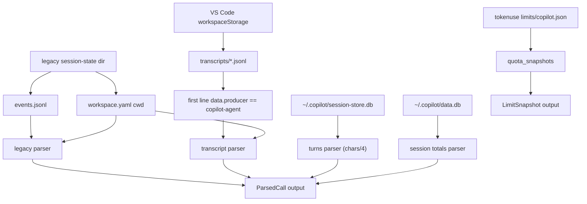
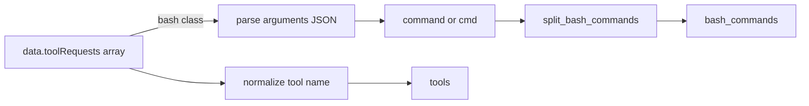

# GitHub Copilot

Copilot has three supported on-disk layouts: the legacy CLI agent's `events.jsonl` under `~/.copilot/session-state/`, the newer CLI's central SQLite stores under `~/.copilot/`, and VS Code Copilot Chat transcripts under workspace storage. `tokenuse` reads all of them through `src/tools/copilot/`.

> Status: implemented.

## Where the Data Lives

### Legacy CLI Agent

```text
~/.copilot/session-state/<session-id>/
    events.jsonl
    workspace.yaml
```

`workspace.yaml` is parsed for a scalar `cwd:` line and used as the project path. `events.jsonl` is the timeline.

### CLI SQLite Stores

The Copilot CLI stopped writing `events.jsonl` around May 2026. Newer builds keep history in two central SQLite databases:

```text
~/.copilot/session-store.db   -- sessions + turns (message text, no token counts)
~/.copilot/data.db            -- workspace app sessions with real token totals
```

- `session-store.db` `turns` rows carry `user_message`/`assistant_response` text. Tokens are estimated with the same `chars / 4` rule as VS Code transcripts, the model is the `copilot-auto` bucket (the store records none), and the project comes from `sessions.cwd`, falling back to `sessions.repository`.
- `data.db` `sessions` rows carry authoritative running totals: `model`, `total_input_tokens`, `total_output_tokens`, `total_cached_tokens`, and `total_reasoning_tokens`. Each session becomes one aggregate `ParsedCall`. Cached tokens are assumed to be included in the input total and are subtracted before pricing (the Codex convention). Because these totals grow while a session is live, the archive refreshes the row in place on re-sync instead of relying on insert-only dedup.

Both stores run in WAL mode, so the parser copies the database plus any `-wal`/`-shm` sidecars to a private temp directory before opening; reading the live file with `immutable=1` would miss un-checkpointed rows. The adapter's source fingerprint also folds in the `-wal` file's metadata so archive syncs notice new turns before a checkpoint runs.

### VS Code Extension

| Platform | Workspace storage |
| --- | --- |
| macOS | `~/Library/Application Support/Code/User/workspaceStorage/<hash>/` |
| macOS Insiders | `~/Library/Application Support/Code - Insiders/User/workspaceStorage/<hash>/` |
| Linux | `~/.config/Code/User/workspaceStorage/<hash>/` |
| Linux Insiders/server | `~/.config/Code - Insiders/User/workspaceStorage/<hash>/`, `~/.vscode-server/data/User/workspaceStorage/<hash>/` |
| Windows | `%APPDATA%/Code/User/workspaceStorage/<hash>/` |
| Windows Insiders | `%APPDATA%/Code - Insiders/User/workspaceStorage/<hash>/` |

Inside each workspace hash directory:

```text
GitHub.copilot-chat/transcripts/<session>.jsonl
```

A transcript file only parses as Copilot when its first line has `type == "session.start"` and `data.producer == "copilot-agent"`. When that `session.start` event includes `data.context.cwd`, the cwd is the authoritative project path. If absent, `tokenuse` falls back to `workspace.yaml`, the VS Code `workspace.json` folder name, and then the workspace hash.


```mermaid
flowchart TD
    A["legacy session-state dir"] --> B["events.jsonl"]
    A --> C["workspace.yaml cwd"]
    D["VS Code workspaceStorage"] --> E["transcripts/*.jsonl"]
    J["tokenuse limits/copilot.json"] --> K["quota_snapshots"]
    M["~/.copilot/session-store.db"] --> N["turns parser (chars/4)"]
    O["~/.copilot/data.db"] --> P["session totals parser"]
    E --> F["first line data.producer == copilot-agent"]
    B --> G["legacy parser"]
    F --> H["transcript parser"]
    C --> G
    C --> H
    G --> I["ParsedCall output"]
    H --> I
    N --> I
    P --> I
    K --> L["LimitSnapshot output"]
```

## Record Format

### Legacy `events.jsonl`

Legacy events store their payload under `data`. A legacy assistant message only emits a `ParsedCall` when the current model has been set by `session.model_change` and `data.outputTokens` is positive.

```jsonc
{ "type": "session.model_change",
  "timestamp": "2026-04-26T10:00:00Z",
  "data": { "newModel": "claude-sonnet-4-5" } }

{ "type": "user.message",
  "timestamp": "2026-04-26T10:00:01Z",
  "data": { "content": "fix the typo in README" } }

{ "type": "assistant.message",
  "timestamp": "2026-04-26T10:00:02Z",
  "data": {
    "messageId": "m1",
    "outputTokens": 220,
    "toolRequests": [
      { "toolCallId": "tooluse_xyz", "name": "bash",
        "arguments": "{\"command\":\"ls -la | wc -l\"}" },
      { "toolCallId": "tooluse_yyy", "name": "edit_file" }
    ]
  } }
```

### VS Code Transcripts

VS Code transcript payloads also live under `data`. The parser validates the first `session.start` line, uses `data.context.cwd` for the project path, and estimates tokens from message text.

```jsonc
{ "type": "session.start",
  "data": {
    "sessionId": "x",
    "producer": "copilot-agent",
    "model": "gpt-5",
    "context": { "cwd": "/Users/me/Code/tokens" }
  } }

{ "type": "user.message",
  "data": { "content": "hello world" } }

{ "type": "assistant.message",
  "data": {
    "messageId": "abc",
    "content": "sure thing",
    "reasoningText": "let me think",
    "toolRequests": [
      { "toolCallId": "toolu_bdrk_01ZZ", "name": "read_file" },
      { "toolCallId": "toolu_bdrk_02YY", "name": "edit_file" }
    ]
  } }
```

The transcript parser infers one model alias per transcript from tool-call id prefixes. `session.start data.model` is only trusted when no known prefix appears — see [Model Inference](#model-inference).

## Token & Cost Mapping

| `ParsedCall` field | Legacy source | VS Code transcript source |
| --- | --- | --- |
| `input_tokens` | `0` | latest `data.content.len() / 4`, rounded up |
| `output_tokens` | `data.outputTokens` | `data.content.len() / 4` plus `data.reasoningText.len() / 4`, both rounded up, unless explicit `data.outputTokens` exists |
| `reasoning_tokens` | `0` | `data.reasoningText.len() / 4`, rounded up |
| `cache_creation_input_tokens` | `0` | `0` |
| `cache_read_input_tokens` | `0` | `0` |
| `model` | latest `session.model_change.data.newModel` | inferred alias from tool-call ids, falling back to `session.start.data.model` |
| `timestamp` | top-level `timestamp`, parsed as RFC3339 | top-level `timestamp` when present; otherwise `None` |
| `project` | `workspace.yaml` `cwd:`, then discovered source | `session.start.data.context.cwd`, then `workspace.yaml`, then VS Code `workspace.json` folder name or workspace hash |

Transcript reasoning tokens are preserved in `reasoning_tokens` and folded into `output_tokens` so estimated transcript cost includes generated reasoning text.

## Model Inference

When parsing VS Code transcripts, count recognized `data.toolRequests[].toolCallId` prefixes across the whole transcript and use the most common alias:

| Prefix | Alias | Pricing target |
| --- | --- | --- |
| `toolu_bdrk_` | `anthropic-auto` | Sonnet alias |
| `toolu_vrtx_` | `anthropic-auto` | Sonnet alias |
| `tooluse_` | `anthropic-auto` | Sonnet alias |
| `call_` | `openai-auto` | GPT-5 mini alias |

Tool-call prefixes win because they reflect the backend that actually served the session; `session.start data.model` has been observed to disagree (declaring `gpt-5` in transcripts whose tool ids are Bedrock Anthropic). When no recognized prefix appears, the parser falls back to `data.model` (unless it is empty or `auto`) — display names like `Claude Sonnet 4.5` resolve through the `copilot` tool aliases in the pricing overrides. Only when both signals are missing does the call land in `copilot-auto`, which falls through pricing lookup to the book fallback.

GitHub's usage-based Copilot billing starts on June 1, 2026 and includes cached tokens, but these local transcript sources do not expose reliable cache buckets today. tokenuse therefore keeps `cache_read_input_tokens` and `cache_creation_input_tokens` at `0` for Copilot and treats local cost as an estimate. See [Pricing and cache rates](../pricing.md).

## Deduplication

- Legacy: `copilot:<session_id>:<message_id>`, where `session_id` is the parent directory name and `message_id` is `data.messageId`.
- VS Code: `copilot:<session_id>:<message_id>`, where `session_id` is the transcript file stem and `message_id` is `data.messageId`.
- CLI session store: `copilot:<session_id>:turn-<turn_index>`.
- CLI data store: `copilot:cli:<session_id>` — one aggregate row per session; the archive updates it in place when totals grow.

## Tools / Bash Extraction

Walk `data.toolRequests[]` and normalize each `name`:

| Copilot name | Normalized |
| --- | --- |
| `bash`, `run_in_terminal`, `kill_terminal` | `Bash` |
| `read_file` | `Read` |
| `edit_file`, `write_file`, `replace_string_in_file`, `apply_patch` | `Edit` |
| `create_file` | `Write` |
| `delete_file` | `Delete` |
| `search_files`, `file_search` | `Grep` |
| `find_files` | `Glob` |
| `list_directory`, `list_dir` | `LS` |
| `web_search` | `WebSearch` |
| `fetch_webpage` | `WebFetch` |
| `github_repo` | `GitHub` |
| `memory` | `Memory` |

For Bash-class calls, parse `arguments` as a JSON string and split `command` or `cmd` with `tools::jsonl::split_bash_commands`.


```mermaid
flowchart LR
    A["data.toolRequests array"] --> B["normalize tool name"]
    A -->|bash class| C["parse arguments JSON"]
    C --> D["command or cmd"]
    D --> E["split_bash_commands"]
    B --> F["tools"]
    E --> G["bash_commands"]
```

## Known Limitations

- Legacy events without a positive `data.outputTokens` value are skipped.
- Legacy input tokens are currently recorded as `0` because the legacy format only exposes output tokens in the supported path.
- VS Code transcript and CLI session-store token counts are estimates based on `chars / 4.0`; treat Copilot totals as approximate. Only `data.db` sessions carry real token counts.
- VS Code `data.model` is used only as a fallback when tool-call id inference finds no known prefix; inference picks one model alias for the whole transcript. Auto aliases are displayed as Copilot-specific model buckets.
- `data.db` does not link sessions to a project path, so its aggregate rows use the `copilot-cli` project label.
- `workspace.yaml` parsing reads only the scalar `cwd:` line used by Copilot session-state files. If Copilot starts writing richer YAML, replace the small parser with a YAML crate.

## Rate-limit snapshots

Copilot transcripts do not include quota state. `tokenuse` imports Copilot limits from a local sidecar:

```text
<config dir>/tokenuse/limits/copilot.json
```

The sidecar can be either the raw `GET https://api.github.com/copilot_internal/user` payload or the wrapper object written by the Config page sync action:

```jsonc
{
  "observed_at": "2026-07-05T12:00:00Z",
  "source": "https://api.github.com/copilot_internal/user",
  "payload": {
    "copilot_plan": "individual_pro",
    "quota_reset_date_utc": "2026-08-01T00:00:00.000Z",
    "token_based_billing": { "enabled": true },
    "quota_snapshots": {
      "premium_interactions": {
        "entitlement": 1000,
        "percent_remaining": 40.0,
        "remaining": 400,
        "unlimited": false,
        "timestamp_utc": "2026-07-05T12:02:00Z"
      }
    }
  }
}
```

`tokenuse` skips unlimited snapshots with no entitlement, converts `percent_remaining` into `used_percent`, and emits one `LimitSnapshot` per constrained quota key. `quota_reset_date` (or the newer `quota_reset_date_utc`) is treated as a monthly reset at 00:00 UTC unless a future quota key indicates a weekly window.

GitHub moved every Copilot plan to usage-based AI-credit billing on June 1, 2026 (1 credit = $0.01). The payload kept the legacy `premium_interactions` key, but its values are AI-credit units from that date on. When the payload carries `token_based_billing`, or the observation timestamp falls on or after 2026-06-01, `tokenuse` labels the gauge **AI Credits** and reports the remaining balance in credit units; older sidecars keep the legacy **Premium Interactions** label.

The Config page's Copilot sync action is explicit and confirmed. It reads the existing GitHub Copilot OAuth token from local `github-copilot` config files, fetches the quota payload from GitHub, writes the sidecar above, then syncs the archive so Usage gauges update immediately. Builds without the `quota-sync` feature keep this action unavailable.
