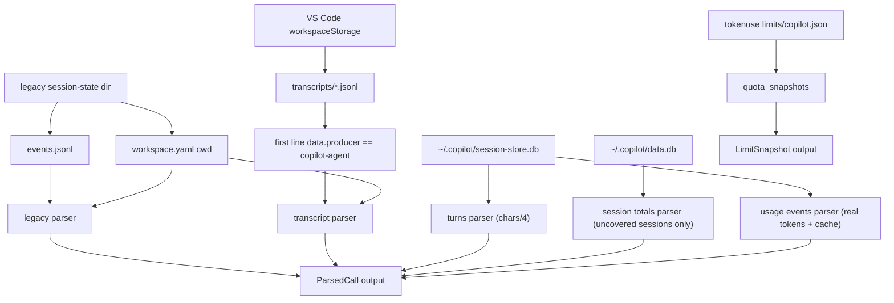
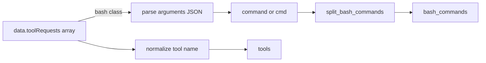

# GitHub Copilot

Copilot has three supported on-disk layouts: the legacy CLI agent's `events.jsonl` under `~/.copilot/session-state/`, the newer CLI's central SQLite stores under `~/.copilot/`, and VS Code Copilot Chat transcripts under workspace storage. `tokenuse` reads all of them through `src/tools/copilot/`.

> Status: implemented.

## Where the Data Lives

### Legacy CLI Agent

```text
~/.copilot/session-state/<session-id>/
    events.jsonl
    workspace.yaml
```

`workspace.yaml` is parsed for a scalar `cwd:` line and used as the project path. `events.jsonl` is the timeline.

### CLI SQLite Stores

The Copilot CLI stopped writing `events.jsonl` around May 2026. Newer builds keep history in two central SQLite databases:

```text
~/.copilot/session-store.db   -- sessions + turns (message text, no token counts)
~/.copilot/data.db            -- workspace app sessions with real token totals
```

- `session-store.db` `turns` rows carry `user_message`/`assistant_response` text. Tokens are estimated with the same `chars / 4` rule as VS Code transcripts, the model is the `copilot-auto` bucket (the store records none), and the project comes from `sessions.cwd`, falling back to `sessions.repository`.
- `data.db` `sessions` rows carry authoritative running totals: `model`, `total_input_tokens`, `total_output_tokens`, `total_cached_tokens`, and `total_reasoning_tokens`. Each session becomes one aggregate `ParsedCall`. Cached tokens are assumed to be included in the input total and are subtracted before pricing (the Codex convention). Because these totals grow while a session is live, the archive refreshes the row in place on re-sync instead of relying on insert-only dedup.
- Newer CLI builds (~July 2026) additionally write `assistant_usage_events` rows into `session-store.db`: one row per model request with the real serving `model`, `input_tokens` (inclusive of cache reads — verified against `token_details_json`), `output_tokens`, `cache_read_tokens`, `cache_write_tokens`, `reasoning_tokens`, and `created_at`. When a session has usage rows they are authoritative: each becomes a `ParsedCall` with real cache buckets (cache reads are subtracted from input before pricing), the covered turns stop emitting chars/4 estimates (the turn's user message attaches to the turn's first usage row), and the session's `data.db` aggregate is skipped entirely because both stores describe the same requests with identical totals. Sessions without usage rows keep the estimate path, so history from older CLI builds is unaffected.

Both stores run in WAL mode, so the parser copies the database plus any `-wal`/`-shm` sidecars to a private temp directory before opening; reading the live file with `immutable=1` would miss un-checkpointed rows. The adapter's source fingerprint also folds in the `-wal` file's metadata so archive syncs notice new turns before a checkpoint runs.

### VS Code Extension

| Platform | Workspace storage |
| --- | --- |
| macOS | `~/Library/Application Support/Code/User/workspaceStorage/<hash>/` |
| macOS Insiders | `~/Library/Application Support/Code - Insiders/User/workspaceStorage/<hash>/` |
| Linux | `~/.config/Code/User/workspaceStorage/<hash>/` |
| Linux Insiders/server | `~/.config/Code - Insiders/User/workspaceStorage/<hash>/`, `~/.vscode-server/data/User/workspaceStorage/<hash>/` |
| Windows | `%APPDATA%/Code/User/workspaceStorage/<hash>/` |
| Windows Insiders | `%APPDATA%/Code - Insiders/User/workspaceStorage/<hash>/` |

Inside each workspace hash directory:

```text
GitHub.copilot-chat/transcripts/<session>.jsonl
```

A transcript file only parses as Copilot when its first line has `type == "session.start"` and `data.producer == "copilot-agent"`. When that `session.start` event includes `data.context.cwd`, the cwd is the authoritative project path. If absent, `tokenuse` falls back to `workspace.yaml`, the VS Code `workspace.json` folder name, and then the workspace hash.


```mermaid
flowchart TD
    A["legacy session-state dir"] --> B["events.jsonl"]
    A --> C["workspace.yaml cwd"]
    D["VS Code workspaceStorage"] --> E["transcripts/*.jsonl"]
    J["tokenuse limits/copilot.json"] --> K["quota_snapshots"]
    M["~/.copilot/session-store.db"] --> N["turns parser (chars/4)"]
    M --> Q["usage events parser (real tokens + cache)"]
    O["~/.copilot/data.db"] --> P["session totals parser (uncovered sessions only)"]
    E --> F["first line data.producer == copilot-agent"]
    B --> G["legacy parser"]
    F --> H["transcript parser"]
    C --> G
    C --> H
    G --> I["ParsedCall output"]
    H --> I
    N --> I
    P --> I
    Q --> I
    K --> L["LimitSnapshot output"]
```

## Record Format

### Legacy `events.jsonl`

Legacy events store their payload under `data`. A legacy assistant message only emits a `ParsedCall` when the current model has been set by `session.model_change` and `data.outputTokens` is positive.

```jsonc
{ "type": "session.model_change",
  "timestamp": "2026-04-26T10:00:00Z",
  "data": { "newModel": "claude-sonnet-4-5" } }

{ "type": "user.message",
  "timestamp": "2026-04-26T10:00:01Z",
  "data": { "content": "fix the typo in README" } }

{ "type": "assistant.message",
  "timestamp": "2026-04-26T10:00:02Z",
  "data": {
    "messageId": "m1",
    "outputTokens": 220,
    "toolRequests": [
      { "toolCallId": "tooluse_xyz", "name": "bash",
        "arguments": "{\"command\":\"ls -la | wc -l\"}" },
      { "toolCallId": "tooluse_yyy", "name": "edit_file" }
    ]
  } }
```

### VS Code Transcripts

VS Code transcript payloads also live under `data`. The parser validates the first `session.start` line, uses `data.context.cwd` for the project path, and estimates tokens from message text.

```jsonc
{ "type": "session.start",
  "data": {
    "sessionId": "x",
    "producer": "copilot-agent",
    "model": "gpt-5",
    "context": { "cwd": "/Users/me/Code/tokens" }
  } }

{ "type": "user.message",
  "data": { "content": "hello world" } }

{ "type": "assistant.message",
  "data": {
    "messageId": "abc",
    "content": "sure thing",
    "reasoningText": "let me think",
    "toolRequests": [
      { "toolCallId": "toolu_bdrk_01ZZ", "name": "read_file" },
      { "toolCallId": "toolu_bdrk_02YY", "name": "edit_file" }
    ]
  } }
```

The transcript parser infers one model alias per transcript from tool-call id prefixes. `session.start data.model` is only trusted when no known prefix appears — see [Model Inference](#model-inference).

## Token & Cost Mapping

| `ParsedCall` field | Legacy source | VS Code transcript source |
| --- | --- | --- |
| `input_tokens` | `0` | latest `data.content.len() / 4`, rounded up |
| `output_tokens` | `data.outputTokens` | `data.content.len() / 4` plus `data.reasoningText.len() / 4`, both rounded up, unless explicit `data.outputTokens` exists |
| `reasoning_tokens` | `0` | `data.reasoningText.len() / 4`, rounded up |
| `cache_creation_input_tokens` | `0` | `0` |
| `cache_read_input_tokens` | `0` | `0` |
| `model` | latest `session.model_change.data.newModel` | inferred alias from tool-call ids, falling back to `session.start.data.model` |
| `timestamp` | top-level `timestamp`, parsed as RFC3339 | top-level `timestamp` when present; otherwise `None` |
| `project` | `workspace.yaml` `cwd:`, then discovered source | `session.start.data.context.cwd`, then `workspace.yaml`, then VS Code `workspace.json` folder name or workspace hash |

Transcript reasoning tokens are preserved in `reasoning_tokens` and folded into `output_tokens` so estimated transcript cost includes generated reasoning text.

## Model Inference

When parsing VS Code transcripts, count recognized `data.toolRequests[].toolCallId` prefixes across the whole transcript and use the most common alias:

| Prefix | Alias | Pricing target |
| --- | --- | --- |
| `toolu_bdrk_` | `anthropic-auto` | Sonnet alias |
| `toolu_vrtx_` | `anthropic-auto` | Sonnet alias |
| `tooluse_` | `anthropic-auto` | Sonnet alias |
| `call_` | `openai-auto` | GPT-5 mini alias |

Tool-call prefixes win because they reflect the backend that actually served the session; `session.start data.model` has been observed to disagree (declaring `gpt-5` in transcripts whose tool ids are Bedrock Anthropic). When no recognized prefix appears, the parser falls back to `data.model` (unless it is empty or `auto`) — display names like `Claude Sonnet 4.5` resolve through the `copilot` tool aliases in the pricing overrides. Only when both signals are missing does the call land in `copilot-auto`, which falls through pricing lookup to the book fallback.

GitHub's usage-based Copilot billing includes cached tokens. Legacy events and VS Code transcripts do not expose reliable cache buckets, so those sources keep `cache_read_input_tokens` and `cache_creation_input_tokens` at `0` and their cost is an estimate. CLI `assistant_usage_events` rows carry real `cache_read`/`cache_write` buckets and price cache-aware. See [Pricing and cache rates](../pricing.md).

## Deduplication

- Legacy: `copilot:<session_id>:<message_id>`, where `session_id` is the parent directory name and `message_id` is `data.messageId`.
- VS Code: `copilot:<session_id>:<message_id>`, where `session_id` is the transcript file stem and `message_id` is `data.messageId`.
- CLI session store: `copilot:<session_id>:turn-<turn_index>`.
- CLI usage events: `copilot:<session_id>:turn-<turn_index>:usage-<event_id>` (or `copilot:<session_id>:usage-<event_id>` when the event carries no turn index). When the archive first inserts a usage row it zeroes the token and cost fields of the superseded chars/4 turn row (encoded in the key) and the session's `copilot:cli:` aggregate, so archives written by older builds don't double count after the one-off reparse; the zeroed rows keep their message metadata.
- CLI data store: `copilot:cli:<session_id>` — one aggregate row per session; the archive updates it in place when totals grow. Sessions covered by usage events are skipped here.

## Tools / Bash Extraction

Walk `data.toolRequests[]` and normalize each `name`:

| Copilot name | Normalized |
| --- | --- |
| `bash`, `run_in_terminal`, `kill_terminal` | `Bash` |
| `read_file` | `Read` |
| `edit_file`, `write_file`, `replace_string_in_file`, `apply_patch` | `Edit` |
| `create_file` | `Write` |
| `delete_file` | `Delete` |
| `search_files`, `file_search` | `Grep` |
| `find_files` | `Glob` |
| `list_directory`, `list_dir` | `LS` |
| `web_search` | `WebSearch` |
| `fetch_webpage` | `WebFetch` |
| `github_repo` | `GitHub` |
| `memory` | `Memory` |

For Bash-class calls, parse `arguments` as a JSON string and split `command` or `cmd` with `tools::jsonl::split_bash_commands`.


```mermaid
flowchart LR
    A["data.toolRequests array"] --> B["normalize tool name"]
    A -->|bash class| C["parse arguments JSON"]
    C --> D["command or cmd"]
    D --> E["split_bash_commands"]
    B --> F["tools"]
    E --> G["bash_commands"]
```

## Coach signals (archive v4 enrichment)

Copilot's sources differ sharply in what they expose, so enrichment is populated only where the JSONL event streams carry real message text. All CLI SQLite rows — session-store chars/4 turn estimates, `assistant_usage_events` rows, and `data.db` aggregates — deliberately leave every enrichment field at its default: their text feeds token estimation (or is absent entirely), not per-turn signals.

| `ParsedCall` field | Legacy `events.jsonl` | VS Code transcripts | CLI SQLite stores |
| --- | --- | --- | --- |
| `prompt_chars` | latest `user.message` `data.content` length, measured **before** the 500-char `user_message` truncation | same | `None` |
| `response_chars` | `None` — the legacy path never reads assistant `data.content` | assistant `data.content` length; `data.reasoningText` is excluded, mirroring Claude thinking blocks | `None` |
| `code_blocks` | empty | ``` fences in assistant `data.content`; merged per call by language, capped at 32 | empty |
| `is_canceled` | `false` — no Copilot source records an interrupt/abort event | same | same |
| `elapsed_ms` | `None` — a turn emits one `assistant.message` per tool round-trip and the pending user message is consumed by the first one, so later messages have no user anchor; the signal is left out rather than recorded misleadingly | same | `None` |
| `edited_files` / `referenced_files` | empty — `toolRequests` arguments are not mined for file paths | same | empty |

The pending user message (and its `prompt_chars`) attaches only to the first `assistant.message` after it; follow-up assistant messages in the same turn carry `prompt_chars: None`.

The adapter appends `copilot-transcript-schema:2` to legacy/transcript session fingerprints; bumping it forces archived transcripts back through the parser after an extraction change. CLI stores keep their separate `copilot-cli-schema` version, which did not change for enrichment because store rows emit none.

## Known Limitations

- Legacy events without a positive `data.outputTokens` value are skipped.
- Legacy input tokens are currently recorded as `0` because the legacy format only exposes output tokens in the supported path.
- VS Code transcript token counts are estimates based on `chars / 4.0`. CLI session-store turns are estimates only for sessions that predate `assistant_usage_events`; sessions with usage rows carry real per-request token and cache counts, and `data.db` aggregates are used only for sessions without usage rows.
- VS Code `data.model` is used only as a fallback when tool-call id inference finds no known prefix; inference picks one model alias for the whole transcript. Auto aliases are displayed as Copilot-specific model buckets.
- `data.db` does not link sessions to a project path, so its aggregate rows use the `copilot-cli` project label.
- `workspace.yaml` parsing reads only the scalar `cwd:` line used by Copilot session-state files. If Copilot starts writing richer YAML, replace the small parser with a YAML crate.

## Rate-limit snapshots

Copilot transcripts do not include quota state. `tokenuse` imports Copilot limits from a local sidecar:

```text
<config dir>/tokenuse/limits/copilot.json
```

The sidecar can be either the raw `GET https://api.github.com/copilot_internal/user` payload or the wrapper object written by the Config page sync action:

```jsonc
{
  "observed_at": "2026-07-05T12:00:00Z",
  "source": "https://api.github.com/copilot_internal/user",
  "payload": {
    "copilot_plan": "individual",
    "access_type_sku": "monthly_subscriber_quota",
    "quota_reset_date_utc": "2026-08-01T00:00:00.000Z",
    "token_based_billing": true,
    "quota_snapshots": {
      "premium_interactions": {
        "entitlement": 1000,
        "percent_remaining": 40.0,
        "remaining": 400,
        "quota_remaining": 399.5,
        "overage_permitted": false,
        "unlimited": false,
        "timestamp_utc": "2026-07-05T12:02:00Z"
      }
    }
  }
}
```

`tokenuse` skips unlimited snapshots with no entitlement, converts `percent_remaining` into `used_percent`, and emits one `LimitSnapshot` per constrained quota key. `quota_reset_date` (or the newer `quota_reset_date_utc`) is treated as a monthly reset at 00:00 UTC unless a future quota key indicates a weekly window.

Current individual payloads can report the generic `copilot_plan: "individual"`. Known `access_type_sku` values take precedence: `monthly_subscriber_quota` displays as **Copilot Pro**, `plus_monthly_subscriber_quota` as **Copilot Pro Plus**, `copilot_standalone_seat_quota` / `copilot_business_seat` as **Copilot Business**, `copilot_enterprise_seat_quota` / `copilot_enterprise_seat` as **Copilot Enterprise**, and `free_limited_copilot` / `free_educational_quota` as **Copilot Free**. When the SKU is unknown, `copilot_plan` values `business`, `enterprise`, `individual_max`, and `individual_edu` map to the matching product names.

Org-managed seats differ by plan. A verified Enterprise seat grants real per-seat credits (`access_type_sku: "copilot_enterprise_seat_quota"`, `premium_interactions` entitlement 3,900 with a fractional `quota_remaining`) and parses as a normal AI Credits row. Verified **Business** seats instead return every quota snapshot as a zero-entitlement placeholder (`unlimited: true, entitlement: 0`, no top-level reset date) — GitHub never exposes the org credit pool to the member. When a payload contains only such placeholders and no reset date, `tokenuse` emits a single `org_managed_credits` row (copy key `usage.org_managed_credits`, "AI Credits · managed by your organization") with the plan label and a neutral gauge, so the seat doesn't render as an empty section.

The shared Usage view model keeps the credit entitlement, precise remaining balance, derived used balance, and `overage_permitted` state. Both the TUI and desktop Usage consoles render those fields beside the AI Credits gauge, including whether GitHub additional usage is enabled.

GitHub moved Copilot to usage-based AI-credit billing on June 1, 2026 (1 credit = $0.01), while existing annual plans can remain on legacy request-based billing until their term ends. The payload kept the legacy `premium_interactions` key under both billing models. An explicit `token_based_billing` value therefore takes precedence: `true` labels the gauge **AI Credits**, while `false` keeps **Premium Interactions**. Sidecars without that discriminator fall back to the observation date. When both balance fields are present, the fractional `quota_remaining` value takes precedence over the legacy integer `remaining` value.

The Config page's Copilot sync action is explicit and confirmed. It first reads the existing GitHub Copilot OAuth token from local `github-copilot` config files, then falls back to the active authenticated GitHub CLI session (`gh auth token`). It fetches the quota payload from GitHub, writes the sidecar above, then syncs the archive so Usage gauges update immediately. Builds without the `quota-sync` feature keep this action unavailable.

Once a sidecar exists, the shared background refresher re-syncs automatically every 15 minutes and at the start of each manual reload — sidecar existence is the opt-in, so deleting the `limits/copilot*.json` files disables auto-refresh (the same pattern as the Claude/Codex keychain cookies). Auto-refresh failures are silent and leave the previous sidecar in place; the manual Config action remains the path that surfaces errors. Every quota request carries a 20-second HTTP timeout, and `gh auth token` calls are bounded at 10 seconds and resolve `gh` through the inherited `PATH` plus well-known install directories (`/opt/homebrew/bin`, `/usr/local/bin`, `~/.local/bin`), so Finder-launched desktop builds work without a shell `PATH`.

The sync is multi-account. It discovers every local GitHub identity: host-keyed entries in the `github-copilot` credential files, each host in the gh CLI's `hosts.yml` (inline `oauth_token` or `gh auth token --hostname <host>`), accounts the Copilot CLI itself stores in `~/.copilot/data.db` (`accounts` table), and finally `COPILOT_GITHUB_TOKEN` / `GH_TOKEN` / `GITHUB_TOKEN` with the host taken from `COPILOT_GH_HOST` / `GH_HOST`. Duplicates dedup to the earliest source. github.com accounts query `api.github.com`; GitHub Enterprise Cloud data-residency accounts (`*.ghe.com`) query `https://api.<host>/copilot_internal/user` — tokens are region-locked, so each account's own host must serve its request; other hosts are skipped. A single discovered account keeps writing the legacy unlabeled `copilot.json`, preserving existing gauge identity. Two or more accounts each get `limits/copilot-<host>-<login>.json` whose wrapper carries `host` and `login`; the parser then suffixes limit ids (`premium_interactions@<host>/<login>`) and display names (`AI Credits · <login>`) so both accounts' gauges coexist, and the legacy file is removed so one account isn't rendered twice (previously archived unlabeled rows age out through the stale-gauge rules). Discovery registers every `copilot*.json` in the limits directory as a limit source.
