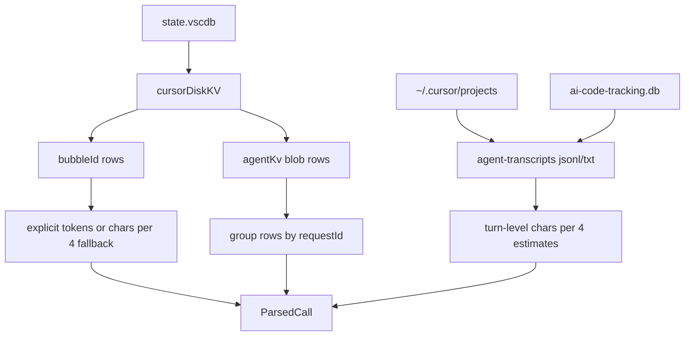

# Cursor

Cursor stores older conversation history in a single SQLite database per install and newer Cursor Agent / Composer transcripts under `~/.cursor/projects`. `tokenuse` reads both sources under one user-facing **Cursor** tool.

> Status: implemented (`src/tools/cursor/`).

## Where the data lives

| Platform | Path |
| --- | --- |
| macOS | `~/Library/Application Support/Cursor/User/globalStorage/state.vscdb` |
| Linux | `~/.config/Cursor/User/globalStorage/state.vscdb` |
| Windows | `%APPDATA%/Cursor/User/globalStorage/state.vscdb` |

Cursor Agent transcripts live at:

```text
~/.cursor/projects/<project-id>/agent-transcripts/**/*.jsonl
~/.cursor/projects/<project-id>/agent-transcripts/**/*.txt
~/.cursor/ai-tracking/ai-code-tracking.db
```

Set `CURSOR_AGENT_HOME` to point at another Cursor data directory, for example a copied sample folder. The parser reads SQLite files via read-only immutable URIs. The Cursor adapter does not maintain its own cache; tokenuse's archive-level source fingerprint skips reparsing when source file metadata is unchanged, except when Cursor parser attribution logic is versioned forward.



## Record format

Cursor uses two storage layouts in the `cursorDiskKV` table. Both are JSON blobs stored under string keys. Some Agent KV values are stored with SQLite's `blob` type even when the bytes are UTF-8 JSON, so the parser decodes blob bytes before deserializing.

### V2 bubbles

Query: `SELECT key, value FROM cursorDiskKV WHERE key LIKE 'bubbleId:%'`

Each row's `value` is JSON of the form:

```jsonc
{
  "type": 0,                              // 1 = user, 0 = assistant
  "createdAt": 1731539400000,             // ms since epoch
  "tokenCount": {
    "inputTokens": 412,
    "outputTokens": 188
  },
  "modelInfo": { "modelName": "claude-sonnet-4-5" },
  "codeBlocks": [{ "language": "rust" }, { "language": "ts" }],
  "text": "...assistant or user message..."
}
```

### Agent KV (newer Cursor Agent)

Query: `SELECT key, value FROM cursorDiskKV WHERE key LIKE 'agentKv:blob:%'`

These rows carry a series of `{role, content}` pairs without explicit token counts. Estimate tokens with `chars / 4.0` and treat the row's `requestId` as the dedup key (`cursor:agentKv:<requestId>`). Cursor often injects a `<user_info>` block with `Workspace Path: ...`; when present, tokenuse uses that as the project path for the Agent KV session. Bubble rows use a cautious fallback chain: row workspace path, Cursor Agent transcript / tracking DB project by `conversationId`, then a single unique Agent KV workspace path when the database exposes one.

### Cursor Agent transcripts

JSONL Composer 2 transcripts contain one JSON object per line:

```jsonc
{"role":"user","message":{"content":[{"type":"text","text":"<user_query>fix bug</user_query>"}]}}
{"role":"assistant","message":{"content":[{"type":"text","text":"I'll inspect it."},{"type":"tool_use","name":"Shell","input":{"command":"cargo test"}}]}}
```

The parser starts a new turn on each `role == "user"` line and aggregates following assistant lines until the next user line. Legacy `.txt` transcripts are also supported when they use `user:`, `A:`, `[Thinking]`, `[Tool call]`, and `[Tool result]` markers. Subagent transcripts under `agent-transcripts/<conversation>/subagents/` are discovered as their own sessions.

## Token & cost mapping

| `ParsedCall` field | Source |
| --- | --- |
| `input_tokens` | `tokenCount.inputTokens` for bubbles; otherwise extracted user text chars / 4 |
| `output_tokens` | `tokenCount.outputTokens` for bubbles; otherwise assistant text and tool input chars / 4 |
| `cache_*` | `0` — Cursor does not surface cache breakdown |
| `model` | `modelInfo.modelName`, transcript tracking DB model, with empty / `default` falling back to `cursor-auto` |
| `timestamp` | Bubble `createdAt`; transcript `conversation_summaries.updatedAt`, then latest `ai_code_hashes` timestamp, then file mtime |
| `project` | Explicit workspace path, transcript tool path / cwd / shell command, `ai_code_hashes.fileName`, then decoded `~/.cursor/projects/<project-id>` folder |
| `tools` | Empty for SQLite rows; transcript `tool_use.name` normalized to names such as `Read`, `Glob`, `Bash`, `StrReplace`, and `CreatePlan` |

**Token quirk:** Cursor v3 sometimes records zero tokens. When `tokenCount.inputTokens + tokenCount.outputTokens == 0`, fall back to character-count estimation.

**Model resolution:**
- `"default"` → `claude-sonnet-4-5` (alias in pricing snapshot)
- `"cursor-auto"` → `claude-sonnet-4-5` (alias in pricing snapshot)
- Unknown model name → fallback to Sonnet rate (`pricing::PriceTable::lookup` handles this)

## Deduplication

- V2 bubbles: `cursor:<conversation_id>:<created_at>:<input_tokens>:<output_tokens>`.
- AgentKv: `cursor:agentKv:<requestId>`.
- Cursor Agent transcripts: `cursor:transcript:<path>:<conversation_id>:<turn_index>`.

A single Cursor row is one user message *or* one assistant message, and the current parser emits `ParsedCall`s for both bubble types when they carry usage or a chars/4 fallback.

## Tools / bash extraction

Cursor does not expose tool-call names in a structured form on the SQLite tables. Transcript `tool_use` blocks do expose tool names; `Shell` is normalized to `Bash`, and `input.command` is copied into `bash_commands` so shell-command panels can include Cursor Agent work.

## Known limitations

- Bubble rows still roll up under a synthetic `cursor-workspace` project when Cursor provides no workspace path, no matching transcript or tracking DB `conversationId`, and no single Agent KV workspace fallback.
- AgentKv and transcript chars/4 estimation undercounts some code-heavy turns. Treat the cost as approximate.
- Cursor project folder names are sanitized, so transcript project attribution first uses explicit path hints from `Workspace Path:`, tool `path` / `target_directory` inputs, shell commands, and `ai_code_hashes.fileName` before falling back to the folder-derived project id. When the folder id matches the local home directory, tokenuse restores the real home path and resolves ambiguous nested projects if the matching folder exists.
- The DB is locked while Cursor is running. Open with `SQLITE_OPEN_READ_ONLY` and add `?immutable=1` to the URI to avoid blocking.
