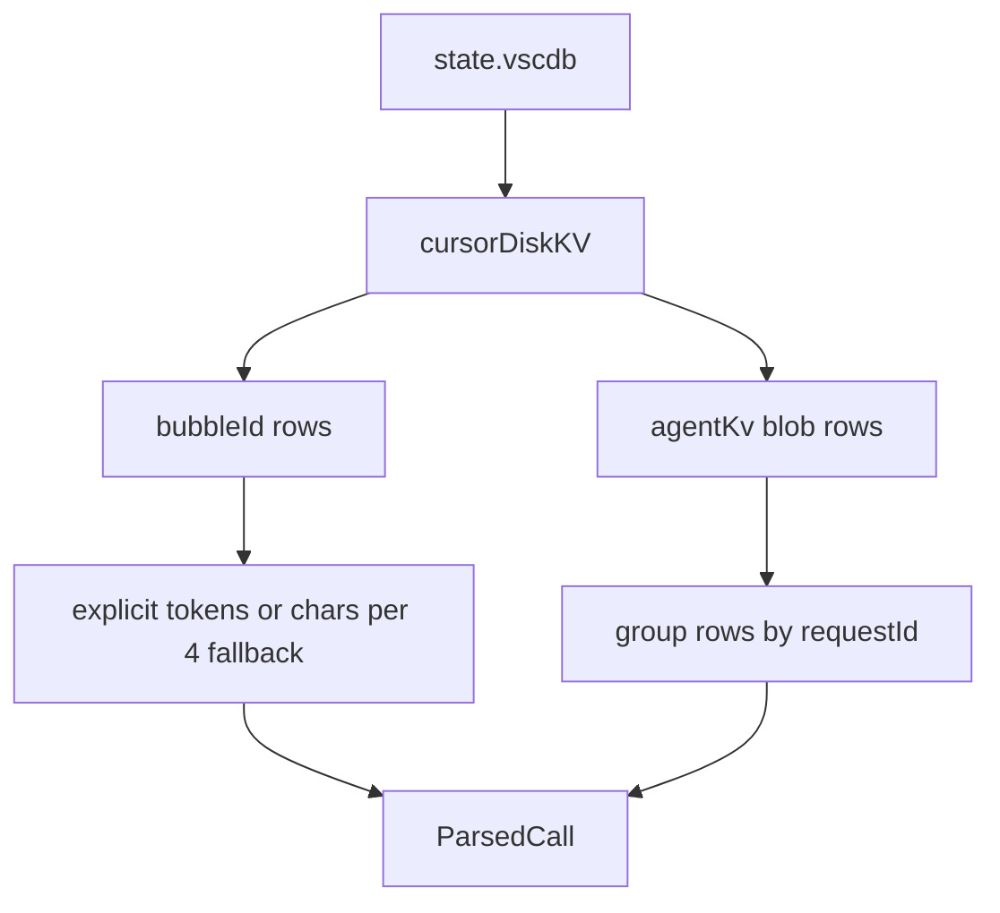

# Cursor

Cursor stores its conversation history in a single SQLite database per install. `tokenuse` reads it via `rusqlite` (bundled — no system SQLite required).

> Status: implemented (`src/tools/cursor/`).

## Where the data lives

| Platform | Path |
| --- | --- |
| macOS | `~/Library/Application Support/Cursor/User/globalStorage/state.vscdb` |
| Linux | `~/.config/Cursor/User/globalStorage/state.vscdb` |
| Windows | `%APPDATA%/Cursor/User/globalStorage/state.vscdb` |

The parser reads `state.vscdb` via a read-only immutable SQLite URI. The Cursor adapter does not maintain its own cache; tokenuse's archive-level source fingerprint skips reparsing when the database file metadata is unchanged.



## Record format

Cursor uses two storage layouts in the `cursorDiskKV` table. Both are JSON blobs stored under string keys. Some Agent KV values are stored with SQLite's `blob` type even when the bytes are UTF-8 JSON, so the parser decodes blob bytes before deserializing.

### V2 bubbles

Query: `SELECT key, value FROM cursorDiskKV WHERE key LIKE 'bubbleId:%'`

Each row's `value` is JSON of the form:

```jsonc
{
  "type": 0,                              // 1 = user, 0 = assistant
  "createdAt": 1731539400000,             // ms since epoch
  "tokenCount": {
    "inputTokens": 412,
    "outputTokens": 188
  },
  "modelInfo": { "modelName": "claude-sonnet-4-5" },
  "codeBlocks": [{ "language": "rust" }, { "language": "ts" }],
  "text": "...assistant or user message..."
}
```

### Agent KV (newer Cursor Agent)

Query: `SELECT key, value FROM cursorDiskKV WHERE key LIKE 'agentKv:blob:%'`

These rows carry a series of `{role, content}` pairs without explicit token counts. Estimate tokens with `chars / 4.0` and treat the row's `requestId` as the dedup key (`cursor:agentKv:<requestId>`). Cursor often injects a `<user_info>` block with `Workspace Path: ...`; when present, tokenuse uses that as the project path for the Agent KV session. If the database has exactly one unique Agent KV workspace path, tokenuse also uses it as the fallback project for bubble rows.

## Token & cost mapping

| `ParsedCall` field | Source |
| --- | --- |
| `input_tokens` | `tokenCount.inputTokens` (or `chars / 4` for AgentKv) |
| `output_tokens` | `tokenCount.outputTokens` (or `chars / 4` for AgentKv) |
| `cache_*` | `0` — Cursor does not surface cache breakdown |
| `model` | `modelInfo.modelName`, with empty / `default` falling back to `cursor-auto` |
| `timestamp` | `DateTime::from_timestamp_millis(createdAt)` or parsed RFC3339 when present |
| `tools` | empty — the current parser does not populate tool names from Cursor rows |

**Token quirk:** Cursor v3 sometimes records zero tokens. When `tokenCount.inputTokens + tokenCount.outputTokens == 0`, fall back to character-count estimation.

**Model resolution:**
- `"default"` → `claude-sonnet-4-5` (alias in pricing snapshot)
- `"cursor-auto"` → `claude-sonnet-4-5` (alias in pricing snapshot)
- Unknown model name → fallback to Sonnet rate (`pricing::PriceTable::lookup` handles this)

## Deduplication

- V2 bubbles: `cursor:<conversation_id>:<created_at>:<input_tokens>:<output_tokens>`.
- AgentKv: `cursor:agentKv:<requestId>`.

A single Cursor row is one user message *or* one assistant message, and the current parser emits `ParsedCall`s for both bubble types when they carry usage or a chars/4 fallback.

## Tools / bash extraction

Cursor does not expose tool-call names in a structured form on these tables. We do **not** populate `tools` or `bash_commands` from Cursor.

## Known limitations

- Bubble rows still roll up under a synthetic `cursor-workspace` project unless the row text itself contains a workspace path or the database has exactly one unique Agent KV workspace path to use as a cautious fallback. Agent KV rows use the attached `Workspace Path:` context when present.
- AgentKv chars/4 estimation undercounts code blocks (which compress more in tokenization). Treat the cost as approximate.
- The DB is locked while Cursor is running. Open with `SQLITE_OPEN_READ_ONLY` and add `?immutable=1` to the URI to avoid blocking.
