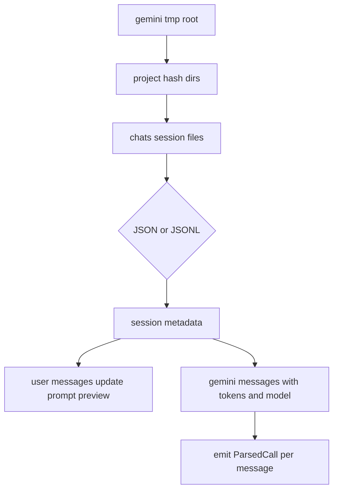

# Gemini

Gemini CLI writes project-scoped chat session files under `~/.gemini/tmp/<project_hash>/chats/`. Recent builds use JSONL session files; older or exported sessions can appear as single JSON documents with the same top-level session metadata and `messages` array.

> Status: implemented (`src/tools/gemini/`).

## Where the data lives

| Path | Notes |
| --- | --- |
| `~/.gemini/tmp/<project_hash>/chats/session-*.jsonl` | Current JSONL session format |
| `~/.gemini/tmp/<project_hash>/chats/session-*.json` | Older/exported JSON session format |

There is no v1 environment override. The adapter reads the default Gemini CLI data directory only.

**Discovery rules** (`src/tools/gemini/discovery.rs`):
- Read direct child project directories under `~/.gemini/tmp/`.
- Scan each `<project_hash>/chats/` directory.
- Match files whose name starts with `session-` and whose extension is `.json` or `.jsonl`.
- Use `<project_hash>` as the fallback project label.



## Record format

The JSON format is a session object:

```jsonc
{
  "sessionId": "90a6c51d-c8dd-480c-a6a4-30b0265bb001",
  "projectHash": "project-hash",
  "startTime": "2026-05-01T18:34:30.869Z",
  "messages": [
    { "id": "u1", "type": "user", "content": "run tests" },
    {
      "id": "g1",
      "type": "gemini",
      "timestamp": "2026-05-01T18:34:40.000Z",
      "model": "gemini-2.5-pro",
      "tokens": { "input": 120, "output": 30, "cached": 20, "thoughts": 5 },
      "toolCalls": [
        { "name": "run_command", "args": { "command": "cargo test" } }
      ]
    }
  ]
}
```

The JSONL format stores the metadata as one line, followed by message lines. Lines with `$set` are ignored.

## Token & cost mapping

One `ParsedCall` is emitted for each Gemini/model message with both `tokens` and `model`.

| `ParsedCall` field | Source |
| --- | --- |
| `input_tokens` | `tokens.input` - `tokens.cached` |
| `output_tokens` | `tokens.output` + `tokens.thoughts` |
| `cached_input_tokens` | `tokens.cached` |
| `cache_read_input_tokens` | `tokens.cached` |
| `cache_creation_input_tokens` | always `0` |
| `reasoning_tokens` | `tokens.thoughts` |
| `model` | message `model` |
| `timestamp` | message `timestamp`, falling back to session `startTime` |

Gemini reports cached tokens inside the input total, so the parser subtracts cached input before pricing while still preserving the cache-read bucket.

## Tools / bash extraction

Gemini `toolCalls` names map to canonical tool labels:

| Gemini tool | Normalized |
| --- | --- |
| `read_file`, `ReadFile` | `Read` |
| `write_file`, `create_file`, `WriteFile` | `Write` |
| `edit_file`, `EditFile`, `replace` | `Edit` |
| `delete_file` | `Delete` |
| `list_dir`, `ListDir` | `LS` |
| `grep_search`, `search_files`, `SearchText` | `Grep` |
| `find_files` | `Glob` |
| `run_command`, `Shell` | `Bash` |
| `web_search` | `WebSearch` |
| anything else | passed through unchanged |

For `Bash`, the parser reads `args.command` or `args.cmd`, including JSON-encoded string arguments, and splits shell pipelines/separators with `tools::jsonl::split_bash_commands`.

## Deduplication

`dedup_key = format!("gemini:{session_id}:{message_id}")` when a message id exists.

If a message id is missing, the parser falls back to session id, timestamp, model, and token counts. Message-level keys let the archive import newly appended messages from an updated session file without duplicating earlier calls.

## Known limitations

- Gemini project names are project hashes unless future session files expose a real working directory.
- Gemini limit snapshots are not imported because the local session format does not expose plan windows in the same shape as Codex.
- Unknown future model names are displayed as their raw model string and priced through the normal pricing table fallback path.
