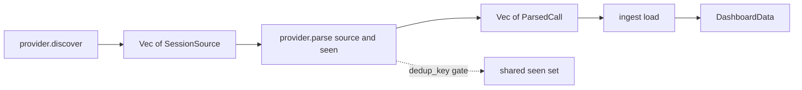

# Provider ingestion

`tokenuse` reads usage data **directly from local files** written by each AI coding assistant. There is no proxy, no API key, no telemetry endpoint. Every provider lives in its own module under `src/providers/<name>/` with its on-disk paths declared in a co-located `config.rs`.

## Per-provider documents

| Provider | Status | Source format | Doc |
| --- | --- | --- | --- |
| Claude Code | implemented | JSONL session files under `~/.claude/projects/` | [claude-code.md](claude-code.md) |
| Cursor | implemented | SQLite `state.vscdb` | [cursor.md](cursor.md) |
| Codex | implemented | JSONL rollouts under `~/.codex/sessions/` | [codex.md](codex.md) |
| GitHub Copilot | scaffolded | JSONL events (legacy CLI + VS Code transcripts) | [copilot.md](copilot.md) |

Today only Copilot is still scaffolded. Scaffolded providers ship the full **discovery + config** code and produce zero `ParsedCall`s until the parser lands.

## Provider trait

All providers implement the same trait (`src/providers/mod.rs`):

```rust
pub trait Provider: Send + Sync {
    fn id(&self) -> &'static str;                         // "claude-code", "cursor", ...
    fn display_name(&self) -> &'static str;
    fn discover(&self) -> Result<Vec<SessionSource>>;     // find on-disk sources
    fn parse(&self, source: &SessionSource,
             seen: &mut HashSet<String>) -> Result<Vec<ParsedCall>>;
    fn model_display(&self, model: &str) -> String { /* default */ }
    fn tool_display(&self, tool: &str) -> String { /* default */ }
}
```

`ParsedCall` is the single normalized record (`src/providers/types.rs`). Every provider produces this; every aggregator consumes this:

```rust
pub struct ParsedCall {
    pub provider: &'static str,
    pub model: String,
    pub input_tokens: u64,
    pub output_tokens: u64,
    pub cache_creation_input_tokens: u64,
    pub cache_read_input_tokens: u64,
    pub cached_input_tokens: u64,         // tokens reported as cached *inside* input_tokens (OpenAI)
    pub reasoning_tokens: u64,            // o1/o3 thinking tokens
    pub web_search_requests: u64,
    pub cost_usd: f64,                    // priced by src/pricing/ before being yielded
    pub tools: Vec<String>,
    pub bash_commands: Vec<String>,
    pub timestamp: Option<DateTime<Utc>>,
    pub speed: Speed,                     // Standard | Fast (Claude fast-mode multiplier)
    pub dedup_key: String,
    pub user_message: String,             // first 500 chars
    pub session_id: String,
    pub project: String,
}
```

## Pipeline



```
provider.discover()          -> Vec<SessionSource>
provider.parse(src, seen)    -> Vec<ParsedCall>     (yielded only if dedup_key is new)
ingest::load()               aggregates across all providers
ingest.dashboard(period, p)  -> DashboardData       (period-filtered, provider-filtered)
```

The same `seen: &mut HashSet<String>` is shared across every provider on a single run, so a record that looks identical between providers (rare but possible) only counts once.

## Pricing

`src/pricing/snapshot.json` is an embedded LiteLLM-derived price table. `pricing::cost(model, &call, speed)` computes:

```
cost = multiplier * (
    input * input_per_token
  + output * output_per_token
  + cache_creation * cache_write_per_token
  + cache_read * cache_read_per_token
  + web_search_requests * 0.01
)
```

`multiplier = 6.0` for Opus + `Speed::Fast`, otherwise `1.0`. Model name normalization strips a leading `provider/` prefix, an `@pin` suffix, and any trailing `-YYYYMMDD` date stamp before the lookup. Aliases (`cursor-auto`, `default`, `auto`, ...) resolve to canonical model names.

To refresh the snapshot from upstream LiteLLM:

```bash
cargo run --features refresh-prices -- --refresh-prices
```

This fetches `model_prices_and_context_window.json` from BerriAI/litellm, filters to the model families this app cares about, and rewrites `src/pricing/snapshot.json`. The default build has zero network code.

## Adding a new provider

1. Create `src/providers/<name>/{mod.rs, config.rs, discovery.rs, parser.rs}`.
2. Put **every path, env var, glob, and SQL query** in `config.rs` so the data location is reviewable in one place.
3. Implement the `Provider` trait in `mod.rs`. Register the type in `providers::registry()`.
4. Write `docs/providers/<name>.md` following the structure used by the existing four.
5. Add the provider variant to `app::Provider` so `[p]` cycles through it.

## Verification

- `cargo test` runs the parser unit tests, the price-lookup tests, and the bash-command splitter tests.
- `cargo run` launches the TUI; if no local sessions are found the dashboard renders the bundled sample data and the title bar surfaces the reason.
- The status line shows whether the dashboard is running on `Live` ingested data or `Sample` fallback.
