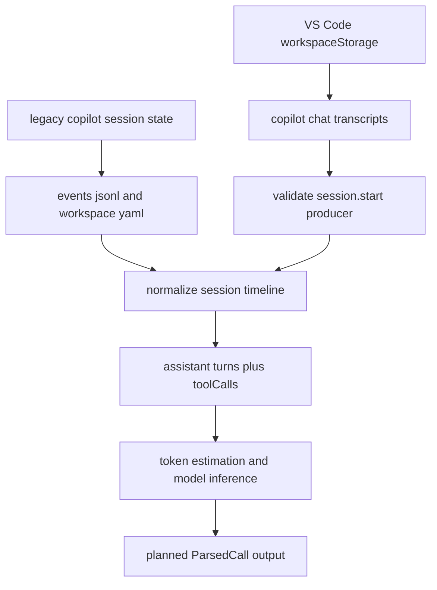
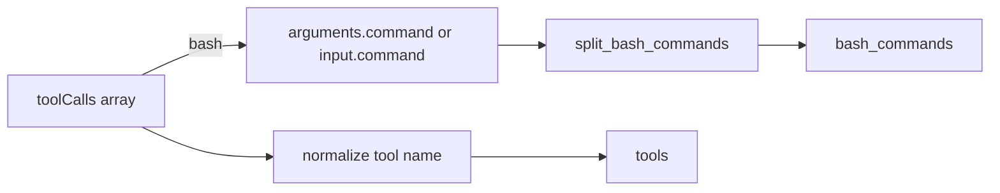

# GitHub Copilot

Copilot has two separate on-disk layouts: the legacy CLI agent (`~/.copilot/...`) and the VS Code Copilot Chat extension (workspace storage). `tokenuse` reads both.

> Status: implemented (`src/providers/copilot/`).

## Where the data lives

### Legacy CLI agent

```
~/.copilot/session-state/<session-id>/
    events.jsonl
    workspace.yaml
```

`workspace.yaml` carries the cwd and is parsed for the project label. `events.jsonl` is the timeline.

### VS Code extension

| Platform | Workspace storage |
| --- | --- |
| macOS | `~/Library/Application Support/Code/User/workspaceStorage/<hash>/` |
| Linux | `~/.config/Code/User/workspaceStorage/<hash>/` |
| Windows | `%APPDATA%/Code/User/workspaceStorage/<hash>/` |

Inside each workspace hash directory:

```
GitHub.copilot-chat/transcripts/<session>.jsonl
```

A directory only counts as a Copilot source if at least one transcript file's first line is `{"type":"session.start","producer":"copilot-agent",...}`.



## Record format

### Legacy `events.jsonl`

```jsonc
{ "type": "session.model_change", "model": "claude-sonnet-4-5" }
{ "type": "user.message",         "content": "fix the typo in README" }
{ "type": "assistant.message",
  "model": "claude-sonnet-4-5",
  "outputTokens": 220,                       // explicit when present
  "content": "..." ,
  "toolCalls": [
    { "id": "toolu_bdrk_01...", "name": "edit_file" },
    { "id": "tooluse_xyz",      "name": "bash" }
  ]
}
```

### VS Code transcripts

```jsonc
{ "type": "session.start", "producer": "copilot-agent", "model": "gpt-5" }
{ "type": "user.message", "content": "..." }
{ "type": "assistant.message", "content": "...", "reasoningText": "...",
  "toolCalls": [{ "id": "call_abc", "name": "edit_file" }] }
```

VS Code transcripts almost never carry explicit token counts — fall back to `chars / 4.0` for both `content` and `reasoningText`.

## Token & cost mapping

| `ParsedCall` field | Source |
| --- | --- |
| `input_tokens` | last `user.message.content` length / 4 (rough) |
| `output_tokens` | `assistant.message.outputTokens` if present, else `(content + reasoningText).len() / 4` |
| `reasoning_tokens` | `reasoningText.len() / 4` (or `0` if absent) |
| `cache_*` | `0` — Copilot does not expose cache breakdown |
| `model` | latest `session.model_change` / `session.start.model`; if absent, infer from tool-call IDs (see below) |

**Model inference (when no model is recorded anywhere):** count tool-call ID prefixes across the session, pick the most frequent:

| Prefix | Implies |
| --- | --- |
| `toolu_bdrk_` | Anthropic via Bedrock — alias `anthropic-auto` (Sonnet) |
| `toolu_vrtx_` | Anthropic via Vertex — alias `anthropic-auto` (Sonnet) |
| `tooluse_` | Anthropic native — alias `anthropic-auto` (Sonnet) |
| `call_` | OpenAI — alias `openai-auto` (gpt-5) |

The aliases resolve through `src/pricing/snapshot.json`.

## Deduplication

- Legacy: `dedup_key = format!("copilot:{session_id}:{message_id}")` where `session_id` is the parent directory name (the session UUID) and `message_id` is `data.messageId` on the `assistant.message` event.
- VS Code: `dedup_key = format!("copilot:{session_id}:{message_id}")` where `session_id` is the transcript file stem and `message_id` is `data.messageId`.

## Tools / bash extraction

Walk `data.toolRequests[]` and normalize each `name`:

| Copilot name | Normalized |
| --- | --- |
| `bash`, `run_in_terminal`, `kill_terminal` | `Bash` |
| `read_file` | `Read` |
| `edit_file`, `write_file`, `replace_string_in_file`, `apply_patch` | `Edit` |
| `create_file` | `Write` |
| `delete_file` | `Delete` |
| `search_files`, `file_search` | `Grep` |
| `find_files` | `Glob` |
| `list_directory`, `list_dir` | `LS` |
| `web_search` | `WebSearch` |
| `fetch_webpage` | `WebFetch` |
| `github_repo` | `GitHub` |
| `memory` | `Memory` |

For `bash`-class calls, parse `arguments` as a JSON string and run `command` (or `cmd`) through `providers::jsonl::split_bash_commands`.



## Known limitations

- VS Code transcripts have no canonical timestamp on every entry — use file mtime as a coarse fallback when the line lacks one.
- Token counts are estimates whenever the legacy `outputTokens` is absent; the dashboard's totals are within ~10–20% of reality on Copilot data, not exact.
- `workspace.yaml` parsing is YAML; pull a small YAML crate (e.g. `serde_yaml`) only if the project label is needed — the session ID directory name is an acceptable fallback.
